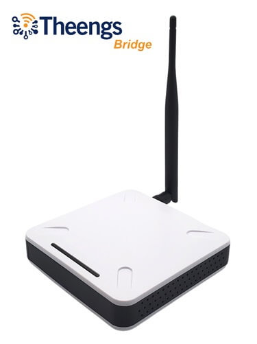
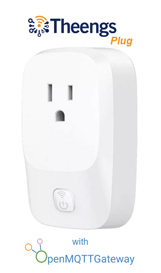

OpenMQTTGateway aims to unify various technologies and protocols into a single firmware. This reduces the need for multiple physical bridges and streamlines diverse technologies under the widely-used [MQTT](http://mqtt.org/) protocol.

## Sponsors

## Documentation

The documentation is [here](https://docs.openmqttgateway.com)

The reference sheet, with the list of all functions, pinouts is [here](https://docs.google.com/spreadsheets/d/1_5fQjAixzRtepkykmL-3uN3G5bLfQ0zMajM9OBZ1bx0/edit#gid=0)

## Upload

Upload OpenMQTTGateway directly from the [upload page](https://docs.openmqttgateway.com/upload/web-install.html) (no additional software required) or [build your own configuration](https://docs.openmqttgateway.com/upload/builds.html) with [PlatformIO](https://platformio.org/).

## Using OpenMQTTGateway ?
Support open-source development through sponsorship and gain exclusive access to our private forum. Your questions, issues, and feature requests will receive priority attention, plus you'll gain insider access to our roadmap.

## Products powered by OpenMQTTGateway

### Theengs Bridge, Bluetooth gateway (BLE) with external antenna

[Theengs bridge](https://shop.theengs.io/products/theengs-bridge-esp32-ble-mqtt-gateway-with-ethernet-and-external-antenna) is a powerfull BLE to MQTT gateway for over [100 sensors](https://decoder.theengs.io/devices/devices.html). Equipped with an Ethernet port, and external antenna, ensuring an enhanced range for your BLE sensors. It supports also WiFi connectivity.

### Theengs Plug, Bluetooth gateway (BLE) gateway and Smart Plug

[Theengs plug](https://shop.theengs.io/products/theengs-plug-smart-plug-ble-gateway-and-energy-consumption) brings the following features:
* BLE to MQTT gateway, tens of [Bluetooth devices](https://compatible.openmqttgateway.com/index.php/devices/ble-devices/) supported thanks to Theengs Decoder library. The plug uses an ESP32 acting as a BLE to Wifi gateway to scan, decode and forward the data of the nearby sensors,
* Smart plug that can be controlled remotely,
* Energy consumption monitoring,
* Device tracker,
* Presence detection (beta),
* Local connectivity first.

Support the project by purchasing the [Theengs bridge](https://shop.theengs.io/products/theengs-bridge-esp32-ble-mqtt-gateway-with-ethernet-and-external-antenna) or the [Theengs plug](https://shop.theengs.io/products/theengs-plug-smart-plug-ble-gateway-and-energy-consumption)

## Compatible items

* [List of supported devices](https://compatible.openmqttgateway.com/index.php/devices/), door/window sensors, PIR sensors, smoke detectors, weather stations...

* [List of compatible boards (Off the shelf or DIY) is available](https://compatible.openmqttgateway.com/index.php/boards/), RF Bridge, IR, BLE gateways...

*Running on a computer*
If you want to use the BLE decoding capabilities of OpenMQTTGateway with a Raspberry Pi, Windows or Unix PC you can now leverage [Theengs Gateway](https://theengs.github.io/gateway/).

* [List of compatible components to build your gateway](https://compatible.openmqttgateway.com/index.php/parts/), DHT, RF, IR emitters and receivers...

## Compatible controllers, saas or software

* [Home Assistant](https://docs.openmqttgateway.com/integrate/home_assistant.html)

* [OpenHAB](https://docs.openmqttgateway.com/integrate/openhab2.html)

* [NodeRed](https://docs.openmqttgateway.com/integrate/node_red.html)

* [AWS-IOT](https://docs.openmqttgateway.com/integrate/aws_iot.html)

## Contributors ✨

Thanks goes to these wonderful [people](https://github.com/1technophile/OpenMQTTGateway/graphs/contributors) who helped OpenMQTTGateway on Github and to the users contributions into the [community](https://community.openmqttgateway.com/).

## Support

For Questions or Support please don't open an issue, first go to the [docs](https://docs.openmqttgateway.com) and if you don't find your answer there, you can post your question in [the community forum](https://community.openmqttgateway.com)

## Help

If you like the project and/or used it please consider supporting it! It can be done in different ways:
* Helping other users in the [community](https://community.openmqttgateway.com)
* [Contribute](development) to the [code](https://github.com/1technophile/OpenMQTTGateway) or the [documentation](https://docs.openmqttgateway.com)
* Buy devices, boards or parts from the [compatible web site](https://compatible.openmqttgateway.com), the devices and parts linked use affiliated links.
* Donate or sponsor the project [developers](https://github.com/1technophile/OpenMQTTGateway/graphs/contributors)
* Make a video or a blog article about what you have done with [OpenMQTTGateway](https://docs.openmqttgateway.com) and share it to the [community](https://community.openmqttgateway.com)

## Media

* [Hackaday - ARDUINO LIBRARY BRINGS RTL_433 TO THE ESP32](https://hackaday.com/2023/01/13/arduino-library-brings-rtl_433-to-the-esp32)
* [CNX Software - 433 MHz is not dead! Using an ESP32 board with LoRa module to talk to 433 MHz sensors](https://www.cnx-software.com/2023/01/14/esp32-board-with-lora-433-mhz-sensors/)
* [RTL_433 PORTED TO ESP32 MICROCONTROLLERS WITH CC1101 OR SX127X TRANSCEIVER CHIPS](https://www.rtl-sdr.com/rtl_433-ported-to-esp32-microcontrollers-with-cc1101-or-sx127x-transceiver-chips/)
* [Using low-cost wireless sensors in the unlicensed bands](https://lwn.net/Articles/921497/)
* [SMART PLUG ESP32 OPENMQTTGATEWAY SERVING AS AN BLE MQTT GATEWAY AND A POWER METER](https://www.electronics-lab.com/smart-plug-esp32-openmqttgateway-serving-as-an-ble-mqtt-gateway-and-a-power-meter/)

### Theengs Plug

### 433Mhz and BLE

### BLE

### 433Mhz

### LORA

