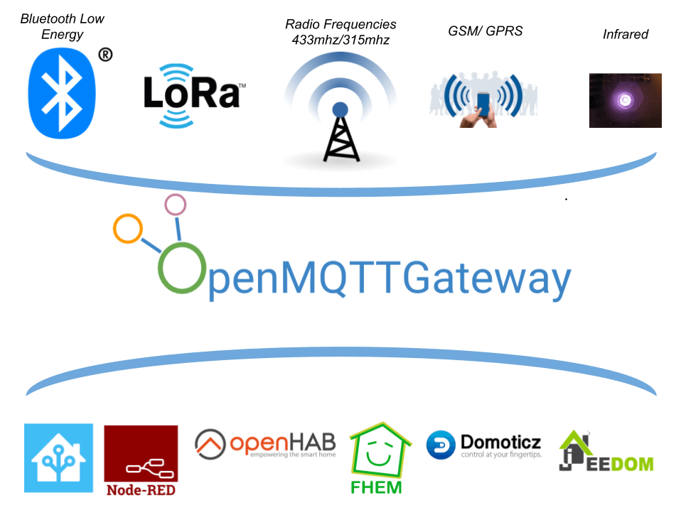
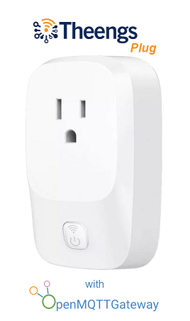

OpenMQTTGateway project goal is to concentrate in one firmware different technologies and protocols, decreasing by the way the number of physical bridges needed, and hiding the different technologies singularity behind a simple & wide spread communication protocol; [MQTT](http://mqtt.org/).

OpenMQTTGateway supports very mature technologies like basic 433mhz/315mhz protocols & infrared (IR) so you can make your old dumb devices "smart" and avoid throwing them away. These devices also have the advantages of having a lower cost compared to Zwave or more sophisticated protocols.
OMG also supports up to date technologies like Bluetooth Low Energy (BLE) or LORA.

To have an overview of the supported PIR, door, water, temperature, smoke sensors, sirens, rings, beacons, switches & weather stations you can take a look to the 
[compatible devices list](https://compatible.openmqttgateway.com/index.php/devices)

You can run OpenMQTTGateway on a wide variety of [boards](https://compatible.openmqttgateway.com/index.php/boards/), ESP32, ESP8266, Arduino MEGA, UNO (with limitation).
BLE to MQTT gateway can also run on Raspberry Pi, Windows or Unix computers thanks to [Theengs Gateway](https://theengs.github.io/gateway/).

With MQTT you can connect the compatible software you want, integrating in home automation controllers like (OpenHAB, Home Assistant, Jeedom, FHEM, Domoticz...) or Internet of Things software like Node-Red.

# Use cases
With OpenMQTTGateway and a controller you can for example:
* Monitor a garden with a Mi Flora BLE sensor and control an irrigation valve depending on the soil moisture,
* Trigger a fan depending on the temperature and humidity thanks to a Mi Jia/LYWSD03MMC BLE sensor,
* Follow your meat temperature when cooking with an Inkbird IBBQ
* Alert yourself by a controller notification if the temperature of a fridge or freezer is too high,
* Detect a beacon/smartwatch so as to trigger a special scenario when you come home,
* [Lose weight with the help of a complete log system](https://www.youtube.com/watch?v=noUROhtf0E0&t=18s), video from [@Andreas Spiess](https://www.youtube.com/channel/UCu7_D0o48KbfhpEohoP7YSQ)
* Detect opened door or windows through 433mhz or BLE and alert yourself when leaving
* Detect water leakage or smoke remotely
* Actionate a siren if something is going wrong
* Detect if your far mailbox has been opened by the postman with LORA
* Make smart your old TV or AC system through infrared control
* Monitor vehicle tire pressure

The limit is your imagination 😀

# Functions
Behind the scene you will find functionalities dedicated to gateways like:
* Deduplication
* Simple and lite API
* Strong integrations with libraries used
* Signal forward/repeat
* First configuration with web portal
* Whitelist & Blacklist management
* Secure connections
* Over the air updates

## First ready to go OpenMQTTGateway device !

[Theengs plug](https://shop.theengs.io/products/theengs-plug-smart-plug-ble-gateway-and-energy-consumption) is available flashed with OpenMQTTGateway, and brings the functions below:
* BLE to MQTT gateway, tens of Bluetooth devices supported thanks to Theengs Decoder library. The plug uses an ESP32 acting as a BLE to Wifi gateway to scan, decode and forward the data of the nearby sensors,
* Smart plug that can be controlled remotely,
* Energy consumption monitoring,
* Presence detection (beta).

Support the project by purchasing the [Theengs plug](https://shop.theengs.io/products/theengs-plug-smart-plug-ble-gateway-and-energy-consumption)
The plug is available in North America only, other regions are planned.

## Media

* [Hackaday - ARDUINO LIBRARY BRINGS RTL_433 TO THE ESP32](https://hackaday.com/2023/01/13/arduino-library-brings-rtl_433-to-the-esp32)
* [CNX Software - 433 MHz is not dead! Using an ESP32 board with LoRa module to talk to 433 MHz sensors](https://www.cnx-software.com/2023/01/14/esp32-board-with-lora-433-mhz-sensors/)
* [RTL_433 PORTED TO ESP32 MICROCONTROLLERS WITH CC1101 OR SX127X TRANSCEIVER CHIPS](https://www.rtl-sdr.com/rtl_433-ported-to-esp32-microcontrollers-with-cc1101-or-sx127x-transceiver-chips/)
* [Using low-cost wireless sensors in the unlicensed bands](https://lwn.net/Articles/921497/)
* [SMART PLUG ESP32 OPENMQTTGATEWAY SERVING AS AN BLE MQTT GATEWAY AND A POWER METER](https://www.electronics-lab.com/smart-plug-esp32-openmqttgateway-serving-as-an-ble-mqtt-gateway-and-a-power-meter/)

### 433Mhz and BLE
<iframe width="560" height="315" src="https://youtube.com/embed/_gdXR1uklaY" frameborder="0" allow="autoplay; encrypted-media" allowfullscreen></iframe>

### BLE
<iframe width="560" height="315" src="https://www.youtube.com/embed/noUROhtf0E0" frameborder="0" allow="autoplay; encrypted-media" allowfullscreen></iframe>

### 433Mhz
<iframe width="560" height="315" src="https://youtube.com/embed/H-JXWbWjJYE" frameborder="0" allow="autoplay; encrypted-media" allowfullscreen></iframe>

### LORA
<iframe width="560" height="315" src="https://www.youtube.com/embed/6DftaHxDawM" frameborder="0" allow="autoplay; encrypted-media" allowfullscreen></iframe>

::: warning Note
The material and information contained in this documentation is for general information purposes only. You should not rely upon the material or information on this documentation as a basis for making any business, legal or any other decisions. There is no warranty given on this documentation content. If you decide to follow the information and materials given it is at your own risk. I will not be liable for any false, inaccurate, inappropriate or incomplete information presented on this website.
:::
