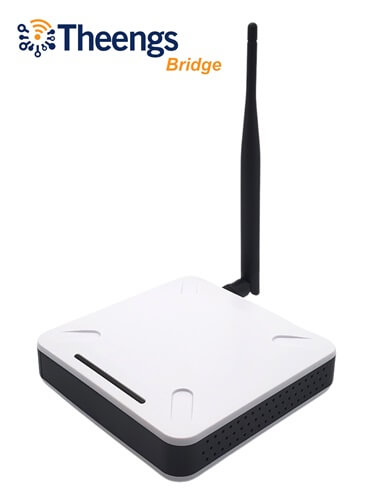

Development Version

This is the edge version of the documentation, built from commit <a v-if="commitUrl" :href="commitUrl"><code>{{ version }}</code></a><code v-else>{{ version }}</code>. It is under active development and may contain bugs, incomplete features, or breaking changes. Use it at your own risk.

  <h2>How it works</h2>
  
OpenMQTTGateway is a firmware for ESP32 and ESP8266 boards that translates your devices' signals into <a href="http://mqtt.org/">MQTT</a> messages — and back. One board replaces a drawer full of proprietary bridges.

  <OmgPipeline />
  
Decodes <a href="https://decoder.theengs.io/devices/devices.html">more than 100 BLE devices</a> and many RF protocols (433/315/868/915MHz) through <a href="./use/rf.html#supported-decoders">RTL_433 decoders</a> — and the BLE decoding also runs on Raspberry Pi, Windows or Linux with <a href="https://theengs.github.io/gateway/">Theengs Gateway</a>.

  <h2>What will you automate?</h2>
  

    

      {{ uc.icon }}
      {{ uc.text }}
    

  

  
The limit is your imagination 😀

  <h2>See it in action</h2>
  

    <a v-for="v in videos" :key="v.id" class="omg-video" :href="`https://www.youtube.com/watch?v=${v.id}`" target="_blank" rel="noopener noreferrer">
      
      {{ v.title }}
      by {{ v.author }}
    </a>
  

  
In the press:
    <template v-for="(p, i) in press" :key="p.url"><a :href="p.url" target="_blank" rel="noopener noreferrer">{{ p.name }}</a> · </template>
  

  <h2>Under the hood</h2>
  

    {{ f }}
  

  <h2>Support the project</h2>
  

    
    

      <h3>Theengs Bridge — ready-to-use BLE gateway</h3>
      
Pre-flashed with OpenMQTTGateway, with an Ethernet port and an external antenna for enhanced BLE range. Every purchase directly funds the project.

      <a class="omg-cta" href="https://shop.theengs.io/products/theengs-bridge-esp32-ble-mqtt-gateway-with-ethernet-and-external-antenna" target="_blank" rel="noopener noreferrer">Get the Theengs Bridge</a>
    

  

  
You can also sponsor the development to help keep the project healthy and evolving.

  

    <iframe src="https://github.com/sponsors/1technophile/button" title="Sponsor 1technophile" height="32" width="228" style="border: 0; border-radius: 6px;"></iframe>
  

  
The material and information contained in this documentation is for general information purposes only. You should not rely upon it as a basis for making any business, legal or any other decisions. There is no warranty given on this documentation content; if you decide to follow the information and materials given it is at your own risk.

