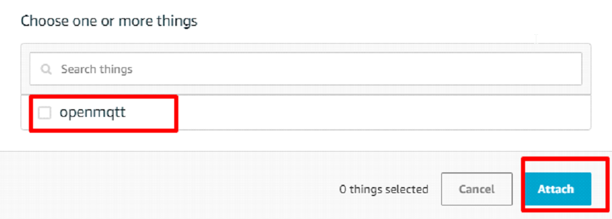

# Integrate AWS IOT
## Create a thing

* From AWS console, search for IOT core
* Create a Thing and name it, this name will be used as the OpenMQTTGateway name.


## Create a policy


* Add this json code to the policy
```json
{
  "Version": "2021-11-01",
  "Statement": [
    {
      "Effect": "Allow",
      "Action": [
        "iot:Connect",
        "iot:Publish",
        "iot:Subscribe",
        "iot:Receive",
        "greengrass:Discover"
      ],
      "Resource": [
        "*"
      ]
    }
  ]
}
```

## Create a certificate

* Create a new certificate


* Download certificates and key


## Attach Policy with certificate


## Activate certificate and attach it to Thing




## Find AWS EndPoint


## Gather the information for OpenMQTTGateway configuration

Now you should have the following information for the OpenMQTTGateway configuration:
* Root certificate
* Client certificate
* Client key
* End point url
* Gateway name

## Modify OpenMQTTGateway configuration

With PlatformIO you can directly leverage the environment `esp32dev-ble-aws` as an example and modify it following your needs.

## Build and upload

## Connect to a WiFi Access point [see portal](../upload/portal)
Enter your credentials and verify that Secure connection is marked.

## Verify that you receive data in AWS

* Go to things
* Click on the thing created
* Go to Activity
* Click on MQTT Test Client
* Subscribe to `+/#`

You should see messages coming.

