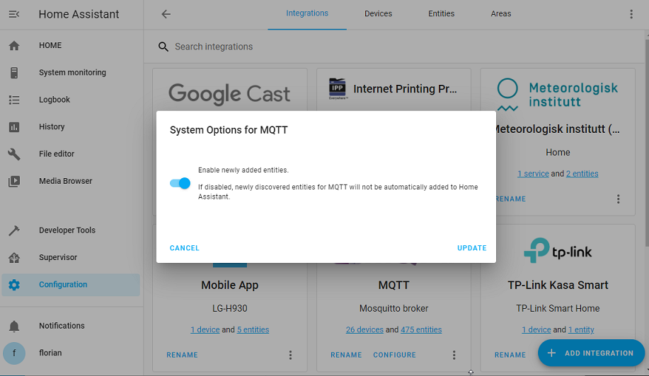
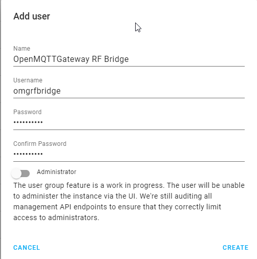
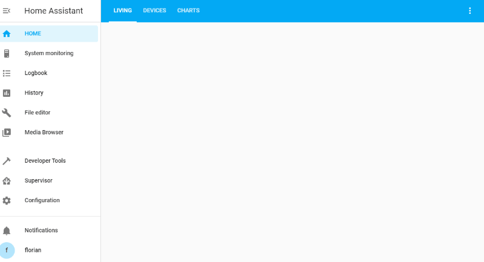
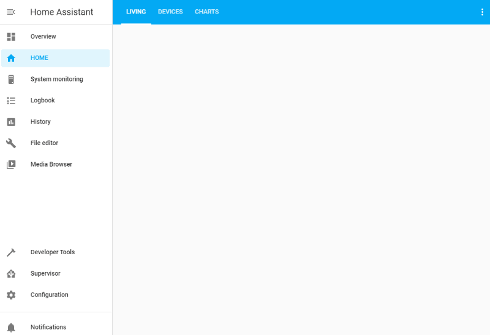
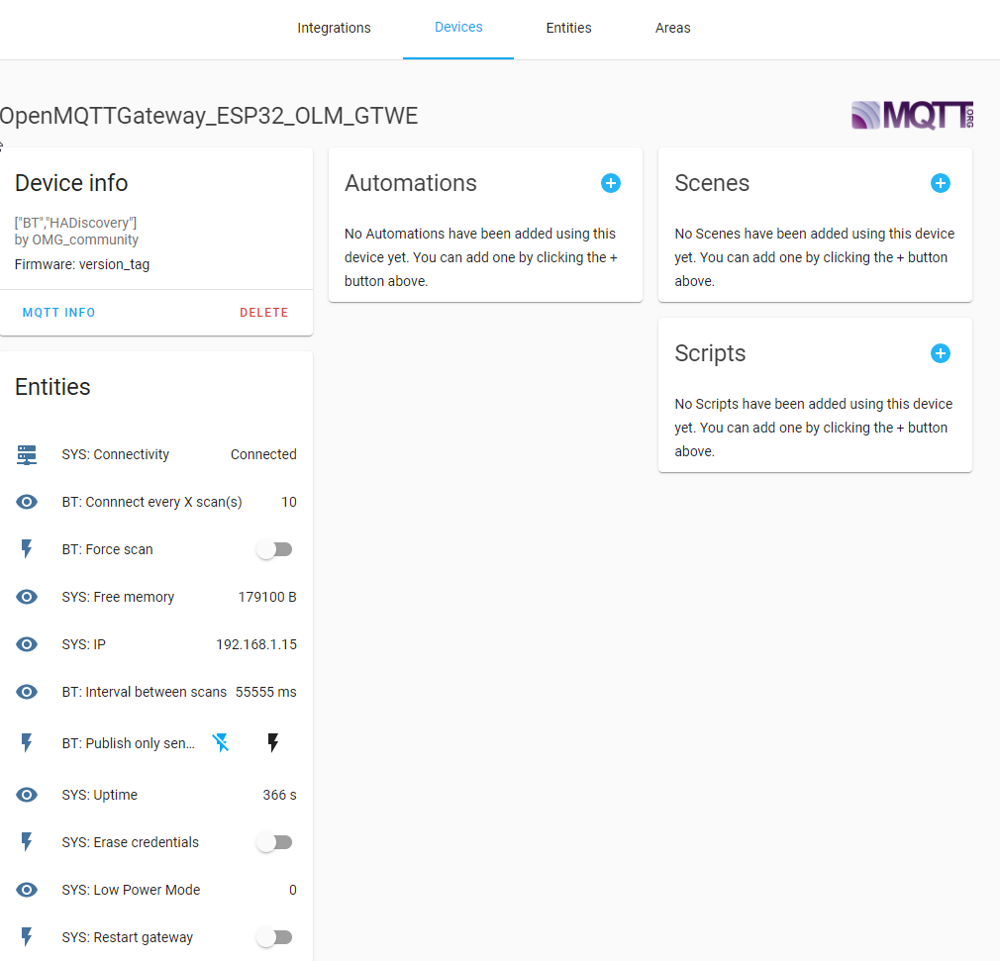

# Integrate Home Assistant

Home Assistant provide the [MQTT integration](https://www.home-assistant.io/integrations/mqtt/) and through this integration it is possible to exploit and manage the messages published by OpenMQTTGateway.

Once this integration on home assistant is configured with the same MQTT broker, it is possible to create devices manually or through the autodiscovery function.


## Auto discovery

From Home Assistant site 

> The discovery of MQTT devices will enable one to use MQTT devices with only minimal configuration effort on the side of Home Assistant. The configuration is done on the device itself and the topic used by the device.

On OpenMQTTGateway the Home Assistant discovery is enabled by default on all binaries and platformio configurations except for UNO. With Arduino IDE please read the [advanced configuration section](../upload/advanced-configuration#auto-discovery) of the documentation. Here are a few tips for activating discovery on Home Assistant, but for detailed configuration please refer to the Home Assistant website. 

Enable discovery on your MQTT integration in HASS (activated per default).



The gateway will need an MQTT username and password, you have to create a new user(recommended) into Home Assistant->Configuration->Users (available in admin mode) or use an existing username/pwd combination (not recommended). This user doesn't need to be an administrator.



::: warning Note
The max size of the username is 30 and 60 for the password.
:::

OMG will use the auto discovery functionality of home assistant to create gateway and sensors into your HASS instance automatically.







::: info
The Bluetooth and the RTL_433 gateway will create automatically devices and entities, the RF gateway will create DeviceTrigger.
The OpenMQTTGateway will also be available as a device to monitor its parameters and control it. The sensors (DHT for example) and actuators (relays) are attached to the gateway.

30 minutes after its activation the auto discovery will be automaticaly deactivated, you can reactivate it from the gateway controls.
Some devices may require a button push or motion/contact event to trigger a message and generate the auto discovery.
:::

## RTL_433 auto discovery specificity

Even if the RTL_433 gateway will create automatically the devices and entities, you may loose the link to them when you change the batteries. This is proper to the RF devices. In this case new device and entities will be created. You may bypass this by creating entities through manual configuration that filter following the device model and other parameters and don't take into account the id.
Example:
```yaml
mqtt:
  sensor:
    - state_topic: "+/+/RTL_433toMQTT/WS2032/+"
```
instead of
```yaml
mqtt:
  sensor:
    - state_topic: "+/+/RTL_433toMQTT/WS2032/47998"
```
Note also that the sensor may leverage channels, types or subtypes, they can be used in the filtering 
Example:
In the example below 9 is the `subtype` and 1 is the `channel`
```yaml
mqtt:
  sensor:
    - state_topic: "+/+/RTL_433toMQTT/Prologue-TH/9/1/+"
```
instead of
```yaml
mqtt:
  sensor:
    - state_topic: "+/+/RTL_433toMQTT/Prologue-TH/9/1/215"
```

Alternatively the rssi signal could be used also.

## MQTT Device Trigger and RF

With OpenMQTTGateway [configured to receive RF signals](./setitup/rf.html) the messages are transmitted as indicated by [RCSwitch based gateway](./use/rf.html#rcswitch-based-gateway), so it is possible to receive a pulse every time the sensor discover a signal. 

With autodiscovery enabled, HomeAssistant will discover a [MQTT Device Trigger](https://www.home-assistant.io/integrations/device_trigger.mqtt/) identified by the value field given in the mqtt argument. 

## Manual integration examples
From @123, @finity, @denniz03, @jrockstad, @anarchking, @dkluivingh

### Door sensor
```yaml
mqtt:
  binary_sensor:
    - name: "test"
      state_topic: "home/OpenMQTTGateway/433toMQTT"
      value_template: >-
        
          {{'ON'}}
        
          {{'OFF'}}
        
          {{states('binary_sensor.test') | upper}}
        
      qos: 0
      device_class: opening
```

```yaml
mqtt:
  binary_sensor:
    - name: doorbell
      state_topic: 'home/OpenMQTTGateway/SRFBtoMQTT'
      #value_template: "{{ value_json.raw }}"
      value_template: >- 
        
          {{'ON'}}
        
          {{states('binary_sensor.doorbell') | upper}}
        
      off_delay: 30
      device_class: 'sound'

    - name: light_back_sensor
      state_topic: 'home/OpenMQTTGateway/SRFBtoMQTT'
      #value_template: '{{ value_jason.value }}'
      value_template: >- 
        
          {{'ON'}}
        
          {{states('binary_sensor.light_back_sensor') | upper}}
        
      off_delay: 5

    - name: rf_outlet_sensor
      state_topic: 'home/OpenMQTTGateway/SRFBtoMQTT'
      value_template: >- 
        
          {{'ON'}}
         
          {{states('binary_sensor.rf_outlet_sensor') | upper}}
        
```

### Motion sensor
```yaml
mqtt:
  binary_sensor:
    - name: "Bewegung_Schlafzimmer"
      #device_class: motion
      state_topic: "home/OpenMQTTGateway1/HCSR501toMQTT"
      value_template: '{{ value_json["presence"] }}'
      payload_on: "true"
      payload_off: "false"
```

### Switches

```yaml
#switches
mqtt:
  switch:
    - name: Plug1
      state_topic: "home/OpenMQTTGateway/SRFBtoMQTT"
      command_topic: "home/OpenMQTTGateway/commands/MQTTtoSRFB"
      value_template: "{{ value_json.value }}"
      payload_on: '{"value":4546575}'
      payload_off: '{"value":4546572}'
      state_on: 4546575
      state_off: 4546572
      qos: "0"
      retain: true
```

### Mijia Thermometer BLE

```yaml
mqtt:
  sensor:
    - name: "mijia_thermometer_temperature"
      state_topic: 'home/OpenMQTTGateway/BTtoMQTT/AAAAAAAAAAAA' # MQTT topic, check MQTT messages; replace AA... with id (BLE MAC) of your device
      unit_of_measurement: '°C'
      value_template: '{{ value_json.tem | is_defined }}'
      expire_after: 21600 # 6 hours
      force_update: true
    - name: "mijia_thermometer_humidity"
      state_topic: 'home/OpenMQTTGateway/BTtoMQTT/AAAAAAAAAAAA'
      unit_of_measurement: '%'
      value_template: '{{ value_json.hum | is_defined }}'
      expire_after: 21600 # 6 hours
      force_update: true
    - name: "mijia_thermometer_battery"
      state_topic: 'home/OpenMQTTGateway/BTtoMQTT/AAAAAAAAAAAA'
      unit_of_measurement: '%'
      value_template: '{{ value_json.batt | is_defined }}'
      expire_after: 21600 # 6 hours
      force_update: true
```


### Xiaomi Mi Scale V2 BLE (XMTZC05HM)

```yaml
mqtt:
  sensor:
    - name: "Weight"
      state_topic: "home/OpenMQTTGateway/BTtoMQTT/AAAAAAAAAAAA" # replace your MQTT topic here
      value_template: '{{ value_json["weight"] }}'
      unit_of_measurement: "kg"
      icon: mdi:weight-kilogram
    
    - name: "Impedance"
      state_topic: "home/OpenMQTTGateway/BTtoMQTT/AAAAAAAAAAAA" # replace your MQTT topic here also
      value_template: '{{ value_json["impedance"] }}'
      unit_of_measurement: "Ohm"
      icon: mdi:omega
    
template:
  sensor:
    - name: body_mass_index:
      friendly_name: 'Body Mass Index'
      value_template: >-
         # replace your height in meters
        
        {{- (WEIGHT/(HEIGHT*HEIGHT))|float|round(1) -}}
      icon_template: >
        {{ 'mdi:human' }}
```

### MQTT Room Presence

The publication into presence topic needs to be activated [here is the command](../use/ble.md)

```yaml
sensor:
  - platform: mqtt_room
    device_id: XX:XX:XX:XX:XX:XX   #Mac Address of device wanting to track
    name: you_are_in    # home assistant will show a sensor named (you are in) with its value being the name you gave the gateway
    state_topic: "home/presence"
    #timeout:
    #away_timeout:
```

### Temperature sensor

```yaml
mqtt:
  sensor:
    - name: outdoor temp
      state_topic: "home/OpenMQTTGateway/433toMQTT"
      unit_of_measurement: '°C'
      value_template: >
        
          {{ value_json.tempc }}
        
          {{ states('sensor.outdoor_temp') }}
        
```
