# Integrate Jeedom

Jeedom is free open-source software. [Jeedom Core](https://doc.jeedom.com/en_US/presentation/index) has multiple functionalities: scenario management, historic visualization, curves/graphics generation, text/speech-based interactions… The clear and intuitive interface allows you to set up a complete solution without development knowledge. And using widgets, views and designs, you can build your own interface.

As a modular system, Jeedom provides a Market where "plugins" are available to handle numerous home automation protocols, answer to specific use cases and provide a higher level of integration between the heterogeneous device ecosystem.

To be able to use MQTT protocol into Jeedom and decode json payloads, [plugin jMQTT](https://domochip.github.io/jMQTT/) is needed first. Then an OMG device will be integrated, as a Jeedom equipment, and finally a BT device will be integrated, also as an equipment.

## Installation of jMQTT
-> If you are already using jMQTT and you know the address and port of your Broker, then go directly to "[Creation of the OMG device](#creation-of-the-omg-device)" step.
* Go to the "Plugins> Plugins management" menu of Jeedom,
* Go to the Market,
* Look for the "jMQTT" plugin by domochip,
* Install the stable version,
* Go to the plugin configuration page next.

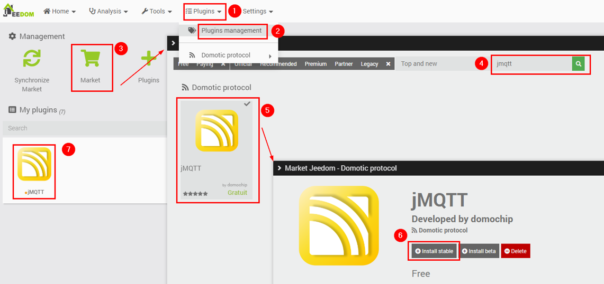

* On the plugin configuration page, activate the plugin,

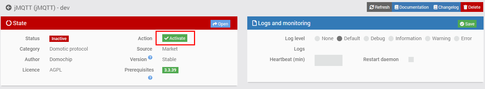

* If you don't already have a MQTT Broker or you want to install Mosquitto on the local machine, then check "Install Mosquitto locally" box.
Otherwise, if you already use the "MQTT" plugin OR the "MQTT Manager" plugin OR you already have a Broker you know of, then ensure the "Install Mosquitto locally" box is uncheck,

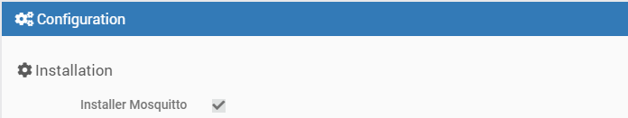

* Install the dependencies, if they have not already started,

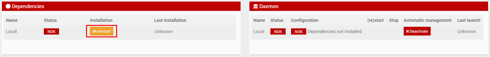

* Wait until they are installed, and start the Daemon,

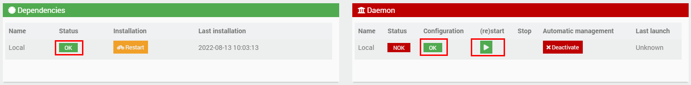

* Dependencies and Daemon are now OK,

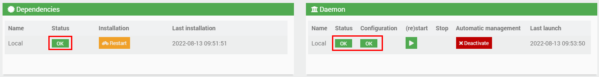

-> If you checked "Install Mosquitto locally", Then you can skip to "[Creation of the OMG device](#creation-of-the-omg-device)" step, jMQTT has automagically created a Broker called "local" for you.

## Configuration the Broker in jMQTT
* Go to the jMQTT main page via "Plugin> Domotic protocol> jMQTT",
* Click on "Add a broker",
* Enter "local" as Broker name (or whatever name you want),

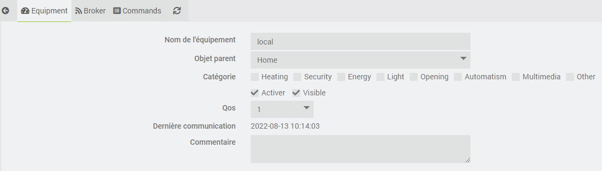

* Check "Activer" box and switch to "Broker" tab without saving (yet),
* Enter "jMQTT" as "Identifier/ClientId" so as not to interfere with other topics,
-> If your Broker is not local, then fill in "IP/Hostname of the Broker" and "Port of the Broker",

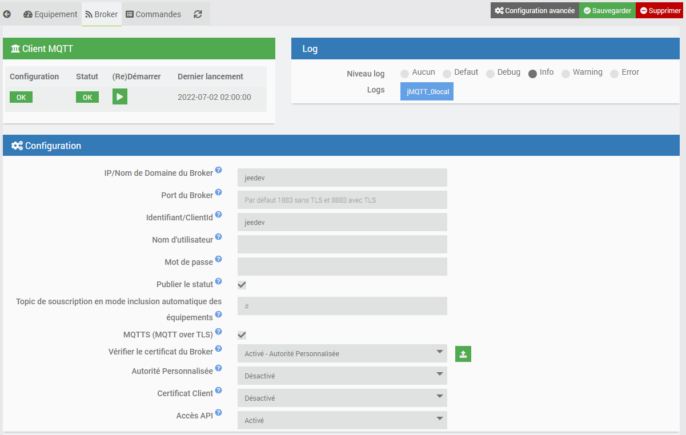

* Save the device, the initial configuration of jMQTT is complete.

If necessary, you can refer to the [complete documentation of jMQTT](https://domochip.github.io/jMQTT/) (still only in French at date).

## Creation of the OMG device
This step aims to create an equipment in jMQTT representing the OMG device itself, not yet the equipment it will see in Bluetooth. It's not necessary, but it's a good practice.
* Go to the jMQTT plugin page via "Plugin> Domotic protocol> jMQTT",
* Click on "Add equipment" on the Broker created in step 2 (or existing one):

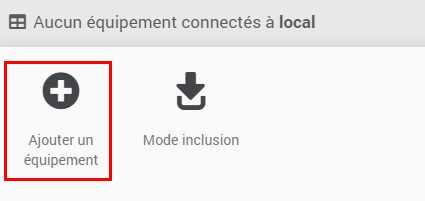

* Give it the name "gateway name" configured in step 4 (for me OMG_tuto),
* In "Registered with the Topic", put the basic topic of the EST, followed by the "gateway name", followed by a slash and a hash (for me `bt/OMG_tuto/#`), this will allow to receive all messages starting with `bt/OMG_tuto/`,
* Check the "Automatic addition of commands" box checked and the other default values,
* Activate the equipment and save:

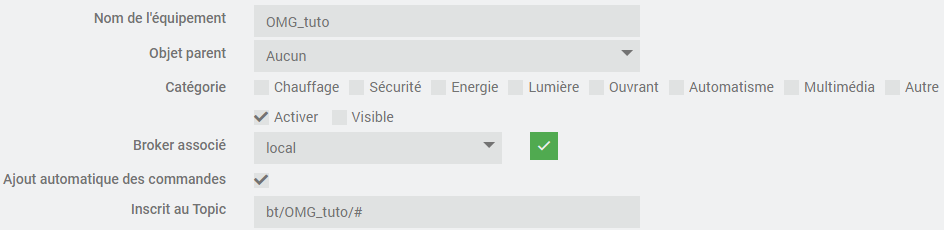

* Restart the OMG device, quickly commands should start to appear:

* Let it run for 5 minutes, go smoke a coffee, you deserve it,
* Uncheck the "Automatically add commands" box and save,
* Go to the Commands tab, several info commands should have appeared:

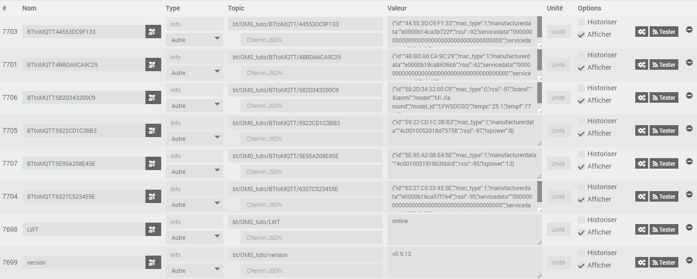

### Creation of the Last Will and Testament command
* The interesting command here is "LWT", put it in binary info, activate "Historize", deactivate "Display" and save:

* In the advanced properties of the command, Configuration tab, define the "Calculation formula" `#value# == "online"`, save:

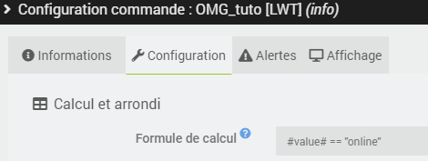

* Electrically disconnect the OMG device, the control goes to 0 after about ten seconds.
Congratulations you have a command that lets you know if your OMG device is alive!
Creation of "uptime", "freemem", "frestack" and "rssi" info commands:
* Among the discovered commands, there must also be "SYStoMQTT":

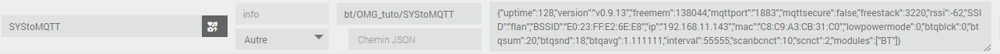

* Switch to JSON mode, there are various interesting sub-commands:

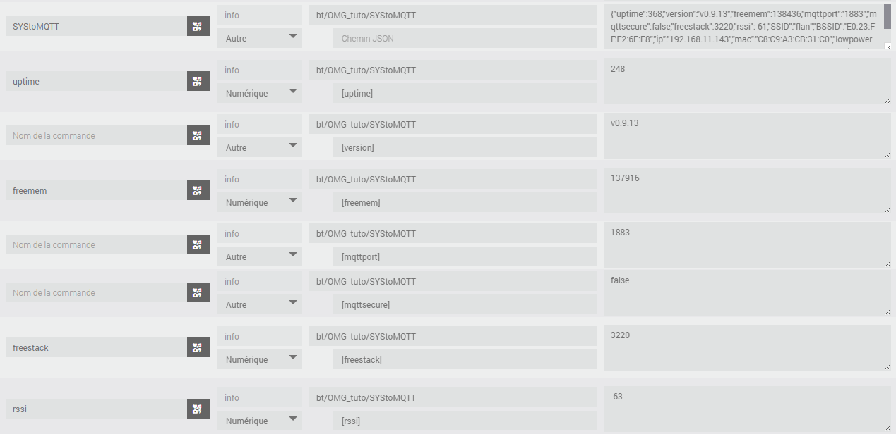

If you want, you can create 'uptime', 'freemem', 'frestack' and 'rssi'.

### Creation of an action command to restart the OMG device
* OMG has several commands 1 that can be executed directly in MQTT.
* Create an action command to restart the OMG device:

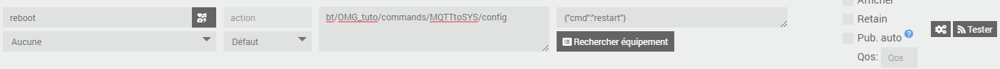

(topic: `bt/OMG_tuto/commands/MQTTtoSYS/config`; payload: `{"cmd":"restart"}`)
* Press the "Test" button on the control,
* Note after a few seconds that the "uptime" command has returned to `0`.

## Creation of the equipment for the "Xiaomi Mi Jia" sensor
"Ah, finally the interesting part?"

"The important part is not the destination, but the journey!"

### Creation of an unknown/unidentified BT device
* Create a new equipment (not a Broker) in jMQTT on the "local" Broker,
* Soberly call it "Trash",
* Enter it in the corresponding Topic for you at `bt/OMG_tuto/BTtoMQTT/#` (yes, with `/#` at the end),
* Check "Automatic command creation", "Enable", "Visible", and save,
* Many devices are detected and added to this equipment:

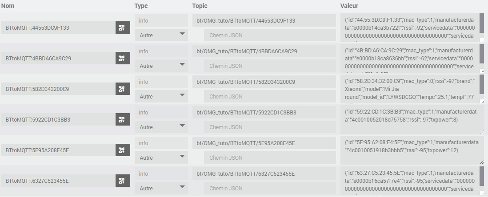

* We see that the topics always end with the MAC address of the equipment,
* Once you have identified the equipment you are interested in, 2 options are available to you:
- Disable automatic inclusion, remove all unnecessary commands; Where
- Delete this equipment and create a new one next to it.
* Let's see this second method (let's start from nothing, just the MAC or the topic).

### Creation of a known/identified BT device
* Identify in the list the MAC of your devices,
* You may have seen this in the previous captures:

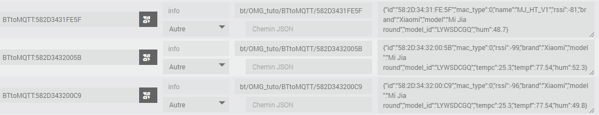

This is exactly what you think it is!

* Create a new equipment (not a Broker) in jMQTT on the "local" Broker,
* Give it for example the name "Xiaomi Mi Jia",
* Enter it in the corresponding Topic for you at `bt/OMG_tuto/BTtoMQTT/582D3431FE5F` (be careful, no `/#` at the end), with `582D3431FE5F` being the MAC of your Bluetooth device,
* Leave "Automatic addition of commands" deactivated,
* Check Enable and Visible, but no need to save for now,

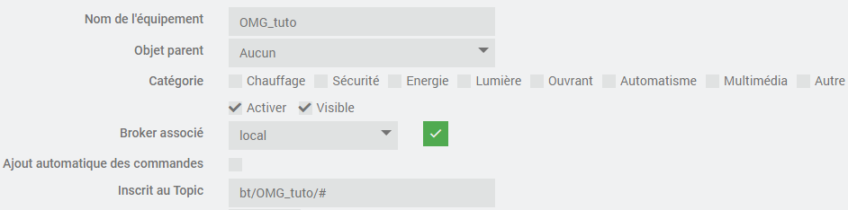

* In the Commands tab, create an info "tmp" command of another type on the topic `bt/OMG_tuto/BTtoMQTT/582D3431FE5F` and save:

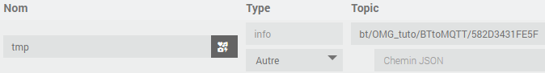

* After a few minutes, a value arrives in the command,
* Then switch to JSON view and create the commands you need:

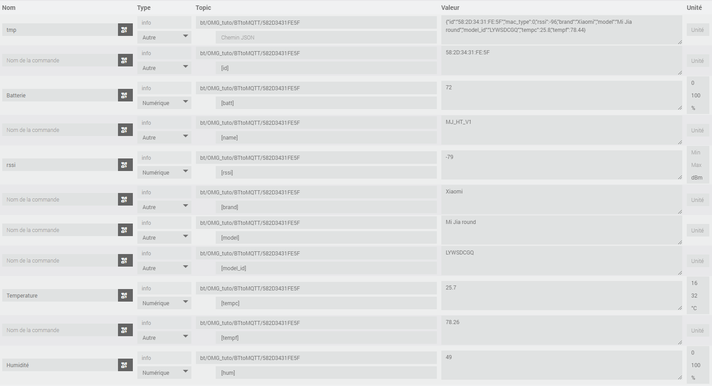

* Delete "tmp" which is no longer useful and save:

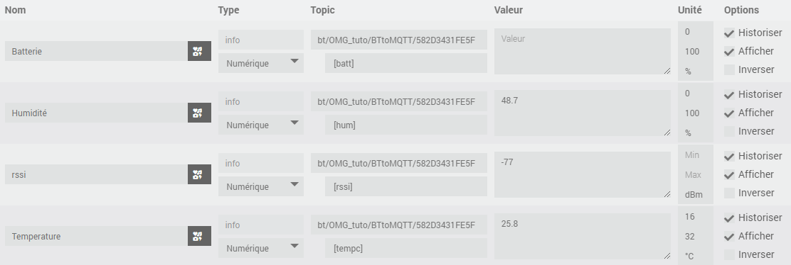

* All that remains is to do the visual part as you want it on your Dashboard:

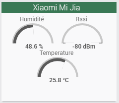

For example:

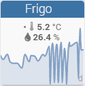

---

This has be made using Open MQTT Gateway v0.9.13, Jeedom Core v4.2.20 and jMQTT plugin v2022-07-25.

The original discussion is available on [Jeedom Community](https://community.jeedom.com/t/antenne-bluetooth-avec-un-esp32-open-mqtt-gateway-et-jmqtt/87407) (in French).
