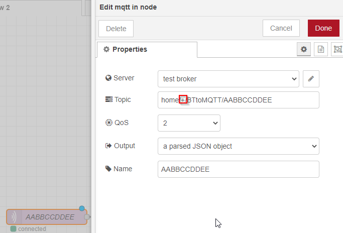
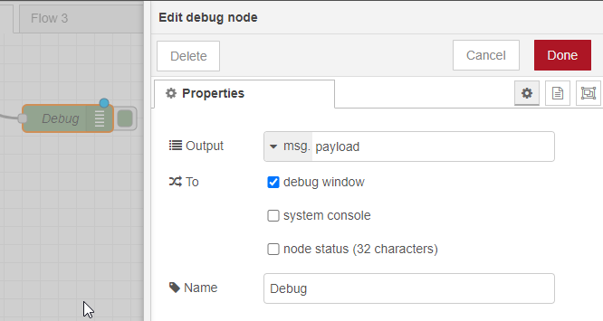
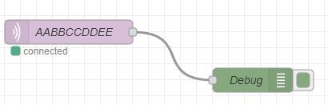
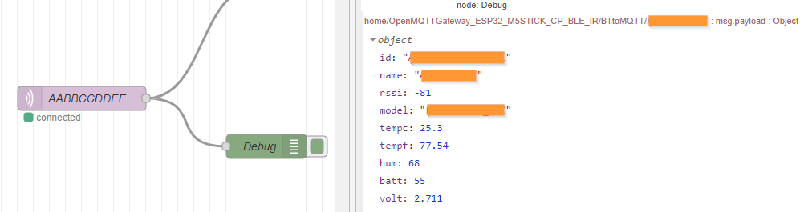
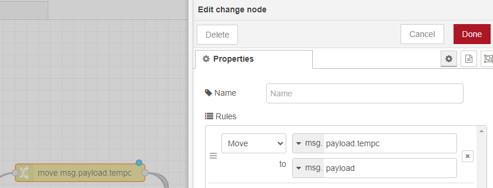
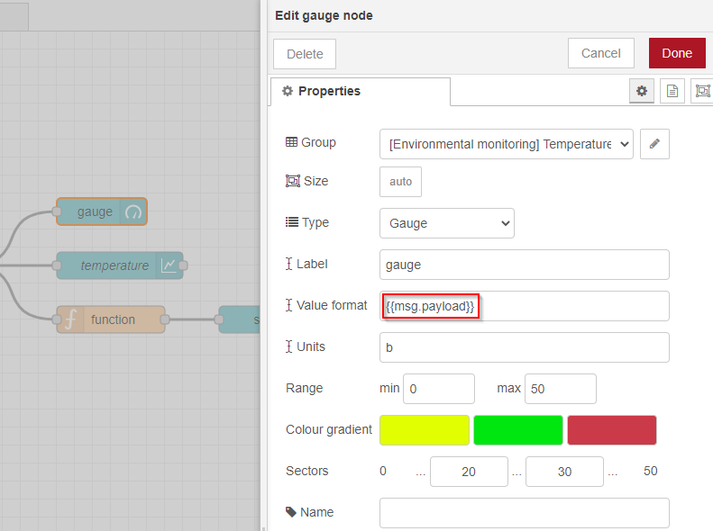
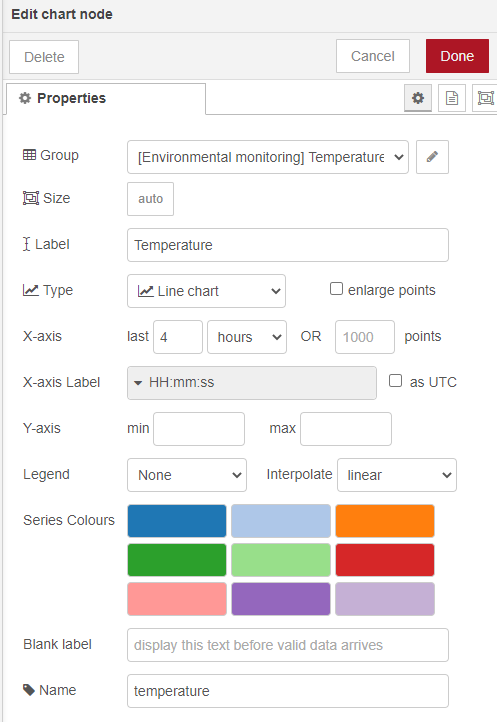
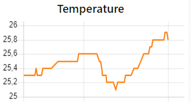
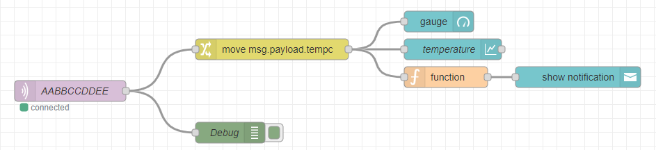

# Integrate Node-Red

## Integrate BLE sensors, devices and display a dashboard

Prerequisites: node-red, node-red-dashboard

### Broker connection
* Add a new `mqtt in` node
* Click 2 times on it
* Add a new broker or connect to an existing one (server field)
* Set the topic like below with the MAC address at the end being the one of the device you want to integrate



::: tip
The "+" enables to process the data from all the gateways whatever name they have. So you may setup several OpenMQTTGateway, you will not have to change the Node-Red configuration.
:::

This configuration enables to process all the data coming from the sensor.

* Click on done
* So as to monitor the traffic coming; you can add a debug node with *msg.payload* as Output



* Link it to the `mqtt in` node



* Deploy
* Open the debug panel
* You should see messages coming when the gateway will receive data



### Json message processing
We need to process the json message so as to extract the value that we want to display.

* Add a `change` node
* Configure it as `Move`
* Add the msg value you would like to process example *msg.payload.tempc* and the target *msg.payload*



* Connect the `change` node to the `mqtt in` node

### Dashboard
You can now add widget so as to display the value processed above

* Add a `gauge` node
* Add a group and organize your dashboard
* Add your value format to process the payload like below



* Click on Done
* Deploy
* Go to your `node-red url`/ui

You should see the gauge with the last value displayed


You can also add easily a chart node:





Or a function with a notification:




## Integrate RF
Here is a simple set of flows for integrating OpenMQTTGateway with NodeRED via an ESP8266 module.

In this example I have used a Wemos D1 Mini with some cheap RF modules.


A flow to receive 433MHz signals into NodeRED (you will need to update the IP address of your broker)


```json
[
    {
        "id": "6d1b2915.7ce798",
        "type": "mqtt in",
        "z": "a9a9b76b.e69998",
        "name": "433MQTT",
        "topic": "home/OpenMQTTGateway/433toMQTT",
        "qos": "2",
        "broker": "4572f098.cc1",
        "x": 80,
        "y": 740,
        "wires": [
            [
                "fe53b819.4f9568"
            ]
        ]
    },
    {
        "id": "fe53b819.4f9568",
        "type": "debug",
        "z": "a9a9b76b.e69998",
        "name": "",
        "active": true,
        "tosidebar": true,
        "console": false,
        "tostatus": false,
        "complete": "payload",
        "x": 290,
        "y": 740,
        "wires": []
    },
    {
        "id": "4572f098.cc1",
        "type": "mqtt-broker",
        "z": "",
        "name": "",
        "broker": "192.168.0.56",
        "port": "1883",
        "clientid": "",
        "usetls": false,
        "compatmode": true,
        "keepalive": "60",
        "cleansession": true,
        "willTopic": "",
        "willQos": "0",
        "willRetain": "false",
        "willPayload": "",
        "birthTopic": "",
        "birthQos": "0",
        "birthRetain": "false",
        "birthPayload": ""
    }
]
```

A flow to send 433MHz signals from NodeRED


```json
[
    {
        "id": "ff924d56.459d6",
        "type": "mqtt out",
        "z": "a9a9b76b.e69998",
        "name": "MQTTto433",
        "topic": "home/OpenMQTTGateway/commands/MQTTto433",
        "qos": "",
        "retain": "",
        "broker": "4572f098.cc1",
        "x": 610,
        "y": 860,
        "wires": []
    },
    {
        "id": "6c25a2d4.6c733c",
        "type": "inject",
        "z": "a9a9b76b.e69998",
        "name": "",
        "topic": "",
        "payload": "On",
        "payloadType": "str",
        "repeat": "",
        "crontab": "",
        "once": false,
        "onceDelay": 0.1,
        "x": 90,
        "y": 840,
        "wires": [
            [
                "7689fe88.45679"
            ]
        ]
    },
    {
        "id": "a76d2f03.5f3",
        "type": "change",
        "z": "a9a9b76b.e69998",
        "name": "",
        "rules": [
            {
                "t": "set",
                "p": "payload",
                "pt": "msg",
                "to": "5510487",
                "tot": "str"
            }
        ],
        "action": "",
        "property": "",
        "from": "",
        "to": "",
        "reg": false,
        "x": 380,
        "y": 840,
        "wires": [
            [
                "ff924d56.459d6"
            ]
        ]
    },
    {
        "id": "7689fe88.45679",
        "type": "switch",
        "z": "a9a9b76b.e69998",
        "name": "",
        "property": "payload",
        "propertyType": "msg",
        "rules": [
            {
                "t": "eq",
                "v": "On",
                "vt": "str"
            },
            {
                "t": "eq",
                "v": "Off",
                "vt": "str"
            }
        ],
        "checkall": "true",
        "repair": false,
        "outputs": 2,
        "x": 210,
        "y": 860,
        "wires": [
            [
                "a76d2f03.5f3"
            ],
            [
                "6a7c2c3a.567794"
            ]
        ]
    },
    {
        "id": "7e52ec9.00dde14",
        "type": "inject",
        "z": "a9a9b76b.e69998",
        "name": "",
        "topic": "",
        "payload": "Off",
        "payloadType": "str",
        "repeat": "",
        "crontab": "",
        "once": false,
        "onceDelay": 0.1,
        "x": 90,
        "y": 880,
        "wires": [
            [
                "7689fe88.45679"
            ]
        ]
    },
    {
        "id": "6a7c2c3a.567794",
        "type": "change",
        "z": "a9a9b76b.e69998",
        "name": "",
        "rules": [
            {
                "t": "set",
                "p": "payload",
                "pt": "msg",
                "to": "4527444",
                "tot": "str"
            }
        ],
        "action": "",
        "property": "",
        "from": "",
        "to": "",
        "reg": false,
        "x": 380,
        "y": 880,
        "wires": [
            [
                "ff924d56.459d6"
            ]
        ]
    },
    {
        "id": "20991aea.cca8a6",
        "type": "comment",
        "z": "a9a9b76b.e69998",
        "name": "Set you RF codes here.",
        "info": "",
        "x": 380,
        "y": 800,
        "wires": []
    },
    {
        "id": "4572f098.cc1",
        "type": "mqtt-broker",
        "z": "",
        "name": "",
        "broker": "192.168.0.56",
        "port": "1883",
        "clientid": "",
        "usetls": false,
        "compatmode": true,
        "keepalive": "60",
        "cleansession": true,
        "willTopic": "",
        "willQos": "0",
        "willRetain": "false",
        "willPayload": "",
        "birthTopic": "",
        "birthQos": "0",
        "birthRetain": "false",
        "birthPayload": ""
    }
]
```
