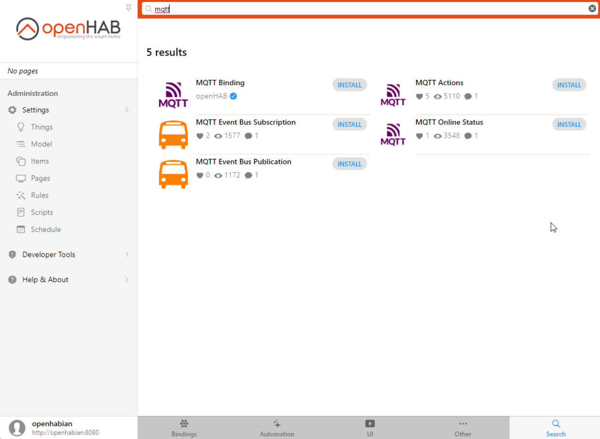

# Integrate OPENHAB3

This tutorial will show how to integrate the BLE gateway to OpenHAB3 leveraging the auto discovery functionality.
After this tutorial, you should see your Bluetooth Low Energy devices in OpenHAB3 without any file based manual configuration.

## Prerequisites
* OpenHAB 3.3 or higher
* MQTT broker installed with or without authentication
* A location defined in the "Model" section under "Settings"

## IP address (if your broker is installed on the same server as OpenHAB)
The goal is to disable the IPv6 address of the broker server, so that the gateway can connect through IPv4.
1. From the Administration click on Settings
2. Click on Network Settings
3. Click on Show Advanced
4. Disable IPv6
5. Click on Save

::: warning Note
If the broker is installed on another server you will also need to configure it with an IPv4 address.
:::

## Install the MQTT binding
1. From the Administration click on Settings
2. Click on Bindings
3. Install the MQTT binding (you can search at the bottom right)

4. Once installed click on Things under Settings
5. Click on the + at the bottom right
6. Click on MQTT Binding

7. Click on MQTT broker

8. Enter for the "Broker Hostname/IP" field, the IP address of your broker, if it is installed on the same server you can enter `localhost`

9. Click on "Show Advanced" if your broker has authentication activated, if not you can go to step 11
10. Enter the broker credentials: username and password

11. Click on Create Thing at the bottom, you should see your MQTT Broker in the Things list with the status "online"

Bravo👏, second step done! Now let's add the Jinja transformation service.

## Install Jinja Transformation
1. From the Administration click on Settings
2. Click on Bindings
3. Install Jinja Transformation (you can search at the bottom right)

Second step done!

## Upload OpenMQTTGateway to an ESP32
[Upload OpenMQTTGateway from the web](../upload/web-install.md) by selecting `esp32dev-ble-openhab`

Or use another upload method from the Upload section.

## Configure OpenMQTTGateway from the web portal
[Wifi and MQTT configuration](../upload/portal.md)

Or use another upload method from the Upload section that requires credentials before the build.

You should see the gateway connected to your broker by checking with an MQTT client like MQTT Explorer.

## Adding the things
1. From the Administration click on "Things" under "Settings", you should see a number in the INBOX button

2. Click on INBOX, you should see your BLE devices and the gateway

3. Click on a device, a pop up "Add as Thing" should appear
4. Rename it if you need, and click OK, repeat for each Thing discovered. The devices should appears as online progressively.

5. Click on Model
6. Select the location of where you want to create the Equipment
7. Click on "Create Equipment from Thing"
8. Click on Thing
9. Select a Thing
10. Rename your Equipment if you need
11. Select the Channels

12. Click on "Add to Model"
13. Go to Model, if you unfold your location and Equipment you should be able to see values

Congratulation🎉! You were able to get data from your BLE sensors into OpenHAB. You can now add the others and use the data to build pages, leverage rules and enjoy all the function of your Home Automation controller with BLE devices.

