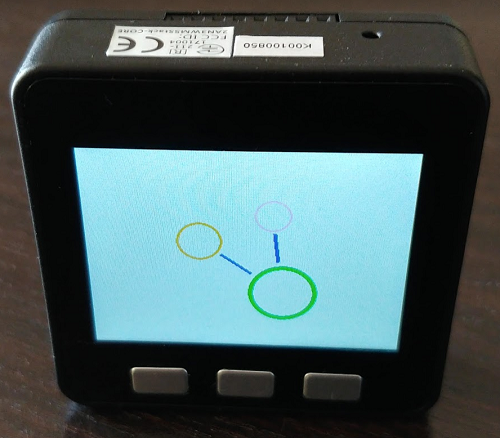
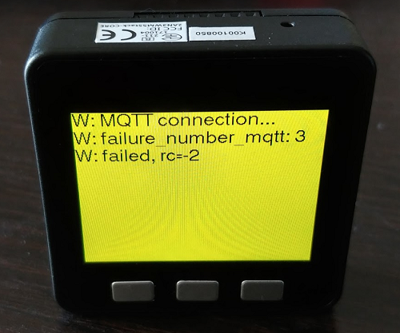

# M5 Boards
M5 boards, manufactured by [M5Stack](https://m5stack.com/) are inexpensive, well featured boards based on ESP32.

## M5StickC and M5Stack
M5StickC and M5Stack are supported by OpenMQTTGateway and provide the following features:

### 3 low power modes 
#### Always ON display
The display is always ON but decrease its brightness when not processing.

#### ON display when processing
The display is OFF when not processing and the ESP32 is put in low power mode.

#### Always OFF display
The display is always OFF, if the board has a led, the led is used when processing.

To change the low power mode you can do it by [MQTT](../use/boards#low-power-mode-for-m5-boards) or by pushing the middle button (btn B) of the M5Stack and the top button (btn B) of the M5Stick C

### Start screen

### Sleep screen
The screen brightness is put to a minimum so as to reduce power consumption.

### Log display in case of warning
If the gateway detects a warning or an error the sleep go out the sleep screen and show the message with a red (error) or orange (warning) background.

The M5Stick support low power mode 2 but its display is not supported for the moment.
