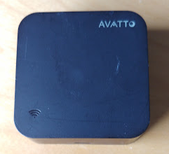
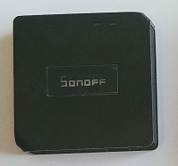
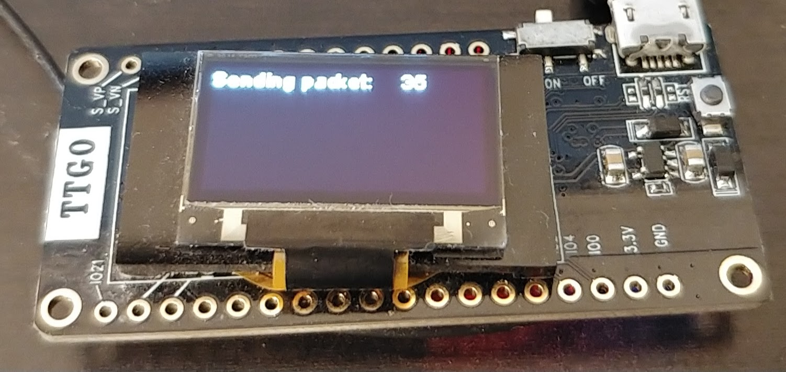
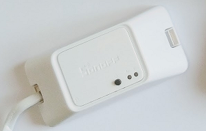
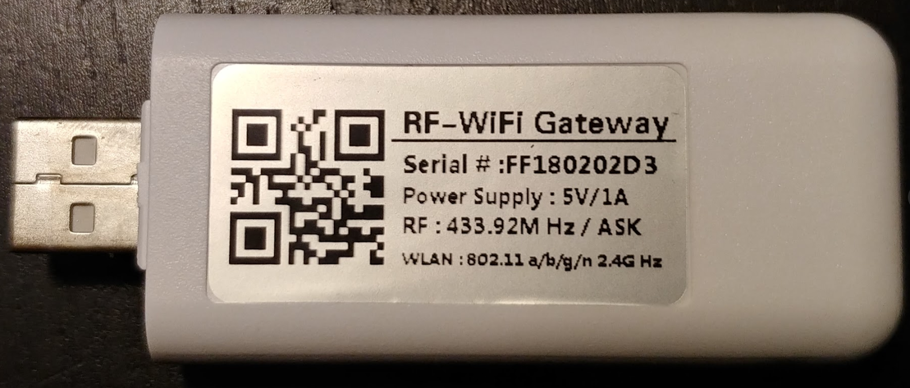
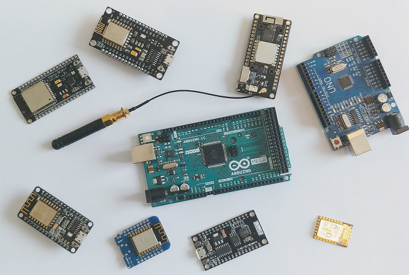

# Board
OpenMQTTGateway is not closed to one board or type of board, by using the power of the Arduino framework and libraries that are cross compatibles it let you many choice of hardware, from an Arduino UNO to an ESP32.

You can take a look to the [OpenMQTTGateway compatible website](https://compatible.openmqttgateway.com) to have a view of the [supported boards](https://compatible.openmqttgateway.com/index.php/boards/).

Moreover the gateways capacities can be extended with sensors; DHT, HC SR501, ADC, I2C bus, INA226, TSL2561, BME280, HTU21D, AHTx0, DS1820
or actuators; LED, relays, PWM.

Here is some information to find the board suitable for your need, you have the choice between off the shelves boards and DIY setup.

## Off the shelves boards
The boards below doesn't need hardware modification (or a lite one).
|Off the shelves wifi boards|Pictures|RF|IR|BLE|LORA|Relay|Display|Low Power|
|-|:-:|:-:|:-:|:-:|:-:|:-:|:-:|:-:|
|AVATTO / BAKEEY||-|[X](https://1technophile.blogspot.com/2020/07/avatto-s06-ir-gateway-compatible-with.html)|-|-|-|-|-|
|Sonoff RF Bridge (*) ||X|[mod](https://1technophile.blogspot.com/2018/02/adding-infrared-emitter-to-sonoff-rf.html)|-|-|-|-|-|
|All bare ESP32|-|-|-|X|-|X|-|X|
|OLIMEX ESP32 Ethernet|-|-|-|X|-|X|-|X|
|ESP32-WT32-ETH01 Ethernet|-|-|-|X|-|X|-|X|
|[M5Stack Basic](M5)||-|-|X|-|X|X|X|
|[M5Tough](M5)|-|-|-|X|-|X|X|X|
|M5Stick|-|-|send|X|-|X|-|X|
|[M5Stick C](M5)||-|send|X|-|X|X|X|
|[M5Atom](M5)||-|send|X|-|X|X|X|
|TTGO LORA32||-|-|-|X|-|-|-|
|Sonoff RFR3||[receiving](https://1technophile.blogspot.com/2019/08/new-sonoff-rfr3-as-433tomqtt-gateway.html)|-|-|-|X|-|-|
|Sonoff Basic|-|-|-|-|-|X|-|-|
|RF WIFI GATEWAY||[receiving](https://1technophile.blogspot.com/2019/09/hack-of-rf-wifi-gateway-usb-stick.html)|-|-|-|-|-|-|

'(*)' *So as to extend the number of RF protocols supported by the Sonoff RF Bridge you can apply a [hardware hack](https://1technophile.blogspot.com/2019/04/sonoff-rf-bridge-pilight-or-how-to.html), this way you will be able to use RFm Pilight or RF2 gateway.*

## DIY boards
The boards below need hardware [parts](parts.md) and electronic/hardware competencies. You have more possibilities of gateways combination, compared to off the shelves ones.
|DIY boards|RF|IR|BLE|LORA|GSM|Button|Relay|
|-|:-:|:-:|:-:|:-:|:-:|:-:|:-:|
|Arduino UNO|X|X(limited compared to ESP)|-|-|-|X|X|
|Arduino MEGA|X|X(limited compared to ESP)|X|-|-|X|X|
|ESP32|X|X|X|X|not tested|X|X|
|ESP8266|X|X|X|not tested|X|X|X|

::: tip
Pilight is only supported on ESP, Arduino UNO handle only 32bits values in our context.
Setup based on HM10 doesn't support some BLE [devices](devices.md#for-ble-devices).
:::

Arduino + ethernet shields enables faster responsiveness of the gateway and a reliable connection. 

The ESP platform is more flexible in term of installation (no need of an ethernet cable) but is less reliable in term of communication. Thanks to its higher memory and processing power it has more modules or possibilities compared to arduino Uno & Mega.

Choosing your board depends heavily on the technologies you want to use with it.
To have a good overview of the compatibilities per board you can refer to the compatible modules attributes of each [board](https://compatible.openmqttgateway.com/index.php/boards/).

The choice between these boards will depend on your knowledge and your requirements in terms of reliability, situation, modules wanted and devices you already have.

