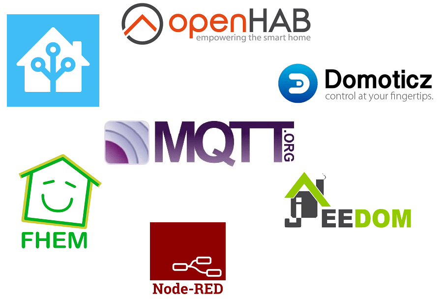

# Controller
MQTT enables you to connect easily a controller so as to monitor, control and automate scenarios.

The following controllers (and many other software) are compatible with MQTT:

OpenMQTTGateway is independent from these projects, you have the liberty of choice among all the compatible software.

* [OpenHAB](https://www.openhab.org)
* [Home Assistant](https://www.home-assistant.io)
* [Domoticz](https://www.domoticz.com)
* [Jeedom](https://www.jeedom.com)
* [Node Red](https://nodered.org)
* [FHEM](https://fhem.de)
