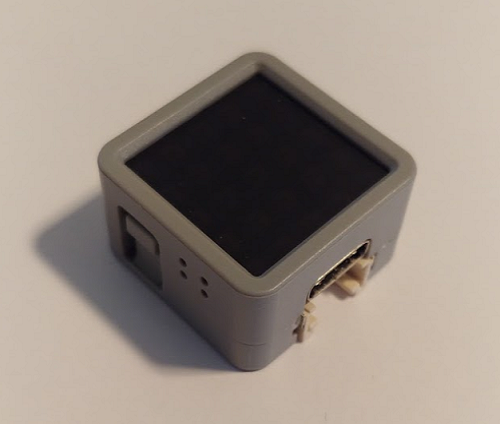

# BLE gateway
## Compatible parts
**The ESP32 has an integrated BLE module**, with this board the BLE gateway don't need any additional hardware. Making it the **advised board for BLE**.

You can use a barebone ESP32 or some nice looking products like the ones below (from M5Stack):

For Arduino and ESP8266, we previously used HM10, this module is no longer supported by OpenMQTTGateway, prefer an ESP32.
