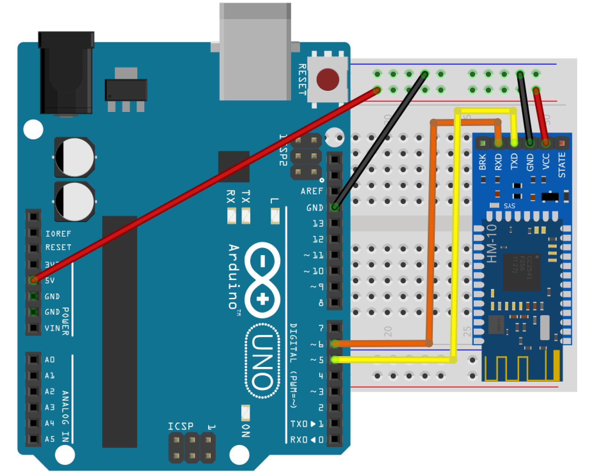
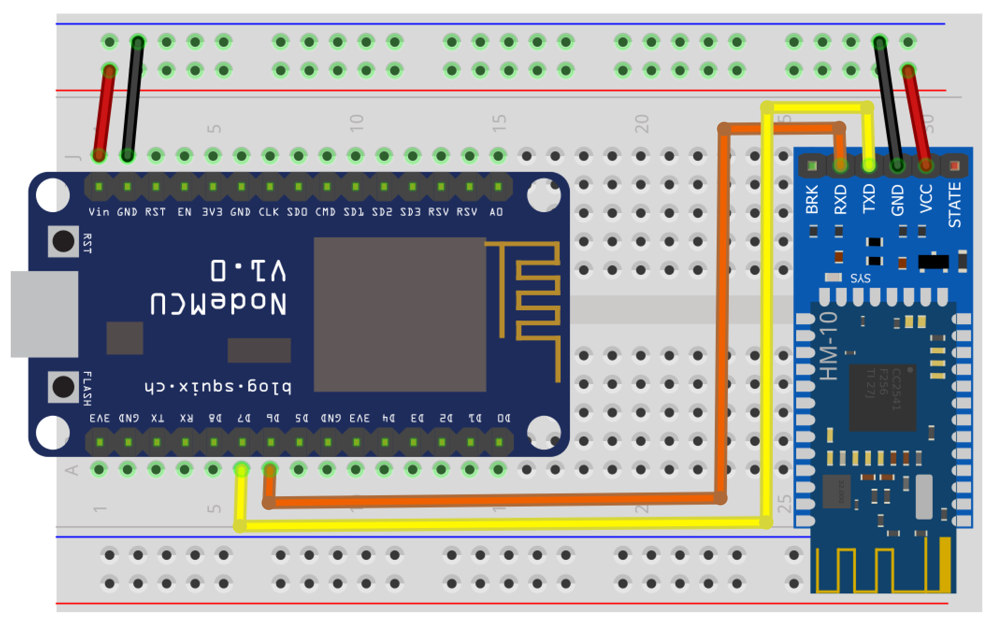

# BLE gateway
## Compatible parts
**The ESP32 has an integrated BLE module**, with this board the BLE gateway don't need any additional hardware. Making it the **advised board for BLE**.

For Arduino and ESP8266 you can use an HM10 or HM11 below.
|Module|Purpose|Where to Buy|
|-|-|-|
|HM 10 Keyes bluetooth module|Bluetooth|[compatible parts list](https://docs.google.com/spreadsheets/d/1_5fQjAixzRtepkykmL-3uN3G5bLfQ0zMajM9OBZ1bx0/edit#gid=1323184277)|

## Pinout
|Module Pin|Board RX Pin|Board TX Pin|
|-|:-:|:-:|
|Arduino|D6 to HM10 TX|D5 to HM10 RX|
|ESP8266|D6 to HM10 TX|D7 to HM10 RX|

Vcc pin of the board and the HM10 Module to a 5V supply source.
Ground pins of the board and the HM10 Module to the ground of the supply source.

### Debugging the HM10
So as to communicate directly with the HM10 you may use [this program](https://github.com/1technophile/serial_modules_debug) from Martin Currey, you can upload it to your ESP board and it will enable without an FTDI to write and read commands directly to the HM10 through the ESP. You may use the Arduino IDE Serial Monitor to read and send the commands.
The baud rate of the HM10/11 module must be set to 9600 bauds , the command `AT+BAUD?` enables to know at which speed the module is set.
So as to set it to 9600 that you may use `AT+BAUD0` command.

The HM10/11 firmware version must be  >= v601, the command `AT+VERS?` enables to know the firmware version.

## Arduino Hardware setup

## ESP8266 Hardware setup

The implementation with the HM10 module would not have been possible without the work of [Martin Currey]( http://www.martyncurrey.com), thanks!
