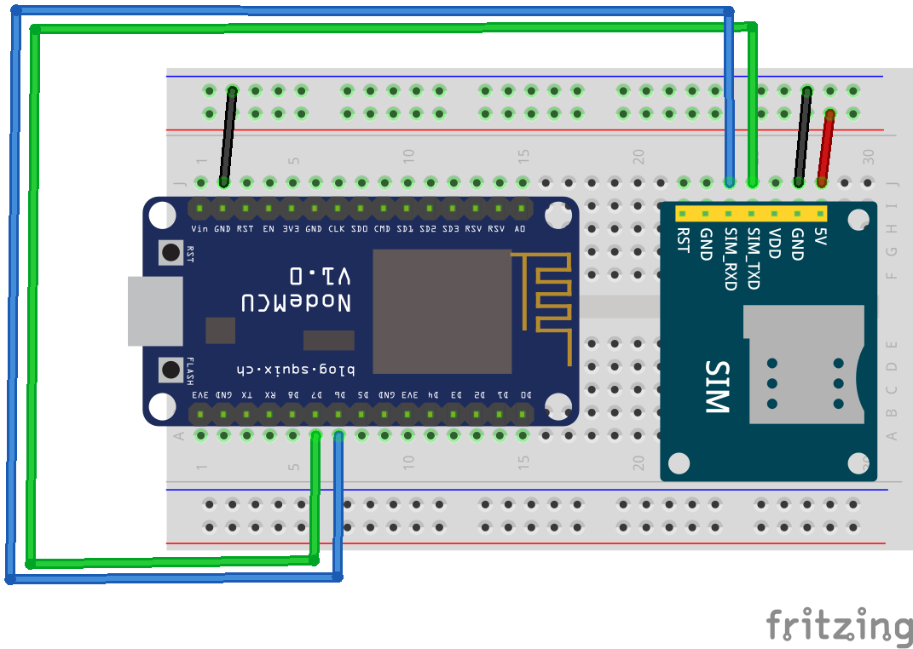

# GSM 2G gateway
## Compatible parts

|Module|Purpose|Where to Buy|
|-|-|-|
|A6|GSM GPRS module|[compatible parts list](https://docs.google.com/spreadsheets/d/1_5fQjAixzRtepkykmL-3uN3G5bLfQ0zMajM9OBZ1bx0/edit#gid=1323184277)|
|A7|GSM GPRS module with GPS|[compatible parts list](https://docs.google.com/spreadsheets/d/1_5fQjAixzRtepkykmL-3uN3G5bLfQ0zMajM9OBZ1bx0/edit#gid=1323184277)|

## Hardware setup

|Module Pin|NodeMCU / ESP8266 Pin|
|-|:-:|
|H_RXD|D6|
|H_TXD|D7|
|GND|GND|
|VCC5|MOSFET driven by D5|

For VCC5 you can power it directly all the time with an USB cable or use a MOSFET like [here](https://gitlab.com/stavros/A6-ESP8266-breakout/raw/master/images/schematic.png)

Don't use the nodemcu/wemos 5V pin for the A6/7 power, use a dedicated power supply for both or dedicated to the A6/7 with at least 2 amps ability.

So as to start your A6/7 module press the red button for 4 seconds, or link the PWR_KEY GPIO to VCC5.0 for the same time.

