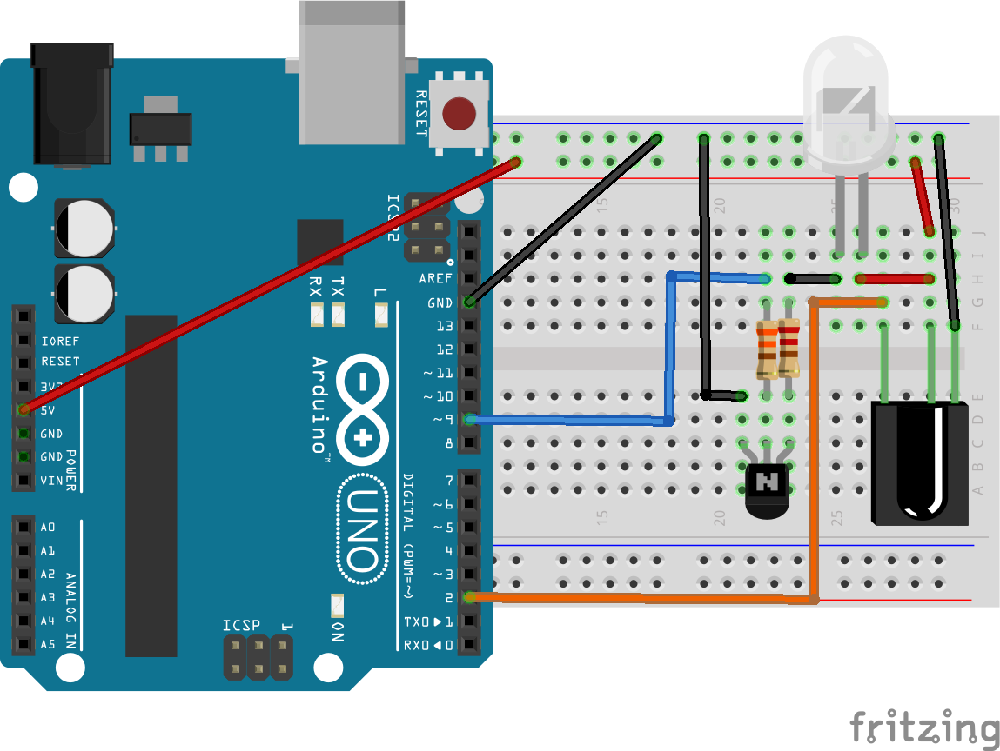
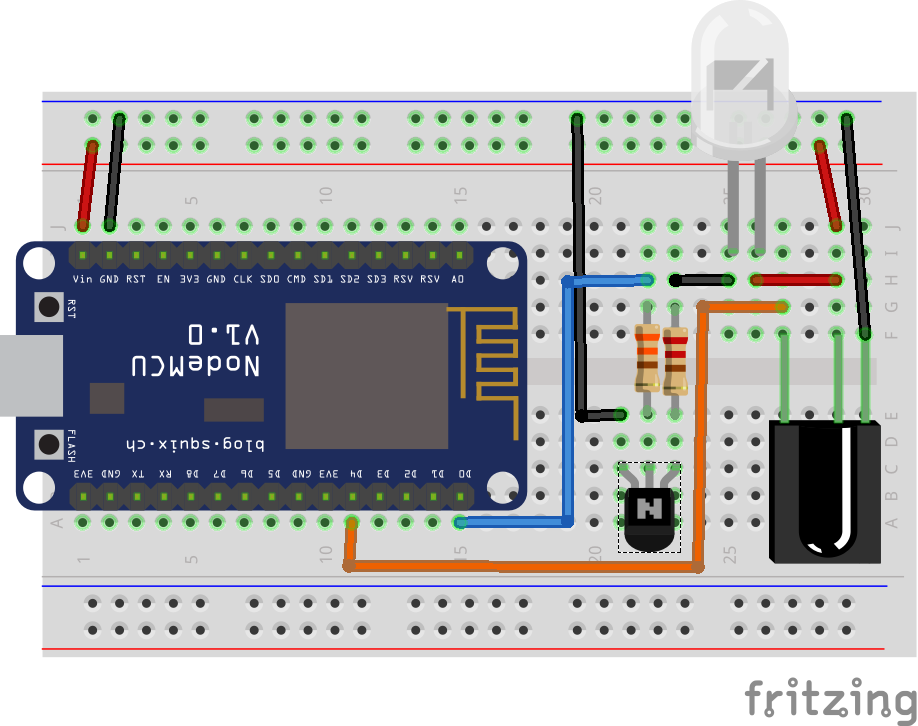
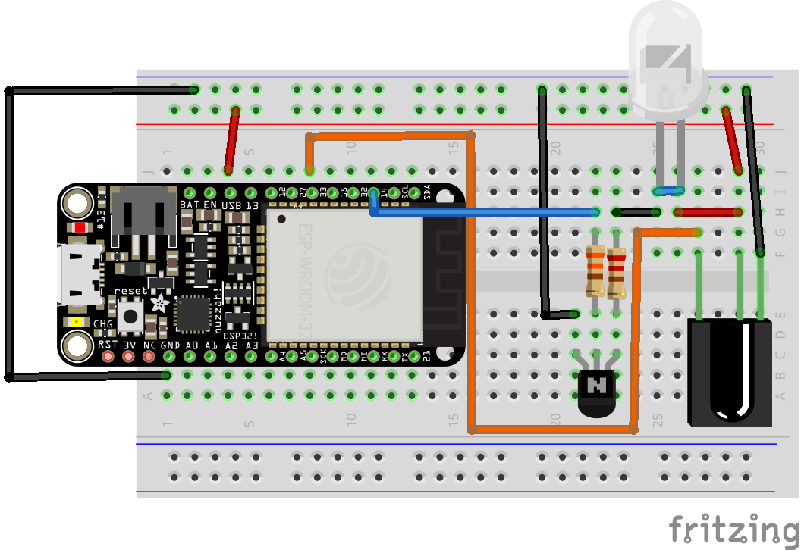

# IR gateway
## Compatible parts
|Module|Purpose|Where to Buy|
|-|-|-|
|IR diode|Emitting|[compatible parts list](https://compatible.openmqttgateway.com/index.php/parts)|
|IR receiver|Receiving|[compatible parts list](https://compatible.openmqttgateway.com/index.php/parts)|
|transistor 2N2222|Amplify uC signal for the IR diode|-|
|330 ohms resistor|-|[compatible parts list](https://compatible.openmqttgateway.com/index.php/parts)|
|220 ohms resistor|limit current to LED|[compatible parts list](https://compatible.openmqttgateway.com/index.php/parts)|

The IR setup can work with bc547 and a 4x3 LED-Matrix.

## Pinout
|Board| Receiver Pin| Emitter Pin|
|-|:-:|:-:|
|Arduino UNO|D2|D9|
|ESP8266|D4|D0|
|ESP32|27/**26**|14|

Connect the Emitter and Receiver to a 5V supply source, and the ground of your supply source to the ground of your board.

## Arduino Hardware setup

## ESP8266 Hardware setup

## ESP32 Hardware setup

## Credits
This gateway exists thanks to the work done on [IRRemote](https://github.com/z3t0/Arduino-IRremote) and [IRremoteESP8266](https://github.com/crankyoldgit/IRremoteESP8266) libraries. Thanks for the works of contributors and especially [@crankyoldgit](https://github.com/crankyoldgit) for its active contributions.
