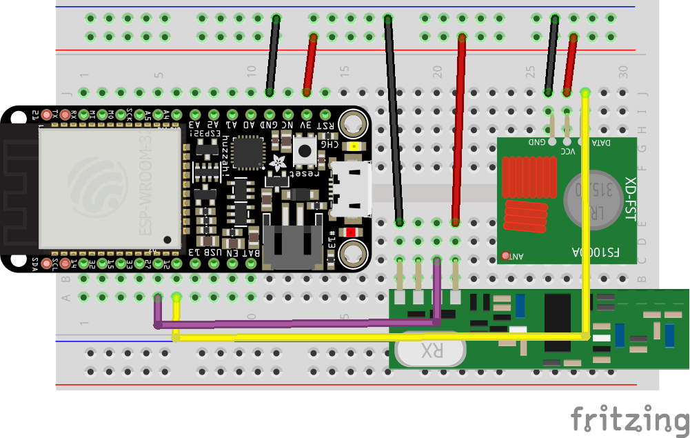
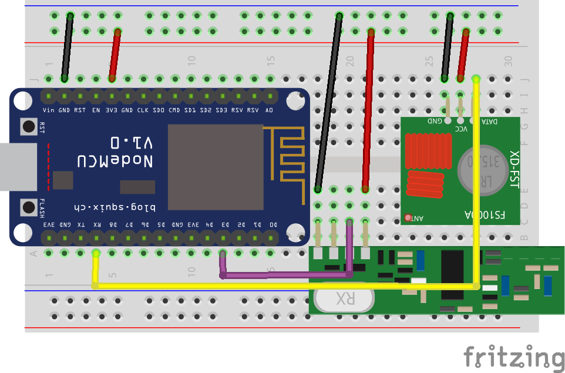

# RF gateway (433mhz/315mhz)

## Protocols, modules and library

RTL_433 covers OOK protocols detailed [here](../use/rf#supported-decoders) and supports auto-discovery following Home Assistant convention. The other libraries/modules are more for advanced users.

|Board| Protocols|Assembly/Soldering required|
|-|:-:|:-:|
|Heltec LORA V2 433Mhz|[RTL_433](../use/rf#supported-decoders), receiving only|No|
|LILYGO® LoRa32 V2.1_1.6.1 433 Mhz|[RTL_433](../use/rf#supported-decoders), receiving only|No|
|ESP32 + SX127X|[RTL_433](../use/rf#supported-decoders), receiving only|Yes|
|ESP32 + CC1101|[RTL_433](../use/rf#supported-decoders), RF(RCSwitch), RF2(KaKu), Pilight|Yes|
|ESP8266 + Basic RF modules (SRX, STX, XD RF, FS1000A|RF(RCSwitch), RF2(KaKu), Pilight|Yes|
|ESP8266 + CC1101 (might have lower range than with SRX/STX above)|RF(RCSwitch), RF2(KaKu), Pilight|Yes|
|ESP32 + Basic RF modules (SRX, STX, XD RF, FS1000A|RF(RCSwitch), RF2(KaKu), Pilight|Yes|

:::tip
If you want to try the RTL_433 module with a combination or a board outside of this list, verify that it has an SX1278 or a SX1276
:::

Heltec LORA V3 is not compatible with RTL_433 library as it is based on an SX1262 module.

## Assembly/soldering required parts
|Module|Purpose|Compatible modules|Receiver Switching|Where to Buy|
|-|-|-|-|-|
|SRX882 or SRX882S (recommended)|433Mhz Receiver|RF(RCSwitch), RF2(KaKu), Pilight|Supported|[compatible parts list](https://compatible.openmqttgateway.com/index.php/parts)|
|STX882 (recommended)|433Mhz Transmitter|RF(RCSwitch), RF2(KaKu), Pilight|Supported|[compatible parts list](https://compatible.openmqttgateway.com/index.php/parts)|
|CC1101|433Mhz Transceiver|[RTL_433](../use/rf#supported-decoders), RF(RCSwitch), RF2(KaKu), Pilight|Supported|[compatible parts list](https://compatible.openmqttgateway.com/index.php/parts)|
|SX1276/SX1278|433Mhz Transceiver|[RTL_433](../use/rf#supported-decoders)|Not Supported|[compatible parts list](https://compatible.openmqttgateway.com/index.php/parts)|
|LilyGo/Heltec|433Mhz Transceiver|[RTL_433](../use/rf#supported-decoders)|Not Supported|[compatible parts list](https://compatible.openmqttgateway.com/index.php/parts)|

### SRX STX Pinout
|Board| Receiver Pin| Emitter Pin|
|-|:-:|:-:|
|Arduino UNO|D3|D4|
|ESP8266|D2/**D3**/D1/D8|**RX**/D2|
|ESP32|**27**/26|12|
|RF BRIDGE|-|-|
|RF BRIDGE [DIRECT HACK](https://github.com/xoseperez/espurna/wiki/Hardware-Itead-Sonoff-RF-Bridge---Direct-Hack)|4|5|
|SONOFF RFR3|4|-|
|RF WIFI GATEWAY|5|-|

Connect the Emitter and Receiver to a 5V or 3.3V supply source, check datasheet of your modules to confirm (**3.3V** for CC1101), and the ground of your supply source to the ground of your board.

:::tip
With SRX882S receiver connect the CS pin to 3.3V
:::

### CC1101 Pinout
|Board|Receiver Pin(GDO2)|Emitter Pin(GDO0)|SCK|VCC|MOSI|MISO|CSN|GND
|-|:-:|:-:|:-:|:-:|:-:|:-:|:-:|:-:|
|ESP8266|D2/**D3**/D1/D8|**RX**/D2|D5|**3V3**|D7|D6|D8|GND
|ESP32|**D27**|D12|D18|**3V3**|D23|D19|D5|GND

To use the CC1101 module, `ZradioCC1101` must be uncomment in the `User_config.h` or added to the `build_flags`.
More information about the [CC1101 wiring](https://github.com/LSatan/SmartRC-CC1101-Driver-Lib#wiring). ( Please note that with OMG we are recommending CC1101 GDO2 to be connected to ESP32 D27 and GDO0 to be connected to D12, this is different than the LSatan diagram. This is due to the ESP32 using D2 as part of the boot process. )

## ESP32 Hardware setup

## ESP8266 Hardware setup
If the gateway works only when serial monitor is connected don't use D3 use D2 instead (gpio 4) and modify config_RF.h accordingly.

With SRX882 some users reported that D3 is not working use D1 instead in this case and modify config_RF.h accordingly.

## Arduino Hardware setup

## SONOFF RF Bridge Hardware setup
Per default there is no need on modifying the RF Bridge hardware, unless you don't want to use the provided RF controller (EFM8BB1). Indeed if you want to extend the protocols supported by the bridge you can [bypass this controller](https://github.com/xoseperez/espurna/wiki/Hardware-Itead-Sonoff-RF-Bridge---Direct-Hack) and use the ESP8255 capacities to decode RF Signal.
The RF processing can be achieved after the modification by either RF, RF2 or Pilight gateways.

## SONOFF RFR3 Hardware setup
[Connect GPIO4 of the ESP8255 to the pin D0 of SYN470](https://1technophile.blogspot.com/2019/08/new-sonoff-rfr3-as-433tomqtt-gateway.html)

## WIFI RF GATEWAY Hardware setup
This board doesn't require any hardware modifications.
