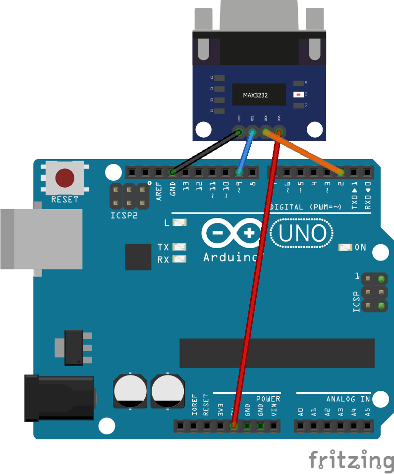
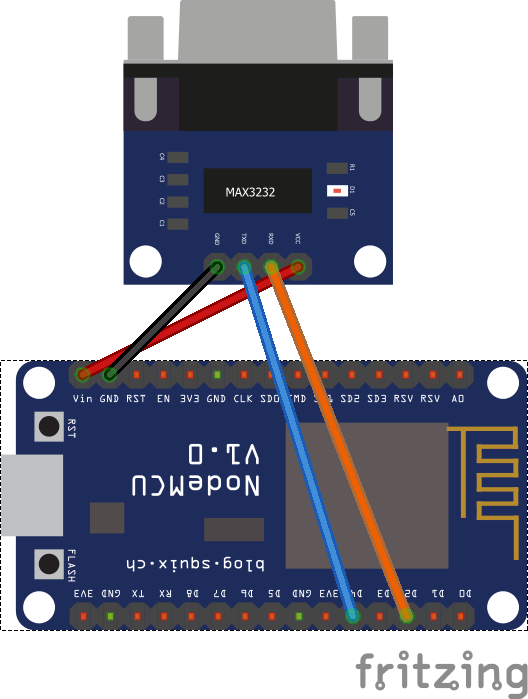
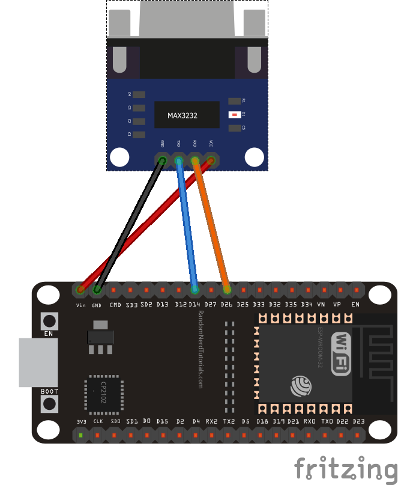

# RS232 gateway
## Compatible parts
|Module|Purpose|Where to Buy|
|-|-|-|
|TTL to RS232 module|Transceiving|-|

Any module using a MAX232 chip will work. Don't pay extra to get all the signals, we're only using RX and TX.

## Pinout
|Board| Receiver Pin| Emitter Pin|
|-|:-:|:-:|
|Arduino UNO|D2|D9|
|ESP8266|D2|D4|
|ESP32|27/**26**|14|

Connect VCC on the module to 5V of your board, and the ground on the module to the ground of your board. your Transmit pin goes to TX and your Receive pin goes to RX. This may seem backwards, but the module is labeled as where it will be connected on the RS232 side of the module.

## Arduino Hardware setup

## ESP8266 Hardware setup

## ESP32 Hardware setup

## Credits
RS232 Gateway Developed by DieKatzchen