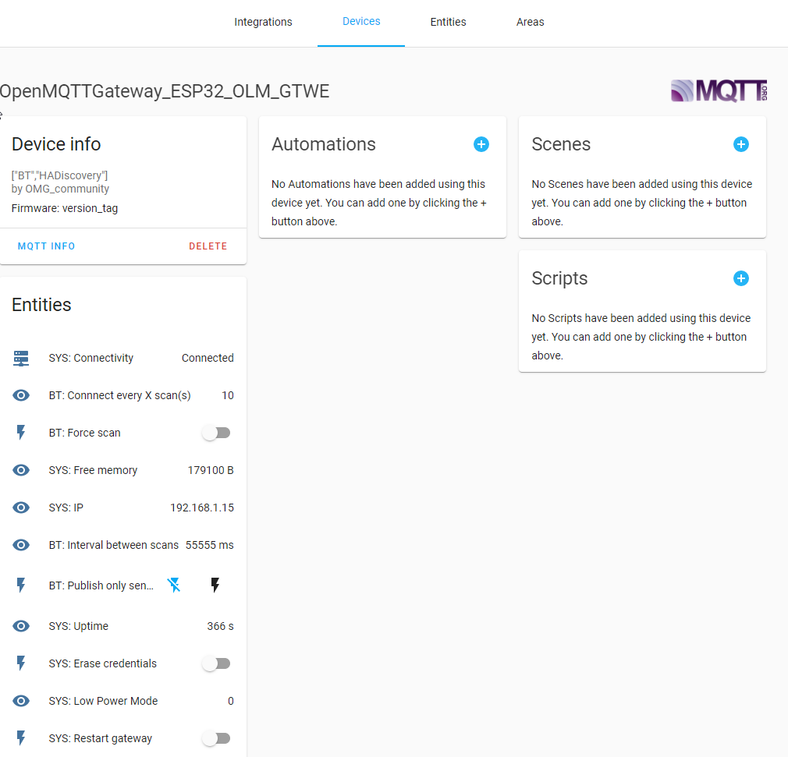

# Advanced configuration of the gateway

## Secure connection to the broker
By default the connection between the gateway and the MQTT broker is not encrypted and the identity of the broker is not verified.
For connections in a private local area network this might not be a big issue, but if you connect to a broker on the internet or the gateway is connected to a public network there is a high security risk.

To secure the connection, Transport Layer Security (TLS) can be used which is supported by most MQTT brokers.
Setting up and configuring TLS in the MQTT broker is a complex process and perhaps include creating a self-signed certificate.
The configuration of the broker is not covered here, you should look into the documentation of your broker.

### Prerequisites
The MQTT broker is configured for TLS and you have access to the CA certificate which was used to sign the MQTT broker certificate.
You are using ESP8266 or ESP32, for other boards TLS is not supported.

### Configure secure connection in the gateway
To enable the secure connection and use TLS set the `#define MQTT_DEFAULT_SECURE` to true.
Set `MQTT_SERVER` to the Common Name (CN) of the certificate of the broker.
This can be the hostname or the IP of the broker.

The CA certificate should be in PEM ascii format.
If your CA certificate is not in the correct format or you don't know the format, use `openssl` to convert the certificate to the correct format.
In `User_config.h` replace the `...` with the content of your certificate which is between the `-----BEGIN CERTIFICATE-----` and `-----END CERTIFICATE-----` lines:
```cpp
const char* certificate CERT_ATTRIBUTE = R"EOF("
-----BEGIN CERTIFICATE-----
...
-----END CERTIFICATE-----
")EOF";
```

You can know compile and upload to your board and the gateway should connect with TLS to your broker.

## Add the received "value" at the end of the topic
For the gateways that publish a "value" parameter on the json (RF, IR...), it is possible to concatenate this parameter at the end of the topic.
So as to activate this function you need to set `valueAsATopic` to true in User_config.h

``` cpp
#ifndef valueAsATopic
#  define valueAsATopic false // define true to integrate msg value into the subject when receiving
#endif
```

Per default you see the following data:
```
home/OpenMQTTGateway/SRFBtoMQTT {"raw":"2B660186042E00E7E5","value":"59365","delay":"1111","val_Thigh":"390","val_Tlow":"1070"}
```

With the line uncommented you will see:
```
home/OpenMQTTGateway/SRFBtoMQTT/59365 {"raw":"2B660186042E00E7E5","value":"59365","delay":"1111","val_Thigh":"390","val_Tlow":"1070"}
```

It can be useful to avoid warning or errors on certain controllers.

## Auto discovery
Home Assistant discovery is enabled by default on all binaries and platformio configurations except for UNO. With Arduino IDE you have to uncomment [ZmqttDiscovery](https://github.com/1technophile/OpenMQTTGateway/blob/0180a0dbd55ed8e0799e30ee84f68070a6f478fa/User_config.h#L99) in User_config.h. 

To have a working discovery setup you need to enable it on your MQTT integration definition in HASS.

::: tip
With platformio you can deactivate discovery by adding:
``` ini
'-UZmqttDiscovery="HADiscovery"'
```
To your environment definition.
:::

So as to create the MQTT username and password, you have to create a new user(recommended) into Home Assistant->Configuration->Users (available in admin mode) or use an existing username/pwd combination (not recommended). This user doesn't need to be an administrator.


::: warning
The max size of the username is 30 and 60 for the password.
:::

OMG will use the auto discovery functionality of home assistant to create sensors and gateways into your HASS instance automatically.

The gateway device will be available into Configuration->Devices section of Home Assistant.


