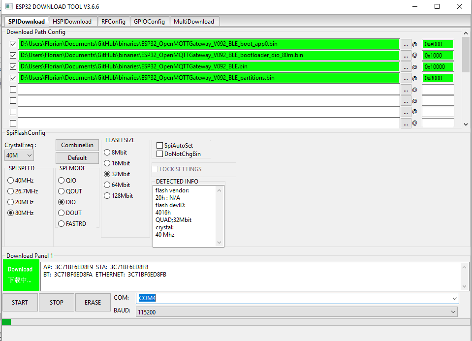
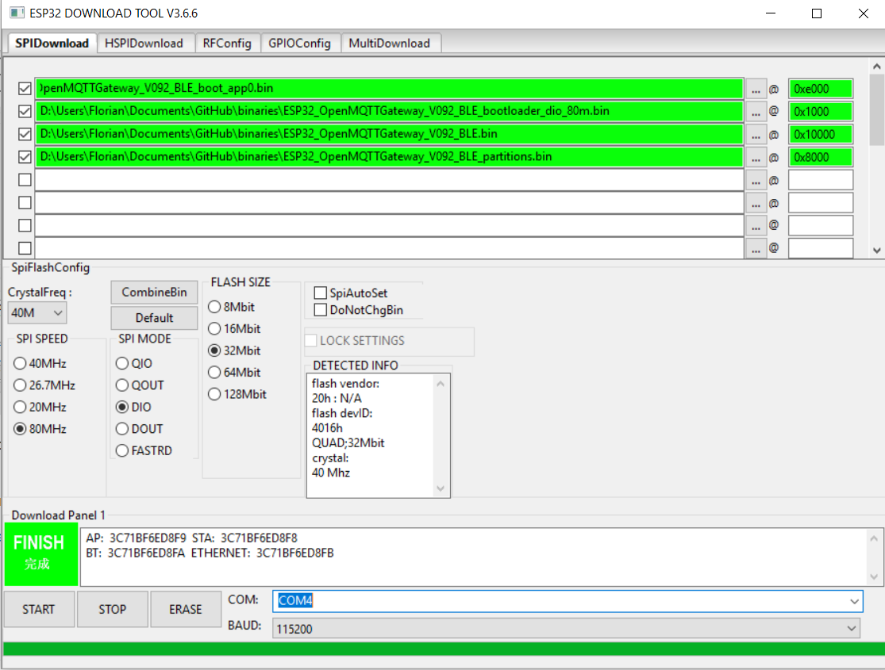
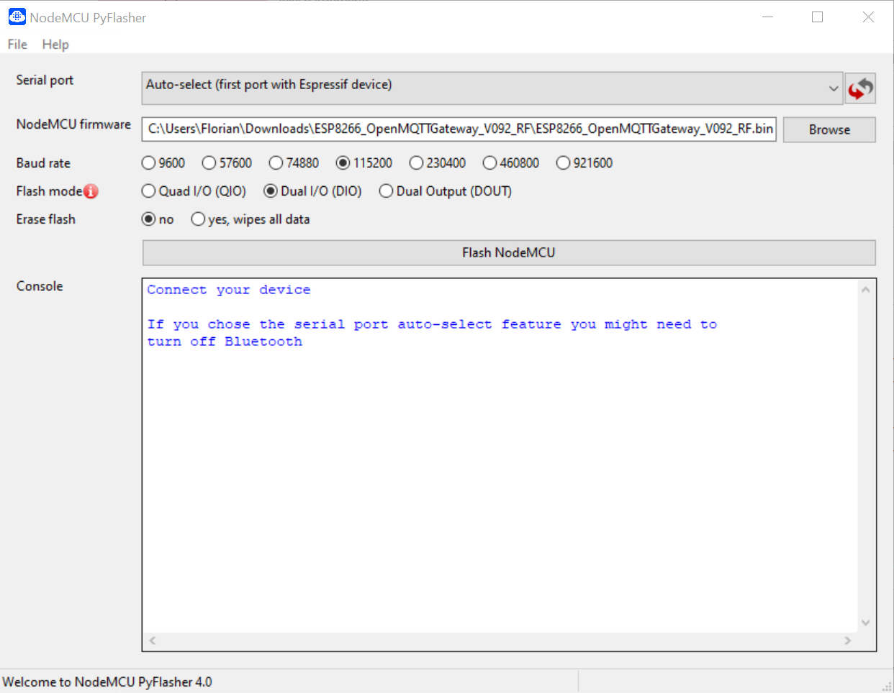

# (Option 2) Upload ready-to-go binaries
This section is useful if you want to directly flash your ESP from your desktop. Once flashed you can change  wifi and broker settings.
Nevertheless you will not be able to change advanced parameters; if you want to do so, refer to [Upload your configurations](builds.md) section.

Download the binary corresponding to your board and gateway [here](https://github.com/1technophile/OpenMQTTGateway/releases) from github and uncompress it.

## ESP32
* Download the bootloader [here](https://github.com/espressif/arduino-esp32/raw/2.0.5/tools/sdk/esp32/bin/bootloader_dio_80m.bin)
* Download the boot_app0 from [here](https://github.com/espressif/arduino-esp32/raw/2.0.5/tools/partitions/boot_app0.bin)
* Download the flash tool utility from espressif:
https://www.espressif.com/en/products/hardware/esp32/resources
* Uncompress the package
* Execute `flash_download_tools`
* Choose Developer mode
* Choose ESP32 DownloadTool
* Set the files and the address as below:

And set the parameters used by Arduino IDE, we are able to upload to ESP32 a binary file containing OpenMQTTGateway.
* Set the config as above
* Connect your ESP32 board and select the COM port 
* Click on erase if it is your first upload
* If you see SYNC (above the START button) for more than 5 seconds, press the boot button of your ESP32
* Once done you can click on START button
* If you see SYNC (above the START button) for more than 5 seconds, press the boot button of your ESP32
The upload details appears in the rear shell windows, you can see also the progress bar changing.
* Once done the flash tool display "FINISH" like below

### Linux - esptool.py
If you want to upload the ready-to-go binary from Linux (or any other OS where you have Python) you can use the [esptool.py](https://github.com/espressif/esptool). This an official Python based flashing tool from Espressif for ESP82XX and ESP32.
* Install esptool from PyPI via pip: `pip install esptool` (or using the python package manager of your choice)
* Now you should be able to run `esptool.py -h` to see a summary of all available commands, command line options and verify the installation
* Download the bootloader, boot_app0 and the binary for your board from the respective links [above](#esp32)
* Use the below command to upload the binary files to the board (change file names and serial port as needed, for Windows use port number e.g.: `COM4`):

      esptool.py --port /dev/ttyUSB0 --chip esp32 --baud 921600 --before default_reset --after hard_reset write_flash -z --flash_mode dout --flash_size detect 0xe000 boot_app0.bin 0x1000 bootloader_dio_80m.bin 0x8000 esp32dev-ble-cont-partitions.bin 0x10000 esp32dev-ble-cont-firmware.bin
* Output for a successful upload should look like this:

      esptool.py v2.8
      Serial port /dev/ttyUSB0
      Connecting.....
      Chip is ESP32D0WDQ6 (revision 1)
      Features: WiFi, BT, Dual Core, 240MHz, VRef calibration in efuse, Coding Scheme None
      Crystal is 40MHz
      MAC: 30:ae:a4:ff:48:14
      Uploading stub...
      Running stub...
      Stub running...
      Changing baud rate to 921600
      Changed.
      Configuring flash size...
      Auto-detected Flash size: 4MB
      Compressed 8192 bytes to 47...
      Wrote 8192 bytes (47 compressed) at 0x0000e000 in 0.0 seconds (effective 15741.5 kbit/s)...
      Hash of data verified.
      Flash params set to 0x0320
      Compressed 17312 bytes to 11972...
      Wrote 17312 bytes (11972 compressed) at 0x00001000 in 0.2 seconds (effective 903.1 kbit/s)...
      Hash of data verified.
      Compressed 3072 bytes to 129...
      Wrote 3072 bytes (129 compressed) at 0x00008000 in 0.0 seconds (effective 5168.4 kbit/s)...
      Hash of data verified.
      Compressed 1444624 bytes to 838880...
      Wrote 1444624 bytes (838880 compressed) at 0x00010000 in 13.1 seconds (effective 881.2 kbit/s)...
      Hash of data verified.
      
      Leaving...
      Hard resetting via RTS pin...
* The board resets after the upload and boots the gateway firmware

## ESP8266
* Download the NodeMCU Py Flasher tool :
https://github.com/marcelstoer/nodemcu-pyflasher/releases
* Execute `NodeMCU-PyFlasher`
* Set the files and parameters as below:

* Connect your board and select the COM port 
* Click on *FlashNodeMCU*
The upload details appears.

With an ESP if you did not set your network and MQTT parameters manually you can now open the [web portal configuration](portal.md).

Note that to reset the wifi and MQTT settings you can check *yes, wipes all data*

