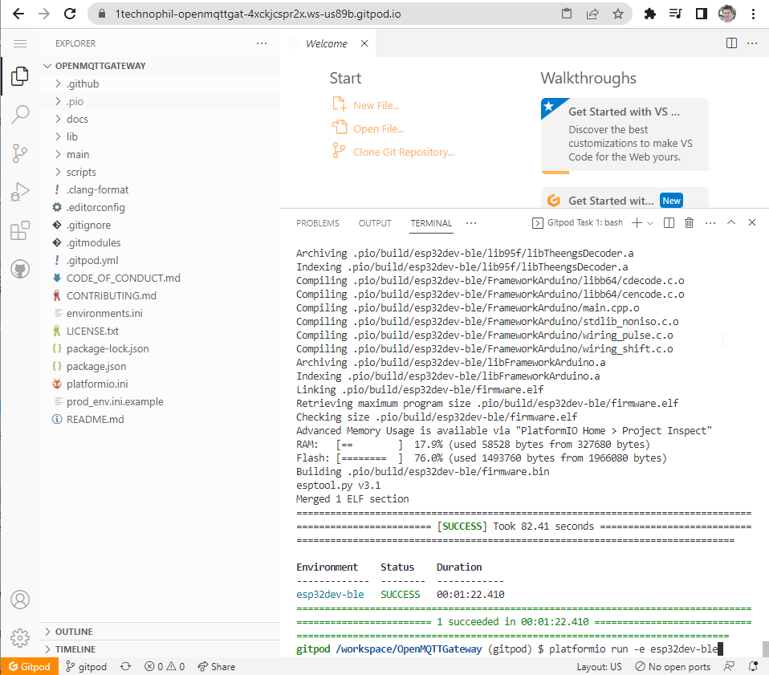
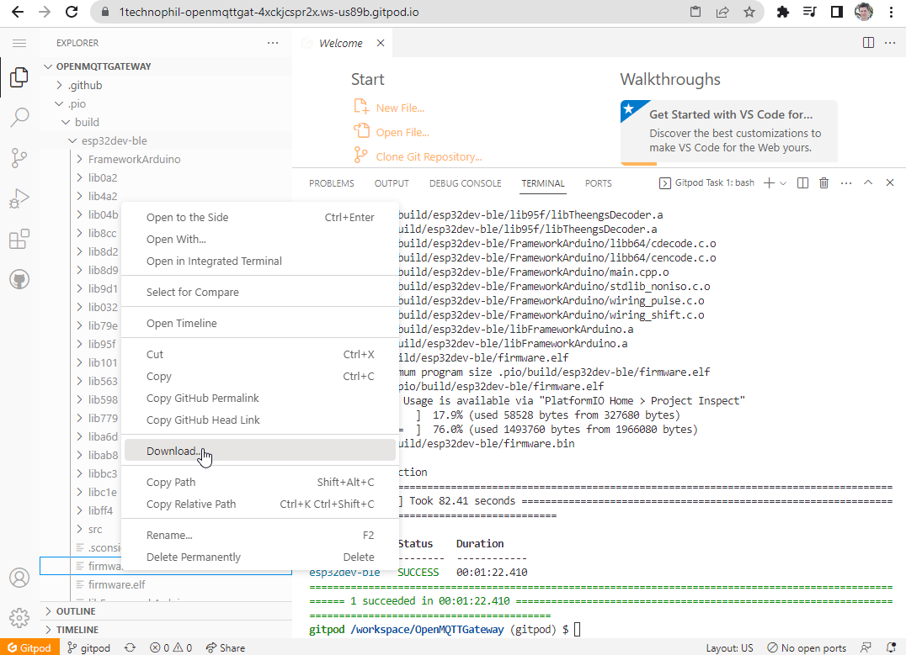

# (Option 4) Build from the web

To build OpenMQTTGateway from the web and download the binary, follow these steps:

1. Use Gitpod by clicking on the link below:
[https://gitpod.io#https://github.com/1technophile/OpenMQTTGateway/tree/development](https://gitpod.io#https://github.com/1technophile/OpenMQTTGateway/tree/development)

2. This will generate a development environment in your browser and install [platformio](https://platformio.org/) as a build environment.

3. A first build for `esp32dev-ble` will be launched automatically. To modify the environment configuration, go to the environments.ini file in the root folder and launch the command like the one shown at the bottom of the image below:
`platformio run -e <environment name>`

4. Wait for the server to build the binary. Once you see [SUCCESS], you can go to `.pio/build/<environment name>` and download `firmware.bin` and `partitions.bin` by right-clicking on each and selecting "Download."

5. Finally, follow [Option 2](binaries.md) to upload the binary.
