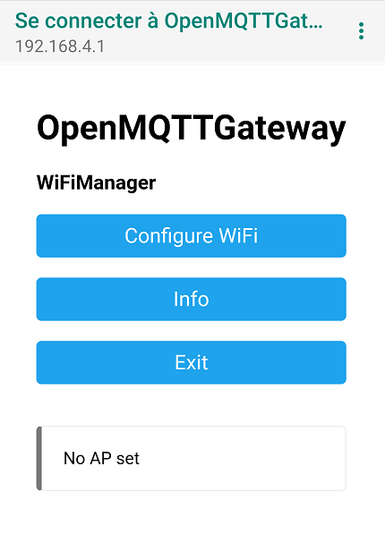
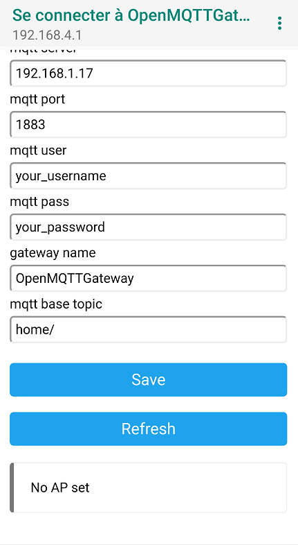

# Wifi and MQTT configuration

## Wifi and MQTT configuration portal for Wifi boards

Once loaded into your ESP, and if you don't use the manual configuration, you have to set your network parameters with Wifi Manager portal.

From your smartphone, search for  OpenMQTTGateway or OMG wifi network and connect to it with the `WifiManager_password` you have defined (the default password is **"your_password"**), or if you are using a device sold by Theengs or the macro `-DWM_PWD_FROM_MAC=true`, the password will be the last eight digits of the device MAC Address with upper case.
Example, the password would be `CCDDEEFF` for a MAC Address `AABBCCDDEEFF`. 
For Theengs devices, the MAC Address can be found on the device sticker, and for all the devices, it is printed on the serial monitor logs.

Once connected to the Wifi, a web page should appear. On Android, you may also have a popup asking you if you want to connect to it without an internet connection. Answer yes always/all the time. If the web page doesn't appear, click on the Wifi Access Point and "Manage router".



* Click on Configure WiFi


* Select your wifi
* Set your wifi password
* Set your MQTT Server IP
* Set your MQTT Server Port
* Set the MQTT secure connection box to select whether or not the connection should be secure
* Copy/paste the MQTT server certificate in the MQTT server cert box (only required if using a secure connection), be sure to include the `-----BEGIN CERTIFICATE-----` and `-----END CERTIFICATE-----` markers  
* Set your MQTT Server username (facultative)
* Set your MQTT Server password (facultative)
* Set your MQTT base topic if you need to change it (you must keep the / at the end)
* Set your gateway name if you need to change it
* Set your Over The Air password, this password is used for local and remote OTA

* Click on save



The ESP restart and connect to your network. Note that your credentials are saved into the ESP memory, if you want to redo the configuration you have to erase the ESP memory with the flash download tool.

Once done the gateway should connect to your network and your broker, you should see it into the broker in the form of the following messages:
```
home/OpenMQTTGateway/LWT Online 
home/OpenMQTTGateway/version
```

Note that the web portal appears only on first boot, if you want to configure again the setting you can do a long press on TRIGGER_GPIO or [erase the settings](../use/gateway.md#erase-the-esp-settings).

## MQTT and network configuration for Ethernet and Wifi boards

You can configure your MQTT server credentials and network configuration before building the application. It can be done either in Arduino or in Platformio IDE thought the User_config.h file. Note that with Platformio IDE you can also set your credentials into the platformio.ini file or an *_env.ini file, here is an example with the Olimex ESP32 gateway:

``` ini
[env:esp32-olimex-gtw-ble]
platform = ${com.esp32_platform}
board = esp32-gateway
board_build.partitions = min_spiffs.csv
lib_deps =
  ${com-esp.lib_deps}
  ${libraries.ble}
build_flags =
  ${com-esp.build_flags}
  '-DZgatewayBT="BT"'
  '-DLED_INFO=33'
  '-DLED_INFO_ON=1'
  '-DESP32_ETHERNET=true'
  '-DMQTT_SERVER="11.22.33.44"'
  '-DMQTT_USER="salut"'
  '-DMQTT_PASS="atoi"'
  '-DGateway_Name="OpenMQTTGateway_ESP32_OLM_GTW"'
```
