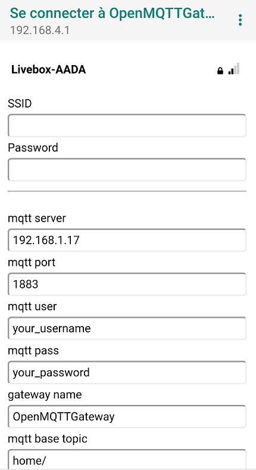

# Wifi and MQTT configuration portal

Once loaded into your board and if you don't use the manual configuration you have to set your network parameters with wifi manager portal.
From your smartphone search for your OpenMQTTGateway wifi network and connect to it, a web page will appear


* Click on Configure WiFi



* Select your wifi
* Set your wifi password
* Set your MQTT Server IP
* Set your MQTT Server username (facultative)
* Set your MQTT Server password (facultative)
* Set your MQTT base topic if you need to change it (you must keep the / at the end)
* Set your gateway name if you need to change it

* Click on save


The ESP restart and connect to your network. Note that your credentials are saved into the ESP memory, if you want to redo the configuration you have to erase the ESP memory with the flash download tool.

_The default password for wifi manager is "your_password"_

Once done the gateway should connect to your network and your broker, you should see it into the broker in the form of the following messages:
```
home/OpenMQTTGateway/LWT Online 
home/OpenMQTTGateway/version
```

Note that the web portal appears only on first boot, if you want to configure again the setting you can do a long press on TRIGGER_PIN or [erase the settings](../use/gateway.md#erase-the-esp-settings).
