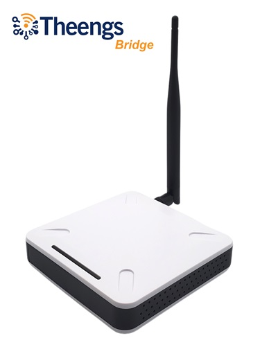
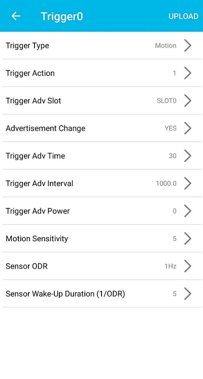
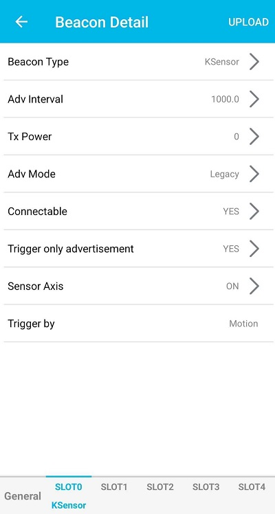

# Bluetooth gateway

The manufacturer agnostic Bluetooth Low Energy (BLE) gateway acts as a powerful BLE scanner and decoder of [Bluetooth devices](https://compatible.openmqttgateway.com/index.php/devices/ble-devices/), allowing you to visualize and analyze information from a wide range of sensors. 
It can also act as a device tracker and presence detection gateway by receiving nearby BLE devices and trackers.

Data are transmitted to an MQTT broker, where it can be used to trigger events and rules, as well as displayed, stored and processed in your favorite controller (Home Assistant, OpenHAB, Jeedom, Domoticz, ioBroker or any MQTT compatible software).

With the ability to monitor and analyze data such as temperature, humidity, moisture, luminance, weight, pressure, fine particles, and more, the BLE gateway provides a flexible and customizable solution for integrating BLE technology into your control and monitoring systems.

<div style="text-align: center;">
    
</div>

## Products powered by OpenMQTTGateway

### Theengs Bridge, BLE gateway with external antenna

[Theengs bridge](https://shop.theengs.io/products/theengs-bridge-esp32-ble-mqtt-gateway-with-ethernet-and-external-antenna) is a powerfull BLE to MQTT gateway for over [100 sensors](https://decoder.theengs.io/devices/devices.html). Equipped with an Ethernet port, and external antenna, ensuring an enhanced range for your BLE sensors. It supports also WiFi connectivity.

<div style="text-align: center;">
    <a href="https://shop.theengs.io/products/theengs-bridge-esp32-ble-mqtt-gateway-with-ethernet-and-external-antenna" target="_blank" rel="noopener noreferrer">
    
    </a>
</div>

### Theengs Plug, BLE gateway and Smart Plug

[Theengs plug](https://shop.theengs.io/products/theengs-plug-smart-plug-ble-gateway-and-energy-consumption) brings the following features:
* BLE to MQTT gateway, tens of [Bluetooth devices](https://compatible.openmqttgateway.com/index.php/devices/ble-devices/) supported thanks to Theengs Decoder library. The plug uses an ESP32 acting as a BLE to Wifi gateway to scan, decode and forward the data of the nearby sensors,
* Smart plug that can be controlled remotely,
* Energy consumption monitoring,
* Device tracker,
* Presence detection (beta),
* Local connectivity first.

<div style="text-align: center;">
    <a href="https://shop.theengs.io/products/theengs-plug-smart-plug-ble-gateway-and-energy-consumption" target="_blank" rel="noopener noreferrer">
    
    </a>
</div>

Support the project by purchasing the [Theengs bridge](https://shop.theengs.io/products/theengs-bridge-esp32-ble-mqtt-gateway-with-ethernet-and-external-antenna) or the [Theengs plug](https://shop.theengs.io/products/theengs-plug-smart-plug-ble-gateway-and-energy-consumption)

## Disable or enable the BLE gateway (default: true, available with HA discovery)

If you want to deactivate the BLE gateway:

`mosquitto_pub -t home/OpenMQTTGateway/commands/MQTTtoBT/config -m '{"enabled":false}'`

If you want to activate the BLE gateway:

`mosquitto_pub -t home/OpenMQTTGateway/commands/MQTTtoBT/config -m '{"enabled":true}'`

## Receiving signals from [compatible BLE sensors](https://decoder.theengs.io/devices/devices_by_brand.html) to publish it to an MQTT broker.
To receive data from BLE sensors you can use an ESP32-based device with a programming USB port or use a Serial adapter.

OpenMQTTGateway is also available preloaded and configured with the [Theengs plug](https://shop.theengs.io/products/theengs-plug-smart-plug-ble-gateway-and-energy-consumption), a smart plug that acts as a BLE gateway and energy monitoring device.

1. Follow the [Upload](../upload/web-install.md) and [Configuration](../upload/portal.md) steps.

1. Download an MQTT client like MQTT explorer.

1. You should see data coming in your broker.


Once the data has been transmitted to the MQTT broker, it can be easily integrated with your preferred controller. For example, the data can be automatically discovered and made available within popular controllers, example below with Home Assistant.


Examples of compatible sensors among [our list](https://decoder.theengs.io/devices/devices_by_brand.html: Mi Flora, Mi jia, LYWDS02, LYWSD03MMC, ClearGrass, Mi scale, iBBQ, TPMS

## Receiving signals from BLE devices for Device Tracker detection
The gateway will detect BLE trackers from Tile, Nut, TagIt, iTAG, Gigaset G-Tag and TicWatch GTH (Pro), as well as other devices with additional properties decoding like Mi Band, Amazfit, RuuviTag and others indicated as Device Trackers in the [compatible BLE devices list](https://decoder.theengs.io/devices/devices.html), and automatically create a device tracker entity following the Home Assistant discovery convention (if auto discovery is activated).

The devicen tracker entity created can be attached to a person to leverage presence detection. The `away` or `not home` state is triggered if the BLE tracker is not detected during the timer defined by `presenceawaytimer`.
 


By default `presenceawaytimer` is set to 120s, you can change it from the slider in your controller or with the following command (ms)

`mosquitto_pub -t home/OpenMQTTGateway/commands/MQTTtoBT/config -m '{"presenceawaytimer":66000}'`

Generally BLE devices will not broadcast if they are paired so you may need to ensure your beacons is unpaired/disconnected before it will be seen by the gateway.

Note that you can find apps to simulate beacons and do some tests like [Beacon simulator](https://play.google.com/store/apps/details?id=net.alea.beaconsimulator)

Apple iOS version >=10 devices advertise without an extra MAC address app, nevertheless this address [changes randomly](https://github.com/1technophile/OpenMQTTGateway/issues/71) and can currently only be used with [Theengs Gateway](https://gateway.theengs.io/) and its [Identity MAC Address and Identity Resolving Key](https://gateway.theengs.io/use/use.html#getting-identity-resolving-key-irk-for-apple-watch-iphone-and-ipad) feature.

::: tip INFO
The `presenceawaytimer` is also used to reset the state of the PIR/motion sensors to `off` when using HA MQTT discovery convention. If the Sensor does not detect a motion, its state will be automatically set to `off` after the `presenceawaytimer`.
:::

## Receiving signals from BLE devices for Presence detection
To do this activate the "BT: Publish HASS presence" switch in your controller or send the following MQTT command to your broker: mosquitto_pub -t home/OpenMQTTGateway/commands/MQTTtoBT/config -m '{"hasspresence":true}'

## Receiving signals from BLE devices with accelerometers for movement detection
The gateway is designed to detect BLE trackers from BlueCharm and automatically create a binary sensor entity in accordance with the Home Assistant discovery convention, provided that auto discovery is enabled.

The binary sensor entity's state will be set to on or off based on whether the BLE beacon's x-axis acceleration value is detected during the time period defined by the movingtimer parameter.

By default, the movingtimer parameter is set to 60 seconds (60,000 ms). To modify this value, use the following command:

`mosquitto_pub -t home/OpenMQTTGateway/commands/MQTTtoBT/config -m '{"movingtimer":66000}'`

To ensure proper functionality, configure the beacon using the KBeacon or KBeaconPro app (depending on your specific sensor) with the following settings:
* In the General tab, set the Trigger Command to "motion".
* In the Slot tab, enable advertisement with the Beacon Type set to "KSensor", the Trigger Only Advertisement option set to "YES", and the Sensor Axis set to "ON".





## Setting a white or black list
A black list is a list of MAC addresses that will never be published by OMG
to set black list
`mosquitto_pub -t home/OpenMQTTGateway/commands/MQTTtoBT/config -m '{"black-list":["01:23:14:55:16:15","4C:65:77:88:9C:79","4C:65:A6:66:3C:79"]}'`

A white list is a list of MAC addresses permitted to be published by OMG
to set white list
`mosquitto_pub -t home/OpenMQTTGateway/commands/MQTTtoBT/config -m '{"white-list":["01:23:14:55:16:15","4C:65:77:88:9C:79","4C:65:A6:66:3C:79"]}'`

Note: if you want to filter (white or black list) on BLE sensors that are auto discovered, you need to wait for the discovery before applying the white or black list, or temporarily disable it:

to temporarily disable white/black list
`mosquitto_pub -t home/OpenMQTTGateway/commands/MQTTtoBT/config -m '{"ignoreWBlist":true}'`

to enable white/black list back
`mosquitto_pub -t home/OpenMQTTGateway/commands/MQTTtoBT/config -m '{"ignoreWBlist":false}'`

::: tip
So as to keep your white/black list persistent you can publish it with the retain option of MQTT (-r with mosquitto_pub or retain check box of MQTT Explorer)
`mosquitto_pub -r -t home/OpenMQTTGateway/commands/MQTTtoBT/config -m '{"white-list":["01:23:14:55:16:15","4C:65:77:88:9C:79","4C:65:A6:66:3C:79"]}'`

**NOTE**: Only when sending a white/black list should the retain option be set. All other commands to any OpenMQTTGateway gateway **must not** have the retain option set. To persist such other command settings, read [the following section](https://docs.openmqttgateway.com/use/ble.html#store-ble-configuration-into-the-gateway)
:::

## Setting the time between BLE scans and force a scan (available with HA discovery)

Example if you want the BLE to scan every 66 seconds:

`mosquitto_pub -t home/OpenMQTTGateway/commands/MQTTtoBT/config -m '{"interval":66000}'`

you can also force a scan to be done by the following command:

`mosquitto_pub -t home/OpenMQTTGateway/commands/MQTTtoBT/config -m '{"interval":0}'`

Changing the interval between scans will deactivate adaptive scanning.

::: tip
With Home Assistant, this command is directly available through MQTT auto discovery as a switch into the HASS OpenMQTTGateway device entities list.
:::

Once the forced scan has completed, the previous scan interval value will be restored. Forcing a scan command trigger also a BLE connect process after the scan (see below).

The default value `TimeBtwRead` is set into config_BT.h or into your .ini file for platformio users.

If you want to scan continuously for BLE devices, for example for beacon location you can set the interval to 100ms:

`mosquitto_pub -t home/OpenMQTTGateway/commands/MQTTtoBT/config -m '{"interval":100}'`

In this case you should deactivate the BLE connection mechanism to avoid concurrency between scan and connections (see chapter below, bleconnect).

::: tip
For certain devices like LYWSD03MMC OpenMQTTGateway use a connection (due to the fact that the advertized data are encrypted), this connection mechanism is launched after every `TimeBtwConnect` per default, you can modify it by following the procedure below.
:::

## Setting the time between connection attempts (default: 60min, available with HA discovery)

If you want to change the time between BLE connect you can change it by MQTT, if you want the BLE connect time to be every 300s:

`mosquitto_pub -t home/OpenMQTTGateway/commands/MQTTtoBT/config -m '{"intervalcnct":300000}'`

## Setting if the gateway publishes all the BLE devices scanned or only the detected sensors (default: false, available with HA discovery)

If you want to change this characteristic:

`mosquitto_pub -t home/OpenMQTTGateway/commands/MQTTtoBT/config -m '{"onlysensors":true}'`

The gateway will publish only detected sensors and trackers like Mi Flora, Mi jia, Mi Band, LYWSD03MMC... or trackers like Tile, Nut, TagIt or iTag, and not any other other BLE devices. This is useful if you don't use the gateway for presence detection with unrecognised trackers.

## Setting if the gateway publishes known devices which randomly change their MAC address (default: false)

The default is false, as such changing MAC addresses cannot be related to specific devices.

If you want to change this characteristic:

`mosquitto_pub -t home/OpenMQTTGateway/commands/MQTTtoBT/config -m '{"randommacs":true}'`

## Setting if the gateway use adaptive scanning (default: true, available with HA discovery)

Adaptive scanning lets the gateway decide for you the best passive `interval` and active `intervalacts` scan interval, depending on the characteristics of your devices.
The gateway retrieves your devices' information from [Theengs Decoder](https://decoder.theengs.io) and adapts its parameters accordingly if a device that requires it is detected.
For example a door or a PIR sensor will require continuous scanning, so if detected the gateway is going to reduce its time between scans to the minimum. Or your devices may also require active scanning to retrieve data, in this case the gateway will also trigger active scans at regular intervals.

If you want to change this characteristic (default:true):

`mosquitto_pub -t home/OpenMQTTGateway/commands/MQTTtoBT/config -m '{"adaptivescan":false}'`

Setting Adaptive scanning to `false` will automatically put the gateway to continuous active scanning if no additional manual changes have already been applied.

An overview with background information to better understand the different setting used:

**Passive scanning:** With this scanning mode the gateway picks up any freely available broadcasts sent out by devices, without any interaction with the devices. The interval for this is set with [{"interval":66000}](#setting-the-time-between-ble-scans-and-force-a-scan)

**Active scanning:** With this scanning mode the gateway sends out requests for sensor broadcasts first, before then picking up the broadcast advertisement data. Some devices require this request before they send out all data in their broadcasts. The interval for this active scanning with request first is set by [{"intervalacts":300000}](#setting-the-time-between-active-scanning)

Setting [Publishing advertisement and advanced data](#advanced-publishing-advertisement-and-advanced-data-default-false) to true will show you additional data about which of your devices require active scanning and/or continuous scanning, so that you can tune these setting to your devices and your individual requirements of their data.

**"cont":true** - the device requires continuous scanning. If passive ({"interval":100}) or active ({"intervalacts":100}) depends on the additional device specification.

**"acts":true** - the device requires active scanning to broadcast all of it's data for decoding.

## Setting the time between active scanning (available with HA discovery)

If you have passive scanning activated, but also have some devices which require active scanning, this defines the time interval between two intermittent active scans.

Example for setting the active scan interval time to every 5 minutes:

`mosquitto_pub -t home/OpenMQTTGateway/commands/MQTTtoBT/config -m '{"intervalacts":300000}'`

Changing the active scan interval will deactivate adaptive scanning.

::: warning Note
The active scan interval `intervalacts` can only bet set equal to or higher than the passive scan interval `interval`, as any lower value would not make any sense.
:::

## Setting the duration of a scan (available with HA discovery)

If you want to change the default duration of each scan cycle to 5 seconds

`mosquitto_pub -t home/OpenMQTTGateway/commands/MQTTtoBT/config -m '{"scanduration":5000}'`

## Setting if the gateway connects to BLE devices eligibles (default: true, available with HA discovery)

If you want to change this characteristic:

`mosquitto_pub -t home/OpenMQTTGateway/commands/MQTTtoBT/config -m '{"bleconnect":false}'`

## Setting if the gateway publish into Home Assistant Home presence topic (default: false, available with HA discovery)

If you want to publish to Home Assistant presence topic, you can activate this function by the HASS interface (this command is auto discovered), [here is a yaml example](../integrate/home_assistant.md#mqtt-room-presence).
Or by an MQTT command.

`mosquitto_pub -t home/OpenMQTTGateway/commands/MQTTtoBT/config -m '{"hasspresence":true}'`

To change presence publication topic, use this MQTT command:

`mosquitto_pub -t home/OpenMQTTGateway/commands/MQTTtoBT/config -m '{"prestopic":"presence/"}'`

To use iBeacon UUID for presence, instead of sender (random) MAC address, use this MQTT command:

`mosquitto_pub -t home/OpenMQTTGateway/commands/MQTTtoBT/config -m '{"presuseuuid":true}'`

This will change usual payload for iBeacon from:
`{"id":"60:87:57:4C:9B:C2","mac_type":1,"rssi":-78,"distance":7.85288,"brand":"GENERIC","model":"iBeacon","model_id":"IBEACON","mfid":"4c00","uuid":"1de4b189115e45f6b44e509352269977","major":0,"minor":0,"txpower":-66}`
To:
`{"id":"1de4b189115e45f6b44e509352269977","mac_type":1,"rssi":-78,"distance":7.85288,"brand":"GENERIC","model":"iBeacon","model_id":"IBEACON","mfid":"4c00","uuid":"1de4b189115e45f6b44e509352269977","major":0,"minor":0,"txpower":-66,"mac":"60:87:57:4C:9B:C2"}`
Note: the MAC address is put in "mac" field.

## Setting if the gateway uses iBeacon UUID as topic, instead of (random) MAC address (default: false)

By default, iBeacon are published like other devices, using a topic based on the MAC address of the sender.
But modern phones randomize their Bluetooth MAC address making it difficult to track iBeacon.

For example, the 2 following messages corresponds to the same iBeacon, but with different MAC and topics:
```
home/OpenMQTTGateway/BTtoMQTT/58782076BC24 {"id":"58:78:20:76:BC:24","mac_type":1,"rssi":-79,"brand":"GENERIC","model":"iBeacon","model_id":"IBEACON","mfid":"4c00","uuid":"1de4b189115e45f6b44e509352269977","major":0,"minor":0,"txpower":-66}
home/OpenMQTTGateway/BTtoMQTT/5210A84690AC {"id":"52:10:A8:46:90:AC","mac_type":1,"rssi":-77,"brand":"GENERIC","model":"iBeacon","model_id":"IBEACON","mfid":"4c00","uuid":"1de4b189115e45f6b44e509352269977","major":0,"minor":0,"txpower":-66}
```

To use iBeacon UUID as topic, use this MQTT command:

`mosquitto_pub -t home/OpenMQTTGateway/commands/MQTTtoBT/config -m '{"pubuuid4topic":true}'`

Resulting in such messages (for the same iBeacon as previously):
```
home/OpenMQTTGateway/BTtoMQTT/1de4b189115e45f6b44e509352269977 {"id":"52:10:A8:46:90:AC","mac_type":1,"rssi":-76,"brand":"GENERIC","model":"iBeacon","model_id":"IBEACON","mfid":"4c00","uuid":"1de4b189115e45f6b44e509352269977","major":0,"minor":0,"txpower":-66}
home/OpenMQTTGateway/BTtoMQTT/1de4b189115e45f6b44e509352269977 {"id":"7B:63:C6:82:DC:57","mac_type":1,"rssi":-83,"brand":"GENERIC","model":"iBeacon","model_id":"IBEACON","mfid":"4c00","uuid":"1de4b189115e45f6b44e509352269977","major":0,"minor":0,"txpower":-66}
```

## Setting the minimum RSSI accepted to publish device data (default:-100)

If you want to change the minimum RSSI value accepted for a device to be published, you can change it by MQTT. For example if you want to set -80

`mosquitto_pub -t home/OpenMQTTGateway/commands/MQTTtoBT/config -m '{"minrssi":-80}'`

you can also accept all the devices by the following command:

`mosquitto_pub -t home/OpenMQTTGateway/commands/MQTTtoBT/config -m '{"minrssi":-200}'`

The default value is set into config_BT.h

## Store BLE configuration into the gateway

OpenMQTTGateway has the capability to save the current configuration and reload it at startup.

To store the running configuration into the gateway, use the command:

`mosquitto_pub -t home/OpenMQTTGateway/commands/MQTTtoBT/config -m '{"save":true}'`

At any time, you can reload the stored configuration with the command:

`mosquitto_pub -t home/OpenMQTTGateway/commands/MQTTtoBT/config -m '{"load":true}'`

If you want to erase the stored configuration, use the command:

`mosquitto_pub -t home/OpenMQTTGateway/commands/MQTTtoBT/config -m '{"erase":true}'`
Note that it will not change the running configuration, only ensure default configuration is used at next startup.

By the way, if you want to load the default built-in configuration (on any board, not only ESP32), use the command:

`mosquitto_pub -t home/OpenMQTTGateway/commands/MQTTtoBT/config -m '{"init":true}'`
Note that it will not change the stored configuration, `erase` or `save` is still needed to overwrite the saved configuration.

## Read/write BLE characteristics over MQTT

The gateway can read and write BLE characteristics from devices and provide the results in an MQTT message.  
::: tip
These actions will be taken on the next BLE connection, which occurs after scanning and after the scan count is reached, [see above to set this](#setting-the-number-of-scans-between-connection-attempts).
This can be overridden by providing an (optional) parameter `"immediate": true` within the command. This will cause the BLE scan to stop if currently in progress, allowing the command to be immediately processed. All other connection commands in queue will also be processed for the same device, commands for other devices will be deferred until the next normally scheduled connection.

**Note** Some devices need to have the MAC address type specified. You can find this type by checking the log/MQTT data and looking for "mac_type". The mac_type of your device can be seen by setting `pubadvdata` to `true` with an MQTT command (see Publishing advertisement data), or with the macro `pubBLEAdvData true`. By default the type is 0 but some devices use different type values. You must specify the correct type to connect successfully.  
To specify the MAC address type add the parameter `"mac_type"` to the command. For example `"mac_type": 1` to connect with a device with the MAC address type of 1.
:::

### Example write command
```
mosquitto_pub -t home/OpenMQTTGateway/commands/MQTTtoBT -m '{
  "ble_write_address":"AA:BB:CC:DD:EE:FF",
  "ble_write_service":"cba20d00-224d-11e6-9fb8-0002a5d5c51b",
  "ble_write_char":"cba20002-224d-11e6-9fb8-0002a5d5c51b",
  "ble_write_value":"TEST",
  "value_type":"STRING",
  "ttl":4,
  "immediate":true }'
```
Response:
```
{
  "id":"AA:BB:CC:DD:EE:FF",
  "service":"cba20d00-224d-11e6-9fb8-0002a5d5c51b",
  "characteristic":"cba20002-224d-11e6-9fb8-0002a5d5c51b",
  "write":"TEST",
  "success":true
}
```
### Example read command
```
mosquitto_pub -t home/OpenMQTTGateway/commands/MQTTtoBT -m '{
  "ble_read_address":"AA:BB:CC:DD:EE:FF",
  "ble_read_service":"cba20d00-224d-11e6-9fb8-0002a5d5c51b",
  "ble_read_char":"cba20002-224d-11e6-9fb8-0002a5d5c51b",
  "value_type":"STRING",
  "ttl": 2 }'
```
Response:
```
{
  "id":"AA:BB:CC:DD:EE:FF",
  "service":"cba20d00-224d-11e6-9fb8-0002a5d5c51b",
  "characteristic":"cba20002-224d-11e6-9fb8-0002a5d5c51b",
  "read":"TEST",
  "success":true
}
```

::: tip
The `ttl` parameter is the number of attempts to connect (defaults to 1), which occur after the BLE scan completes.  
`value_type` can be one of: STRING, HEX, INT, FLOAT. Default is STRING if omitted in the message.
:::

## SwitchBot Bot control (available with HA discovery)

SwitchBot Bot devices are automatically discovered and available as a device in the Home Assistant Settings menu. The following commands are supported:
* Press
* On
* Off
* Up
* Down

::: tip
If the SwitchBot mode is changed the ESP32 must be restarted. 
:::

The device can also be controlled over MQTT with a simplified BLE write command.

### Set the SwitchBot Bot state to ON:
```
mosquitto_pub -t home/OpenMQTTGateway/commands/MQTTtoBT -m '{
  "model_id":"X1",
  "cmd":"on",
  "id":"AA:BB:CC:DD:EE:FF"
}'
```

### Set the SwitchBot Bot state to OFF:
```
mosquitto_pub -t home/OpenMQTTGateway/commands/MQTTtoBT -m '{
  "model_id":"X1",
  "cmd":"off",
  "id":"AA:BB:CC:DD:EE:FF"
}'
```

### Set the SwitchBot Bot to PRESS:
```
mosquitto_pub -t home/OpenMQTTGateway/commands/MQTTtoBT -m '{
  "model_id":"X1",
  "cmd":"press",
  "id":"AA:BB:CC:DD:EE:FF"
}'
```

### Set the SwitchBot Bot to go UP:
```
mosquitto_pub -t home/OpenMQTTGateway/commands/MQTTtoBT -m '{
  "model_id":"X1",
  "cmd":"up",
  "id":"AA:BB:CC:DD:EE:FF"
}'
```

### Set the SwitchBot Bot to go DOWN:
```
mosquitto_pub -t home/OpenMQTTGateway/commands/MQTTtoBT -m '{
  "model_id":"X1",
  "cmd":"down",
  "id":"AA:BB:CC:DD:EE:FF"
}'
```

Response (assuming success):
```
{
  "id":"AA:BB:CC:DD:EE:FF",
  "state":"on"
}
```

## SwitchBot Blind Tilt control (available with HA discovery)

SwitchBot Blind Tilt devices are automatically discovered and available as a device in the settings Home Assistant Settings menu. The following commands are supported:
* Open
* Close down
* Set a percentage

The device can also be controlled over MQTT with a simplified BLE write command.

### Set the SwitchBot Blind Tilt state to OPEN:
```
mosquitto_pub -t home/OpenMQTTGateway/commands/MQTTtoBT -m '{
  "model_id":"W270160X",
  "tilt":"open",
  "id":"AA:BB:CC:DD:EE:FF"
  }'
```

### Set the SwitchBot Blind Tilt state to CLOSE_DOWN:
```
mosquitto_pub -t home/OpenMQTTGateway/commands/MQTTtoBT -m '{
  "model_id":"W270160X",
  "tilt":"close_down",
  "id":"AA:BB:CC:DD:EE:FF"
  }'
```

### Set the SwitchBot Blind Tilt state to CLOSE_UP:
```
mosquitto_pub -t home/OpenMQTTGateway/commands/MQTTtoBT -m '{
  "model_id":"W270160X",
  "tilt":"close_up",
  "id":"AA:BB:CC:DD:EE:FF"
  }'
```

### Set the SwitchBot Blind Tilt state to a percentage (0-100):
```
mosquitto_pub -t home/OpenMQTTGateway/commands/MQTTtoBT -m '{
  "model_id":"W270160X",
  "tilt":55,
  "id":"AA:BB:CC:DD:EE:FF"
  }'
```

### Set the SwitchBot Blind Tilt to Stop:
```
mosquitto_pub -t home/OpenMQTTGateway/commands/MQTTtoBT -m '{
  "model_id":"W270160X",
  "tilt":"stop",
  "id":"AA:BB:CC:DD:EE:FF"
  }'
```

### Response (assuming success):
The Switchbot Blind Tilt response :
```
{
  "id":"AA:BB:CC:DD:EE:FF",
  "tilt":55,
  "open":90,
  "direction":"up"
}
```

## SwitchBot Curtain 3 control (available with HA discovery)

SwitchBot Curtain 3 devices are automatically discovered and available as a device in the settings Home Assistant Settings menu. The following commands are supported:
* Set a percentage

The device can also be controlled over MQTT with a simplified BLE write command.

### Set the SwitchBot Curtain state to OPEN:
```
mosquitto_pub -t home/OpenMQTTGateway/commands/MQTTtoBT -m '{
  "model_id":"W070160X",
  "position":"open",
  "id":"AA:BB:CC:DD:EE:FF"
  }'
```

### Set the SwitchBot Curtain state to CLOSE:
```
mosquitto_pub -t home/OpenMQTTGateway/commands/MQTTtoBT -m '{
  "model_id":"W070160X",
  "position":"close",
  "id":"AA:BB:CC:DD:EE:FF"
  }'
```

### Set the SwitchBot Curtain to a percentage (0-100):
```
mosquitto_pub -t home/OpenMQTTGateway/commands/MQTTtoBT -m '{
  "model_id":"W070160X",
  "position":55,
  "id":"AA:BB:CC:DD:EE:FF"
  }'
```

### Set the SwitchBot Curtain to Stop:
```
mosquitto_pub -t home/OpenMQTTGateway/commands/MQTTtoBT -m '{
  "model_id":"W070160X",
  "position":"stop",
  "id":"AA:BB:CC:DD:EE:FF"
  }'
```

### Response (assuming success):
The Switchbot Curtain response :
```
{
  "id":"AA:BB:CC:DD:EE:FF",
  "position":55,
}
```

## ADVANCED: Setting up an external decoder

This advanced option is used to publish raw radio frames on a specific topic to be decoded by an external decoder instead of the integrated one.

To enable external decoder:

`mosquitto_pub -t home/OpenMQTTGateway/commands/MQTTtoBT/config -m '{"extDecoderEnable":true}'`

To change the default external decoder topic to "undecoded":

`mosquitto_pub -t home/OpenMQTTGateway/commands/MQTTtoBT/config -m '{"extDecoderTopic":"undecoded"}'`

## ADVANCED: Filtering out connectable devices (default: false)

[With OpenHAB integration](../integrate/openhab2.md), this configuration is highly recommended, otherwise you may encounter incomplete data.

If you want to enable this feature:

`mosquitto_pub -t home/OpenMQTTGateway/commands/MQTTtoBT/config -m '{"filterConnectable":true}'`

## ADVANCED: Advertisement and advanced data (default: false, available with HA discovery)

If you want to enable this feature:

`mosquitto_pub -t home/OpenMQTTGateway/commands/MQTTtoBT/config -m '{"pubadvdata":true}'`

This will publish extensive information about the device:
```json
{"id":"11:22:33:44:55:66","mac_type":0,"adv_type":0,"name":"Qingping Motion & Light","rssi":-93,"servicedata":"88121122334455660201520f0126090403000000","servicedatauuid":"0xfdcd","brand":"Qingping","model":"Motion & Light","model_id":"CGPR1","lux":3,"batt":82}
```

To stop publishing advertisement data:

`mosquitto_pub -t home/OpenMQTTGateway/commands/MQTTtoBT/config -m '{"pubadvdata":false}'`

::: warning Note
All product and company names are trademarks or registered trademarks of their respective holders. Use of them does not imply any affiliation with or endorsement by them.
:::

::: warning
We strongly encourage the use of a white-list (see below) so as to collect data from your devices only and not from other MAC addresses.
By default the gateway scans the advertizing BLE devices nearby with their MAC addresses. Depending on your country, it may be illegal to monitor networks for MAC addresses, especially on networks that you do not own. Please check your country's laws (for US Section 18 U.S. Code § 2511) - [discussion here](https://github.com/schollz/howmanypeoplearearound/issues/4).
:::
