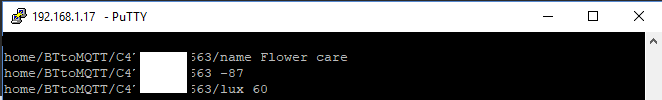

# BLE gateway

::: warning
We strongly encourage the use of a white-list (see below) so as to collect data from your devices only and not from other MAC addresses.
By default the gateway scans the advertizing BLE devices nearby with their MAC addresses. Depending on your country, it may be illegal to monitor networks for MAC addresses, especially on networks that you do not own. Please check your country's laws (for US Section 18 U.S. Code § 2511) - [discussion here](https://github.com/schollz/howmanypeoplearearound/issues/4).
:::

## Receiving signals from BLE beacon devices for Presence detection

Subscribe to all the messages with mosquitto or open your MQTT client software:

`    sudo mosquitto_sub -t +/# -v`

_NOTE: HM-10 or HM-11 module needed if you are not using ESP32; configure in `User_config.h`_

The BT gateway module for OpenMQTTGateway enables the detection of BLE beacons and their signal strength.  Generally BLE devices will not broadcast if they are paired so you may need to ensure your beacons is unpaired before it will be seen by the gateway.

If beacons are detected the gateway will periodically publish messages to MQTT (beacons must not be paired, see above):

```
home/OpenMQTTGateway/BTtoMQTT/45E174126E00 {"id":"45:e1:74:12:6e:00","rssi":-89,"distance":21.51847,"servicedata":"fe0000000000000000000000000000000000000000"}
```
```
home/OpenMQTTGateway/BTtoMQTT/C7FaaD132C00 {"id":"c7:fa:ad:13:2c:00","rssi":-68,"distance":2.799256,"servicedata":"drfgdrgdsrgesrdgdrgdregesrgtrhtyhtfyhdtyhh"}
```

The subtopic after `home/BTtoMQTT/` is the MAC address of the Bluetooth low energy beacon.  The rssi value is the [RSSI signal level](https://www.metageek.com/training/resources/understanding-rssi.html) from which you may deduce the relative distance to the device.
Consider the distance as a beta featuer as currently we are not retrieving the emitting power of the beacon to make it more accurate.

Note that you can find apps to simulate beacons and do some tests like [Beacon simulator](https://play.google.com/store/apps/details?id=net.alea.beaconsimulator)

IOS version >=10 devices advertise without an extra app a mac address, nevertheless this address [changes randomly](https://github.com/1technophile/OpenMQTTGateway/issues/71) and cannot be used for presence detection. You must install an app to advertise a fixed MAC address.


## Receiving signals from BLE devices Mi Flora, Mi jia, LYWDS02, LYWSD03MMC, ClearGrass, Mi scale and [many more](https://compatible.openmqttgateway.com/index.php/devices/ble-devices/)
So as to receive BLE sensors data you need either a simple ESP32 either an ESP8266/arduino + HM10/11 with firmware >= v601
The mi flora supported firmware is >3.1.8

Verify that your sensor is working with the App and update it with the last software version.
You should see in your MQTT broker the following data:


Note that the gateway return one or two measurement value each time. The different measures depending on the devices are:
* Lux
* Temperature
* Moisture
* Fertilization
* Humidity
* Pressure
* Steps
* Weight
* Impedance
* Battery
* Voltage
* Open
* Presence

The infos will appear like this on your MQTT broker:

`home/OpenMQTTGateway/BTtoMQTT/4C33A6603C79 {"hum":"52.6","tempc":"19.2","tempf":"66.56"}`

More info are available on [my blog](https://1technophile.blogspot.fr/2017/11/mi-flora-integration-to-openmqttgateway.html)  (especially about how it was implemented with HM10)

::: tip
The HM10 module doesn't read enough information (servicedata UUID is missing) to support Mi Scale and Mi Band. They are supported nevertheless with ESP32.
OpenMQTTGateway publish the servicedata field of your BLE devices, with HM10 this field can be longer compared to ESP32 if the device is not recognised.
:::

## Setting a white or black list
A black list is a list of mac adresses that will never be published by OMG
to set black list
`mosquitto_pub -t home/OpenMQTTGateway/commands/MQTTtoBT/config -m '{"black-list":["01:23:14:55:16:15","4C:65:77:88:9C:79","4C:65:A6:66:3C:79"]}'`

A white list is a list of mac adresses permitted to be published by OMG
to set white list
`mosquitto_pub -t home/OpenMQTTGateway/commands/MQTTtoBT/config -m '{"white-list":["01:23:14:55:16:15","4C:65:77:88:9C:79","4C:65:A6:66:3C:79"]}'`

Note: if you want to filter (white or black list) on BLE sensors that are auto discovered, you need to wait for the discovery before applying the white or black list

::: tip
So as to keep your white/black list persistent you can publish it with the retain option of MQTT (-r with mosquitto_pub or retain check box of MQTT Explorer)
`mosquitto_pub -r -t home/OpenMQTTGateway/commands/MQTTtoBT/config -m '{"white-list":["01:23:14:55:16:15","4C:65:77:88:9C:79","4C:65:A6:66:3C:79"]}'`
:::

## Setting the time between BLE scans and force a scan

If you want to change the time between readings you can change the interval by MQTT.
For example, if you want the BLE to scan every 66 seconds:

`mosquitto_pub -t home/OpenMQTTGateway/commands/MQTTtoBT/config -m '{"interval":66000}'`

you can also force a scan to be done by the following command:

`mosquitto_pub -t home/OpenMQTTGateway/commands/MQTTtoBT/config -m '{"interval":0}'`

::: tip
With Home Assistant, this command is directly available through MQTT auto discovery as a switch into the HASS OpenMQTTGateway device entities list.
:::

Once the forced scan has completed, the previous scan interval value will be restored. Forcing a scan command trigger also a BLE connect process after the scan (see below).

The default value `TimeBtwRead` is set into config_BT.h or into your .ini file for platformio users.

If you want to scan continuously for BLE devices, for example for beacon location you can set the interval to 1ms:

`mosquitto_pub -t home/OpenMQTTGateway/commands/MQTTtoBT/config -m '{"interval":1}'`

In this case you should deactivate the BLE connection mechanism to avoid concurrency between scan and connections (see chapter below, bleconnect).

::: tip
For certain devices like LYWSD03MMC OpenMQTTGateway use a connection (due to the fact that the advertized data are encrypted), this connection mechanism is launched after every `ScanBeforeConnect` per default, you can modify it by following the procedure below.
:::

## Setting the number of scans between connection attempts

If you want to change the number of BLE scans that are done before a BLE connect you can change it by MQTT, if you want the BLE connect to be every 30 scans:

`mosquitto_pub -t home/OpenMQTTGateway/commands/MQTTtoBT/config -m '{"scanbcnct":30}'`

The BLE connect will be done every 30 * (`TimeBtwRead` + `Scan_duration`), 30 * (55000 + 10000) = 1950000ms

## Setting if the gateway publishes all the BLE devices scanned or only the detected sensors

If you want to change this characteristic:

`mosquitto_pub -t home/OpenMQTTGateway/commands/MQTTtoBT/config -m '{"onlysensors":true}'`

::: tip
With Home Assistant, this command is directly avalaible through MQTT auto discovery as a switch into the HASS OpenMQTTGateway device entities list.
:::

The gateway will publish only the detected sensors like Mi Flora, Mi jia, LYWSD03MMC... and not the other BLE devices. This is usefull if you don't use the gateway for presence detection but only to retrieve sensors data.

## Setting if the gateway connects to BLE devices eligibles on ESP32

If you want to change this characteristic:

`mosquitto_pub -t home/OpenMQTTGateway/commands/MQTTtoBT/config -m '{"bleconnect":false}'`

::: tip
With Home Assistant, this command is directly avalaible through MQTT auto discovery as a switch into the HASS OpenMQTTGateway device entities list.
:::

## Setting if the gateway publish into Home Assistant Home presence topic

If you want to publish to Home Assistant presence topic, you can activate this function by the HASS interface (this command is auto discovered), [here is a yaml example](../integrate/home_assistant.md#mqtt-room-presence).
Or by an MQTT command.

`mosquitto_pub -t home/OpenMQTTGateway/commands/MQTTtoBT/config -m '{"hasspresence":true}'`

## Setting the minimum RSSI accepted to publish device data

If you want to change the minimum RSSI value accepted for a device to be published, you can change it by MQTT. For example if you want to set -80

`mosquitto_pub -t home/OpenMQTTGateway/commands/MQTTtoBT/config -m '{"minrssi":-80}'`

you can also accept all the devices by the following command:

`mosquitto_pub -t home/OpenMQTTGateway/commands/MQTTtoBT/config -m '{"minrssi":-200}'`

The default value is set into config_BT.h

## Read/write BLE characteristics over MQTT (ESP32 only)

The gateway can read and write BLE characteristics from devices and provide the results in an MQTT message.  
::: tip
These actions will be taken on the next BLE connection, which occurs after scanning and after the scan count is reached, [see above to set this.](#setting-the-number-of-scans-between-connection-attempts)  
This can be overridden by providing an (optional) parameter `"immediate": true` within the command. This will cause the BLE scan to stop if currently in progress, allowing the command to be immediately processed. All other connection commands in queue will also be processed for the same device, commands for other devices will be deferred until the next normally scheduled connection.
:::

### Example write command
```
mosquitto_pub -t home/OpenMQTTGateway/commands/MQTTtoBT/config -m '{
  "ble_write_address":"AA:BB:CC:DD:EE:FF",
  "ble_write_service":"cba20d00-224d-11e6-9fb8-0002a5d5c51b",
  "ble_write_char":"cba20002-224d-11e6-9fb8-0002a5d5c51b",
  "ble_write_value":"TEST",
  "value_type":"STRING",
  "ttl":4,
  "immediate":true }'
```
Response:
```
{
  "id":"AA:BB:CC:DD:EE:FF",
  "service":"cba20d00-224d-11e6-9fb8-0002a5d5c51b",
  "characteristic":"cba20002-224d-11e6-9fb8-0002a5d5c51b",
  "write":"TEST",
  "success":true
}
```
### Example read command
```
mosquitto_pub -t home/OpenMQTTGateway/commands/MQTTtoBT/config -m '{
  "ble_read_address":"AA:BB:CC:DD:EE:FF",
  "ble_read_service":"cba20d00-224d-11e6-9fb8-0002a5d5c51b",
  "ble_read_char":"cba20002-224d-11e6-9fb8-0002a5d5c51b",
  "value_type":"STRING",
  "ttl": 2 }'
```
Response:
```
{
  "id":"AA:BB:CC:DD:EE:FF",
  "service":"cba20d00-224d-11e6-9fb8-0002a5d5c51b",
  "characteristic":"cba20002-224d-11e6-9fb8-0002a5d5c51b",
  "read":"TEST",
  "success":true
}
```

::: tip
The `ttl` parameter is the number of attempts to connect (defaults to 1), which occur after the BLE scan completes.  
`value_type` can be one of: STRING, HEX, INT, FLOAT. Default is STRING if omitted in the message.
:::

## Other

To check your hm10 firmware version upload a serial sketch to the nodemcu (this will enable communication directly with the hm10) and launch the command:
`AT+VERR?`

More info about HM-10 is [available here](http://www.martyncurrey.com/hm-10-bluetooth-4ble-modules/)
