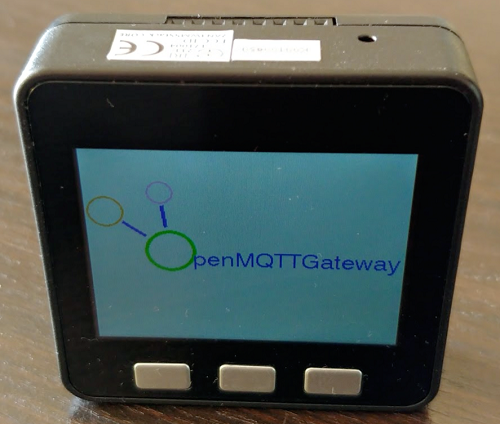
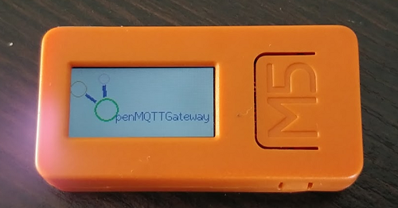

# Boards

## ESP32

### Low power mode for ESP32
OpenMQTTGateway support a low power mode for ESP32, this mode can be set by MQTT on a barebone ESP32:

* Normal mode (per default)

`mosquitto_pub -t "home/OpenMQTTGateway/commands/MQTTtoBT/config" -m '{"low_power_mode":0}'`

* Low Power mode

`mosquitto_pub -t "home/OpenMQTTGateway/commands/MQTTtoBT/config" -m '{"low_power_mode":2}'`

::: warning
If you change the default low power mode in config_BT.h to 2 and your credential are not set or not correct, the ESP32 will not connect to the broker and the only way to change the low power mode will be a new erase/upload.
:::

## M5Stick C or M5Stack

### Behaviour

If the connexion of the board to WIFI and MQTT is successfull you will see the logo with text like below:

The same behaviour apply to M5 Stick C

### Setting the log output

Per default the log of the M5 boards is going to the LCD display with Errors and Warnings only, if you want to change the ouput at build time you can do it in [config_M5.h](https://github.com/1technophile/OpenMQTTGateway/blob/development/main/config_M5.h).

You can also change it by MQTT. For example if you want to set to LCD

`mosquitto_pub -t home/OpenMQTTGateway/commands/MQTTtoM5/config -m '{"log-display":true}'`

you can also revert it to the serial monitor:

`mosquitto_pub -t home/OpenMQTTGateway/commands/MQTTtoM5/config -m '{"log-display":false}'`

### Low power mode for M5 boards
OpenMQTTGateway support a low power mode for ESP32, this mode can be set by MQTT on a barebone ESP32:

* Normal mode (per default), screen ON

`mosquitto_pub -t "home/OpenMQTTGateway/commands/MQTTtoBT/config" -m '{"low_power_mode":0}'`

* Low Power mode, screen ON when processing

`mosquitto_pub -t "home/OpenMQTTGateway/commands/MQTTtoBT/config" -m '{"low_power_mode":1}'`

* Low Power mode, screen OFF, LED ON when processing on M5StickC

`mosquitto_pub -t "home/OpenMQTTGateway/commands/MQTTtoBT/config" -m '{"low_power_mode":2}'`

The low power mode can be changed also with a push to button B when the board is processing (top button on M5stickC and middle button of M5stack).