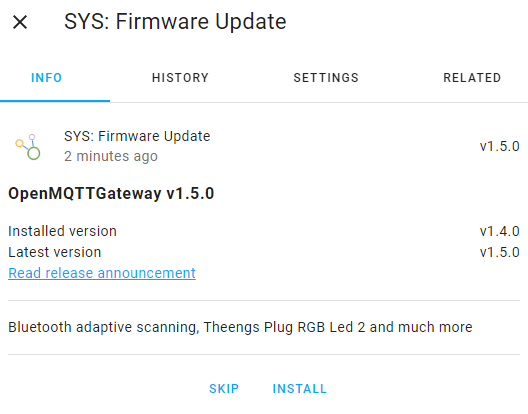

# System commands (ESP only)

## Restart the ESP
`mosquitto_pub -t "home/OpenMQTTGateway/commands/MQTTtoSYS/config" -m '{"cmd":"restart"}'`

::: tip
With Home Assistant, this command is directly available through MQTT auto discovery as a switch into the HASS OpenMQTTGateway device entities list.
:::

## Erase the ESP settings

`mosquitto_pub -t "home/OpenMQTTGateway/commands/MQTTtoSYS/config" -m '{"cmd":"erase"}'`

::: tip
With Home Assistant, this command is directly available through MQTT auto discovery as a switch into the HASS OpenMQTTGateway device entities list.
:::

## Retrieve current status of the ESP

`mosquitto_pub -t "home/OpenMQTTGateway/commands/MQTTtoSYS/config" -m '{"cmd":"status"}'`

## Auto discovery
You can deactivate the MQTT auto discovery function, this function enables to automatically create devices/entities with Home Assistant convention.
### Deactivate
`mosquitto_pub -t "home/OpenMQTTGateway/commands/MQTTtoSYS/config" -m '{"discovery":false}'`

### Activate
`mosquitto_pub -t "home/OpenMQTTGateway/commands/MQTTtoSYS/config" -m '{"discovery":true}'`

If you want the settings to be kept upon gateway restart, you can publish the command with the retain flag.

::: tip
Auto discovery is enable by default on release binaries, on platformio (except for UNO). With Arduino IDE please read the [advanced configuration section](../upload/advanced-configuration#auto-discovery) of the documentation.
:::

## Change the WiFi credentials

`mosquitto_pub -t "home/OpenMQTTGateway/commands/MQTTtoSYS/config" -m '{"wifi_ssid":"ssid", "wifi_pass":"password"}'`

::: tip
If the new connection fails the gateway will fallback to the previous connection.
:::

## Change the MQTT broker credentials
```
mosquitto_pub -t "home/OpenMQTTGateway/commands/MQTTtoSYS/config" -m
'{
  "mqtt_user": "user_name",
  "mqtt_pass": "password",
  "mqtt_server": "host",
  "mqtt_port": "port",
  "mqtt_secure": "false"
}'
```
::: info
By default this function is not available on the pre built binary of RFBridge, in order to have less code size and enable to have OTA update working properly. So as to enable it remove from the rf bridge env:
```
build_flags = '-UMQTTsetMQTT'
``` 
Arduino boards does not have this function per default also, to add it:
```
build_flags = '-DMQTTsetMQTT'
``` 
:::

::: tip
Server, port, and secure_flag are only required if changing connection to another broker.  
If the new connection fails the gateway will fallback to the previous connection.
:::

## Change the MQTT main topic and or gateway name
```
mosquitto_pub -t "home/OpenMQTTGateway/commands/MQTTtoSYS/config" -m
'{
  "mqtt_topic": "topic/",
  "gateway_name": "name"
}'
```
::: info
This will change the subscribed and published mqtt_topic/gateway_name that the gateway uses. No parameters are mandatory, the current topic or gateway name will be used if not supplied.
:::

## Switching brokers and using self signed and client certificates

In the `user_config.h` file it is possible to specify multiple MQTT brokers and client certificates. These are commonly self signed and are supported by defining `MQTT_SECURE_SELF_SIGNED` as true or 1.  
Additionally, support for multiple brokers and client certificates has been added. To use this, it is required that the server certificate, client certificate, and client key are provided as their own constant string value as demonstrated in the file.  
To add more than one broker and switch between them it is necessary to provide all of the relevant certificates/keys and add their respective variable names in the `certs_array` structure, as shown in `user_config.h`, and changing the array size to the number of different connections -1.  

To switch between these servers with an MQTT command message, the format is as follows:
```
mosquitto_pub -t "home/OpenMQTTGateway/commands/MQTTtoSYS/config" -m
'{
  "mqtt_user": "user",
  "mqtt_pass": "password",
  "mqtt_server": "host",
  "mqtt_port": "port",
  "mqtt_secure": "true",
  "mqtt_cert_index":0
 }'
 ```
::: tip
The `mqtt_cert_index` value corresponds to the 0 to X index of the `certs_array` in `user_config.h`.
:::

# Firmware update from MQTT (ESP only)

When the gateway used is from a standard ESP32 environment [listed and defined here](https://github.com/1technophile/OpenMQTTGateway/blob/development/environments.ini), it can be updated through a simple MQTT command:
```
mosquitto_pub -t "home/OpenMQTTGateway_ESP32_BLE/commands/MQTTtoSYS/firmware_update" -m '{
  "version": "latest"
}'
```
This would download the latest version firmware binary from Github and install it.
It can be used with version 1.5.0 and above.

Note that this update option is also autodiscovered through Home Assistant convention, you can update directly from the device page with 2 clicks.



You can also indicate the target version to update:
```
mosquitto_pub -t "home/OpenMQTTGateway_ESP32_BLE/commands/MQTTtoSYS/firmware_update" -m '{
  "version": "v1.2.0"
}'
```

OpenMQTTGateway checks at start and every hour if an update is available.

Alternatively if you want to choose the update URL you can use the command below (ESP32 and ESP8266):

Without certificate, in this case we will use the root certificate defined in User_config.h
```
mosquitto_pub -t "home/OpenMQTTGateway_ESP32_BLE/commands/MQTTtoSYS/firmware_update" -m '{
  "version": "test",
  "password": "OTAPASSWORD",
  "url": "https://github.com/1technophile/OpenMQTTGateway/releases/download/v0.9.12/esp32dev-ble-firmware.bin"
}'
```

With certificate:
```
mosquitto_pub -t "home/OpenMQTTGateway_ESP32_BLE/commands/MQTTtoSYS/firmware_update" -m '{
  "version": "test",
  "password": "OTAPASSWORD",
  "url": "https://github.com/1technophile/OpenMQTTGateway/releases/download/v0.9.12/esp32dev-ble-firmware.bin",
  "server_cert": "-----BEGIN CERTIFICATE-----
MIIDrzCCApegAwIBAgIQCDvgVpBCRrGhdWrJWZHHSjANBgkqhkiG9w0BAQUFADBh
MQswCQYDVQQGEwJVUzEVMBMGA1UEChMMRGlnaUNlcnQgSW5jMRkwFwYDVQQLExB3
d3cuZGlnaWNlcnQuY29tMSAwHgYDVQQDExdEaWdpQ2VydCBHbG9iYWwgUm9vdCBD
QTAeFw0wNjExMTAwMDAwMDBaFw0zMTExMTAwMDAwMDBaMGExCzAJBgNVBAYTAlVT
MRUwEwYDVQQKEwxEaWdpQ2VydCBJbmMxGTAXBgNVBAsTEHd3dy5kaWdpY2VydC5j
b20xIDAeBgNVBAMTF0RpZ2lDZXJ0IEdsb2JhbCBSb290IENBMIIBIjANBgkqhkiG
9w0BAQEFAAOCAQ8AMIIBCgKCAQEA4jvhEXLeqKTTo1eqUKKPC3eQyaKl7hLOllsB
CSDMAZOnTjC3U/dDxGkAV53ijSLdhwZAAIEJzs4bg7/fzTtxRuLWZscFs3YnFo97
nh6Vfe63SKMI2tavegw5BmV/Sl0fvBf4q77uKNd0f3p4mVmFaG5cIzJLv07A6Fpt
43C/dxC//AH2hdmoRBBYMql1GNXRor5H4idq9Joz+EkIYIvUX7Q6hL+hqkpMfT7P
T19sdl6gSzeRntwi5m3OFBqOasv+zbMUZBfHWymeMr/y7vrTC0LUq7dBMtoM1O/4
gdW7jVg/tRvoSSiicNoxBN33shbyTApOB6jtSj1etX+jkMOvJwIDAQABo2MwYTAO
BgNVHQ8BAf8EBAMCAYYwDwYDVR0TAQH/BAUwAwEB/zAdBgNVHQ4EFgQUA95QNVbR
TLtm8KPiGxvDl7I90VUwHwYDVR0jBBgwFoAUA95QNVbRTLtm8KPiGxvDl7I90VUw
DQYJKoZIhvcNAQEFBQADggEBAMucN6pIExIK+t1EnE9SsPTfrgT1eXkIoyQY/Esr
hMAtudXH/vTBH1jLuG2cenTnmCmrEbXjcKChzUyImZOMkXDiqw8cvpOp/2PV5Adg
06O/nVsJ8dWO41P0jmP6P6fbtGbfYmbW0W5BjfIttep3Sp+dWOIrWcBAI+0tKIJF
PnlUkiaY4IBIqDfv8NZ5YBberOgOzW6sRBc4L0na4UU+Krk2U886UAb3LujEV0ls
YSEY1QSteDwsOoBrp+uvFRTp2InBuThs4pFsiv9kuXclVzDAGySj4dzp30d8tbQk
CAUw7C29C79Fv1C5qfPrmAESrciIxpg0X40KPMbp1ZWVbd4=
-----END CERTIFICATE-----"}'
```

A bash script is available [here](ota_command_cert.zip) to simplify the use of the `server_cert` parameter.  


To enable this functionality, `MQTT_HTTPS_FW_UPDATE` will need to be defined or the line that defines in in user_config.h will need to be uncommented.

::: tip
If using an unsecure MQTT broker it is **highly recommended** to disable the password checking by setting the macro `MQTT_HTTPS_FW_UPDATE_USE_PASSWORD` to 0 (default is 1 (enabled)), otherwise a clear text password may be sent over the network.  

The `server_cert` parameter is optional. If the update server has changed or certificate updated or not set in `user_config.h` then you can provide the certificate here.
:::

::: warning
The pre-built binaries for **rfbridge** and **avatto-bakeey-ir** have the above WiFi and MQTT broker credentials and the Firmware update via MQTT options disabled. This is due to the restricted available flash, so as to still be able to use OTA firmware updates for these boards.
:::

# State LED usage

The gateway can support up to 3 LED to display its operating state:
* LED_INFO 
switched ON when network and MQTT connection are OK
5s ON, 5s OFF when MQTT is disconnected
2s ON, 2s OFF when NETWORK is disconnected

* LED_RECEIVE
Blink for `TimeLedON` 1s when the gateway receive a signal from one of its module so as to send to MQTT

* LED_SEND
Blink for `TimeLedON` 1s when the gateway send a signal with one of its module from an MQTT command

