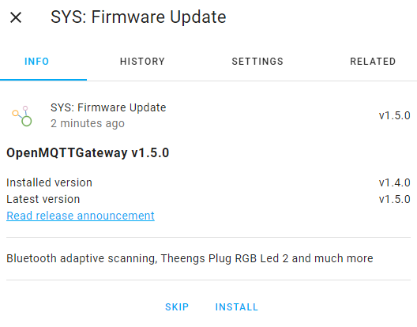

# System commands (ESP only)

## Restart the ESP
`mosquitto_pub -t "home/OpenMQTTGateway/commands/MQTTtoSYS/config" -m '{"cmd":"restart"}'`

::: tip
With Home Assistant, this command is directly available through MQTT auto discovery as a switch into the HASS OpenMQTTGateway device entities list.
:::

## Erase the ESP settings

`mosquitto_pub -t "home/OpenMQTTGateway/commands/MQTTtoSYS/config" -m '{"cmd":"erase"}'`

::: tip
With Home Assistant, this command is directly available through MQTT auto discovery as a switch into the HASS OpenMQTTGateway device entities list.
:::

## Retrieve current status of the ESP

`mosquitto_pub -t "home/OpenMQTTGateway/commands/MQTTtoSYS/config" -m '{"cmd":"status"}'`

## Auto discovery
You can deactivate the MQTT auto-discovery function, which enables you to create devices/entities with the Home Assistant convention automatically. This function is set to `true` at startup for 30 minutes unless you deactivate it.

### Deactivate
`mosquitto_pub -t "home/OpenMQTTGateway/commands/MQTTtoSYS/config" -m '{"disc":false}'`

### Activate
`mosquitto_pub -t "home/OpenMQTTGateway/commands/MQTTtoSYS/config" -m '{"disc":true}'`

If you want the settings to be kept upon gateway restart, you can save the state by adding `"save":true` (ESP32 only).
`mosquitto_pub -t "home/OpenMQTTGateway/commands/MQTTtoSYS/config" -m '{"disc":false, "save":true}'`

::: tip
Auto discovery is enabled by default on release binaries and platformio.
:::

## Activate Offline mode

`mosquitto_pub -t "home/OpenMQTTGateway/commands/MQTTtoSYS/config" -m '{"offline":true,"save":true}'`


## Filter messages

OpenMQTTGateway enables to set pass and block lists to filter outbound messages. The filter can be defined for any keys of the JSON containing a string, and also for MQTT topics.

### Filter Constraints
- **Maximum filters**: 50 total filters combined (pass + block lists)
- **Pattern matching**: Supports simple wildcards `*` (any sequence) and `?` (single character)

Here is an example of append a new setup of filter:

```sh
$> mosquitto_pub -t "home/OpenMQTTGateway/commands/MQTTtoSYS/config" -m '{"filter":{"block":{"name":["TP_*"]},"pass":{"name":["ATC*"]}}}'
```

You don't need to specify both filters; you can use any combination you prefer. The logic behind the pass and block filters is as follows:

A message is allowed if both conditions are met:
- The block list is disabled, or the message is not in the block list (it is not explicitly blocked).
- The pass list is disabled, empty, or the message is in the pass list (it is explicitly allowed).


### Wildcard Pattern Matching
The filter supports two types of wildcards:
- `*` - Matches any sequence of characters (including empty)
- `?` - Matches exactly one character

**Examples:**
- `sensor_*` matches `sensor_123`, `sensor_abc`, `sensor_`
- `dev??e` matches `device`, `devABe` but not `dev1e`
- `*_sensor_*` matches `temp_sensor_01`, `humidity_sensor_data`

### Topic Filtering
OpenMQTTGateway also supports filtering based on MQTT topics. This allows you to control which topics are allowed or blocked at the gateway level.

**Topic Filter Examples:**
- `home/sensor/*` - Allows all topics under `home/sensor/`
- `home/*/temp` - Allows topics like `home/kitchen/temp`, `home/bedroom/temp`
- `home/blocked/*` - Blocks all topics under `home/blocked/`

### Filter Limits
::: warning IMPORTANT
- Maximum of **50 total filters** (combined pass and block lists)
- If you attempt to add more than 50 filters, the gateway will log a warning and reject the additional filters
- The filter count includes both exact matches and wildcard patterns
:::

### Filter Commands API Documentation

#### **Overview**

Filter commands allow you to manage and control filtering rules on the gateway.  Take attention that some commands are **immediate actions**:

#### **Command Table**

| **Command**                    | **Description**                                                                                                       | **Parameters**                            | **Example**                                                                                                                                             |
| ------------------------------ | --------------------------------------------------------------------------------------------------------------------- | ----------------------------------------- | ------------------------------------------------------------------------------------------------------------------------------------------------------- |
| `reset`                        | Resets all filters and restores the gateway to its initial state.                                                     | `cmd: "reset"`                            | `sh mosquitto_pub -t "home/OpenMQTTGateway/commands/MQTTtoSYS/config" -m '{"filter":{"cmd":"reset"}}'`                                                  |
| `clear`                        | Clears all filters but keeps the `ignore_pass` and `ignore_block` flags unchanged.                                    | `cmd: "clear"`                            | `sh mosquitto_pub -t "home/OpenMQTTGateway/commands/MQTTtoSYS/config" -m '{"filter":{"cmd":"clear"}}'`                                                  |
| `persist`                      | Persists the current filter configuration across gateway restarts.                                                    | `cmd: "persist"`                          | `sh mosquitto_pub -t "home/OpenMQTTGateway/commands/MQTTtoSYS/config" -m '{"filter":{"cmd":"persist"}}'`                                                |
| `reload`                       | Reloads the filter configuration from storage.                                                                        | `cmd: "reload"`                           | `sh mosquitto_pub -t "home/OpenMQTTGateway/commands/MQTTtoSYS/config" -m '{"filter":{"cmd":"reload"}}'`                                                 |
| `purge`                        | Resets filters and purges any stored configuration.                                                                   | `cmd: "purge"`                            | `sh mosquitto_pub -t "home/OpenMQTTGateway/commands/MQTTtoSYS/config" -m '{"filter":{"cmd":"purge"}}'`                                                  |
| `status`                       | Requests the gateway to publish its current filter   settings.                                                          | `cmd: "status"`                           | `sh mosquitto_pub -t "home/OpenMQTTGateway/commands/MQTTtoSYS/config" -m '{"cmd":"status"}'`                                                            |
| `ignore_pass` / `ignore_block` | Temporarily disables filter enforcement without removing configured filters. Can be combined with `pass` and `block`. | `ignore_pass: true`, `ignore_block: true` | `sh mosquitto_pub -t "home/OpenMQTTGateway/commands/MQTTtoSYS/config" -m '{"filter":{"ignore_pass":true,"ignore_block":true}}'`                         |
| `new`                          | Creates a new filter configuration from scratch.                                                                      | `cmd: "new"`, `block`, `pass`             | `sh mosquitto_pub -t "home/OpenMQTTGateway/commands/MQTTtoSYS/config" -m '{"filter":{"cmd":"new","block":{"name":["TP_*"]},"pass":{"name":["ATC*"]}}}'` |
| `rules`                        | Programmatically add filter rules with full validation and error handling.                                            | `rules: [...]`                            | See **Rules Array Format** section below                                                                                                                 |

***

#### **Parameters**

| **Parameter**  | **Type**  | **Description**                                                                           |
| -------------- | --------- | ----------------------------------------------------------------------------------------- |
| `cmd`          | `string`  | Specifies the command to execute (`reset`, `clear`, `persist`, `reload`, `purge`, `new`). |
| `block`        | `object`  | Defines blocking rules (e.g., `{"name":["TP_*"]}`).                                       |
| `pass`         | `object`  | Defines passing rules (e.g., `{"name":["ATC*"]}`).                                        |
| `ignore_pass`  | `boolean` | If `true`, ignores pass rules temporarily.                                                |
| `ignore_block` | `boolean` | If `true`, ignores block rules temporarily.                                               |
| `rules`        | `array`   | Array of rule objects with validation (see **Rules Array Format** below).                  |

***

#### **Rules Array Format**

The `rules` array allows programmatic definition of filters with built-in validation and error handling. Each rule must be a JSON object with the following structure:

```json
{
  "target": "topic",
  "action": "pass|block",
  "value": "filter_value",
  "key": "field_name (only for message target)"
}
```

**Rule Fields:**
- `target`(optional): `"topic"` for MQTT topic filtering (default is message) 
- `action`(required): `"pass|block"` for the action to allow  (default si denay)
- `key` : Field name when `target` is not `"topic"`, ignored for `"topic"`
- `value` (required): The filter value (supports wildcards `*` and `?`)


**Example with Rules Array:**

```json
{
  "filter": {
    "rules": [
      {
        "target": "topic",
        "action": "pass",
        "value": "home/sensor/*"
      },
      {
        "action": "block",
        "key": "id",
        "value": "badDevice*"
      },
      {
        "target": "topic",
        "action": "block",
        "value": "home/blocked/*"
      },
      {
        "action": "pass",
        "key": "name",
        "value": "ATC*"
      }
    ]
  }
}
```

::: info VALIDATION
The gateway validates each rule in the array individually:
- Invalid rules are logged and skipped
- Valid rules continue to be processed
- If you accidentally mix non-object elements (strings, numbers, arrays) in the rules array, they are automatically skipped
- Check the gateway logs to see details about rejected rules
:::

***

#### **Usage Notes**

*   Commands like `reset`, `clear`, `purge`, `persist`, and `reload` **cannot be combined** with other filter rules in the same message.
*   Use `ignore_pass` and `ignore_block` for temporary overrides without deleting existing configurations.
*   The `new` command replaces the entire filter configuration with the provided rules.
*   The `rules` array provides programmatic control with full validation - use this for complex filter setups.


### Filter Examples
This is an advanced example that create a new configuration that allows only messages that contain the MAC address of "Tuya Smart Inc" and "Apple, Inc." and within those messages it blocks all devices with names starting with the prefix "BRO" and the attribute "something" with the exact value "strange."

```json
{ 
  "filter":{
    "cmd":"new",
    "pass": {
      "mac": ["00:33:7A:*","00:03:93:*"]
    },
    "block": {
      "name": ["BRO*"],
      "something": ["strange"]
    },
    "ignore_pass":false,
    "ignore_block":false
  }
}
```

#### **Topic Filtering Examples**

Example 1: Block all topics under a specific path while allowing sensor topics:

```json
{
  "filter": {
    "rules": [
      {
        "target": "topic",
        "action": "pass",
        "value": "home/sensor/*"
      },
      {
        "target": "topic",
        "action": "block",
        "value": "home/debug/*"
      }
    ]
  }
}
```

Example 2: Complex topic and message filtering with rules array:

```json
{
  "filter": {
    "rules": [
      {
        "target": "topic",
        "action": "pass",
        "value": "home/*/temp"
      },
      {
        "target": "topic",
        "action": "block",
        "value": "home/blocked/*"
      },
      {
        "action": "pass",
        "key": "mac",
        "value": "00:33:7A:*"
      },
      {
        "action": "block",
        "key": "name",
        "value": "BRO*"
      }
    ]
  }
}
```

Example 3: Using rules with message field filters:

```json
{
  "filter": {
    "rules": [
      {
        "action": "pass",
        "key": "id",
        "value": "sensor_*"
      },
      {
        "action": "pass",
        "key": "id",
        "value": "device_*"
      },
      {
        "action": "block",
        "key": "name",
        "value": "TEST*"
      }
    ]
  }
}
```

::: tip PERFORMANCE
The wildcard matching is optimized for ESP32/ESP8266 and uses minimal resources. Unlike regex patterns, wildcards `*` and `?` have negligible performance impact and are safe to use even on ESP8266.
:::


## Change the WiFi credentials

`mosquitto_pub -t "home/OpenMQTTGateway/commands/MQTTtoSYS/config" -m '{"wifi_ssid":"ssid", "wifi_pass":"password"}'`

::: tip
If the new connection fails the gateway will fallback to the previous connection.
:::

## Change the gateway password

The password must be 8 characters minimum.

`mosquitto_pub -t "home/OpenMQTTGateway/commands/MQTTtoSYS/config" -m '{"gw_pass":"12345678"}'`

## Change the MQTT broker credentials
```
mosquitto_pub -t "home/OpenMQTTGateway/commands/MQTTtoSYS/config" -m
'{
  "mqtt_user": "user_name",
  "mqtt_pass": "password",
  "mqtt_server": "host",
  "mqtt_port": "port",
  "mqtt_validate": false,
  "mqtt_secure": false
}'
```

::: tip INFO
By default this function is not available on the pre built binary of RFBridge, in order to have less code size and enable to have OTA update working properly. So as to enable it remove from the rf bridge env:
```
build_flags = '-UMQTTsetMQTT'
``` 
:::

::: tip
If the new connection fails the gateway will fallback to the previous connection.
:::

## Change the MQTT main topic, discovery prefix, and or gateway name
```
mosquitto_pub -t "home/OpenMQTTGateway/commands/MQTTtoSYS/config" -m
'{
  "mqtt_topic": "topic/",
  "discovery_prefix": "prefix",
  "gateway_name": "name"
}'
```
::: tip INFO
This will change the subscribed and published mqtt_topic/gateway_name that the gateway uses. No parameters are mandatory, the current topic or gateway name will be used if not supplied.
:::

## Switching brokers and using signed and client certificates

In the `user_config.h` file it is possible to specify multiple MQTT brokers and client certificates.
Additionally, support for multiple brokers and client certificates has been added. To use this, it is required that the server certificate, client certificate, and client key are provided as their own constant string value as demonstrated in the file.  
To add more than one broker and switch between them it is necessary to provide all of the relevant certificates/keys and add their respective variable names in the `cnt_parameters_array` structure, as shown in `user_config.h`..  

To switch between these connections with an MQTT command message, the format is as follows:
```
mosquitto_pub -t "home/OpenMQTTGateway/commands/MQTTtoSYS/config" -m
'{
  "mqtt_user": "user",
  "mqtt_pass": "password",
  "mqtt_server": "host",
  "mqtt_port": "port",
  "mqtt_secure": true,
  "mqtt_validate": true,
  "cnt_index":1,
  "save_cnt": true
 }'
 ```
::: tip
The `cnt_index` value corresponds to the 0 to 2 index of the `cnt_parameters_array` in `user_config.h`.
0 being the default index, containing the onboarding parameters.
:::

To read the connection parameters:
```
mosquitto_pub -t "home/OpenMQTTGateway/commands/MQTTtoSYS/config" -m
'{
  "cnt_index":1,
  "read_cnt": true
 }'
 ```

 To test a connection change without saving:
 ```
mosquitto_pub -t "home/OpenMQTTGateway/commands/MQTTtoSYS/config" -m
'{
  "cnt_index":1,
  "test_cnt": true
 }'
 ```

::: tip
If the client can't connect to the MQTT broker corresponding to the current `cnt_index`, it will increment the index to the next valid connection set and restart with it.
:::

## Saving/Loading connection parameters/certificates at runtime
This chapter details the process for managing certificates/connections parameters used for secure MQTT communication with OpenMQTTGateway

### Storing and Loading Certificates
* Flash Memory Storage:
Certificates can be saved to the flash memory using specific indices. Valid indices for storing certificates are 1 and 2, as 0 is reserved for the default certificate.
* RAM Memory Loading:
Certificates can be loaded from RAM, where valid indices range from 0 to 2. The device publishes a hash of the certificate to the broker to verify its identity. If the connection using the current certificate fails, the device will revert to the previous certificate.

### Use Case: Changing a Group of Certificates
When updating certificates, follow these steps to ensure that the new certificates are correctly loaded and used:

1. Push Certificates via MQTT:
Send the new certificates one by one through MQTT, using indices 1 or 2. Replace newline characters (\n) in the certificates with spaces.
```json
{
  "cnt_index": 1,
  "mqtt_server_cert": "-----BEGIN CERTIFICATE----- MIIDQTCC----END CERTIFICATE-----"
}
```

Accepted certificates are:
* `mqtt_server_cert`
* `mqtt_client_cert`
* `mqtt_client_key`
* `ota_server_cert`

2. Verify Certificates in RAM:
After pushing the certificates, verify that they have been correctly loaded into RAM.
```json
{
  "cnt_index": 1,
  "read_cnt": true
}
```

3. Test and Save Certificates:
Once verification is complete, test the connection using the new certificates. If the connection is successful, send the command to save the certificates to flash.
```json
{
  "cnt_index": 1,
  "save_cnt": true
}
```

4. Broker Connection:
The broker will attempt to use the newly received certificates for the connection.

5. Successful Connection Handling:
If the connection is successful, the certificates are permanently stored in the flash memory at the specified index.

6. Handling Connection Failures:
If the connection fails, the device will revert to the previously used certificate index, and the new certificates will not be saved.

# Firmware update from MQTT (ESP only)

When the gateway used is from a standard ESP32 environment [listed and defined here](https://github.com/1technophile/OpenMQTTGateway/blob/development/environments.ini), it can be updated through a simple MQTT command:
```
mosquitto_pub -t "home/OpenMQTTGateway_ESP32_BLE/commands/MQTTtoSYS/firmware_update" -m '{
  "version": "latest"
}'
```
This would download the latest version firmware binary from Github and install it.
It can be used with version 1.5.0 and above.

Note that this update option is also autodiscovered through Home Assistant convention, you can update directly from the device page with 2 clicks.



You can also indicate the target version to update:
```
mosquitto_pub -t "home/OpenMQTTGateway_ESP32_BLE/commands/MQTTtoSYS/firmware_update" -m '{
  "version": "v1.2.0"
}'
```

OpenMQTTGateway checks at start and every hour if an update is available.

Alternatively if you want to choose the update URL you can use the command below (ESP32 and ESP8266):

Without certificate, in this case the gateway will use the ota_server_cert certificate defined in default_ota_cert.h
```
mosquitto_pub -t "home/OpenMQTTGateway_ESP32_BLE/commands/MQTTtoSYS/firmware_update" -m '{
  "version": "test",
  "password": "OTAPASSWORD",
  "url": "https://github.com/1technophile/OpenMQTTGateway/releases/download/v0.9.12/esp32dev-ble-firmware.bin"
}'
```

With certificate (replace the \n in the certificate by spaces to publish it easily):
```
mosquitto_pub -t "home/OpenMQTTGateway_ESP32_BLE/commands/MQTTtoSYS/firmware_update" -m '{
  "version": "test",
  "password": "OTAPASSWORD",
  "url": "https://github.com/1technophile/OpenMQTTGateway/releases/download/v0.9.12/esp32dev-ble-firmware.bin",
  "ota_server_cert": "-----BEGIN CERTIFICATE----- MIIDrzCCApegAwIBAgIQCDvgVpBCRrGhdWrJWZHHSjANBgkqhkiG9w0BAQUFADBh CAUw7C29C79Fv1C5qfPrmAESrciIxpg0X40KPMbp1ZWVbd4= -----END CERTIFICATE-----"}'
```

A bash script is available [here also](ota_command_cert.zip) to simplify the use of the `server_cert` parameter.  


Alternatively the OTA certificate can also be saved with the cnt_index for future use:

```
mosquitto_pub -t "home/OpenMQTTGateway_ESP32_BLE/commands/MQTTtoSYS/config" -m '{
  "cnt_index": 1,
  "save_cnt":true,
  "ota_server_cert": "-----BEGIN CERTIFICATE----- MIIDrzCCApegAwIBAgIQCDvgVpBCRrGhdWrJWZHHSjANBgkqhkiG9w0BAQUFADBh CAUw7C29C79Fv1C5qfPrmAESrciIxpg0X40KPMbp1ZWVbd4= -----END CERTIFICATE-----"
}'
```
The other connection parameters corresponding to the index need to be valid for the save function to work. This command will switch to connection parameters of index 1.

To enable this functionality, `MQTT_HTTPS_FW_UPDATE` will need to be defined or the line that defines in in user_config.h will need to be uncommented.

::: tip
If using an unsecure MQTT broker it is **highly recommended** to disable the password checking by setting the macro `MQTT_HTTPS_FW_UPDATE_USE_PASSWORD` to 0 (default is 1 (enabled)), otherwise a clear text password may be sent over the network.  

The `server_cert` parameter is optional. If the update server has changed or certificate updated or not set in `user_config.h` then you can provide the certificate here.
:::

::: warning
The pre-built binaries for **rfbridge** and **avatto-bakeey-ir** have the above WiFi and MQTT broker credentials and the Firmware update via MQTT options disabled. This is due to the restricted available flash, so as to still be able to use OTA firmware updates for these boards.
:::

# Communication layers

## MQTT
OpenMQTTGateway uses per default MQTT on top of Ethernet or WiFi for communicating (default: true).
The MQTT communication can be deactivated with the following command:
`mosquitto_pub -t "home/OpenMQTTGateway/commands/MQTTtoSYS/config" -m '{"mqtt":false}'`
Once activated the MQTT API is no longer accessible

## Serial
Added to MQTT, OpenMQTTGateway cans use Serial to transmit or receive json data (default: false):
`mosquitto_pub -t "home/OpenMQTTGateway/commands/MQTTtoSYS/config" -m '{"serial":true}'`

The build need to have the following macro:
```
  '-DZgatewaySERIAL="SERIAL"'
```

An example scenario is a slave offline ESP32 dedicated to RF decoding connected to another online ESP32 through Serial.

# Indicators

## Change the LED indicator brightness

Minimum: 0, Maximum: 255, Default defined by DEFAULT_ADJ_BRIGHTNESS

`mosquitto_pub -t "home/OpenMQTTGateway/commands/MQTTtoSYS/config" -m '{"brightness":200}'`

## Understanding LED Indicators in OpenMQTTGateway
With boards having one or several RGB Led, OpenMQTTGateway uses them to provide visual feedback about its current state. This guide will help you interpret these LED signals to understand what's happening with your gateway.

## LED Color Guide
OpenMQTTGateway uses a variety of colors to indicate different states:

Green (0x00FF00): Indicates normal operation or successful connections
Blue (0x0000FF): Shows processing or offline status
Orange (0xFFA500): Indicates waiting states or minor issues
Yellow (0xFFFF00): Used during the onboarding process
Red (0xFF0000): Signals an error state
Magenta (0xFF00FF): Indicates local Over-The-Air (OTA) updates
Purple (0x8000FF): Shows remote OTA updates are in progress

## Understanding Gateway States
Here's what different LED behaviors mean:

### Power On

Color: Green
Behavior: Solid light
Meaning: The gateway is powered and operational

### Processing

Color: Blue
Behavior: Blinking (3 times)
Meaning: The gateway is processing data

### Waiting for Onboarding

Color: Orange
Behavior: Solid light
Meaning: The gateway is ready to be set up

### Onboarding in Progress

Color: Yellow
Behavior: Solid light
Meaning: The gateway is being configured

### Network Connected

Color: Green
Behavior: Solid light
Meaning: Successfully connected to the network

### Network Disconnected

Color: Orange
Behavior: Blinking
Meaning: Lost connection to the network

### MQTT Broker Connected

Color: Green
Behavior: Solid light
Meaning: Successfully connected to the MQTT broker

### MQTT Broker Disconnected

Color: Orange
Behavior: Blinking
Meaning: Lost connection to the MQTT broker

### Offline

Color: Blue
Behavior: Blinking
Meaning: The gateway is offline

### Local OTA Update

Color: Magenta
Behavior: Blinking
Meaning: A local Over-The-Air update is in progress

### Remote OTA Update

Color: Purple
Behavior: Blinking
Meaning: A remote Over-The-Air update is in progress

### Error

Color: Red
Behavior: Blinking (3 times)
Meaning: An error has occurred

### Actuator On/Off

Color: Green
Behavior: Depends on actuator state
Meaning: Indicates the state of a connected actuator