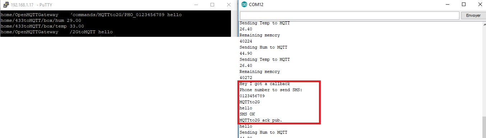
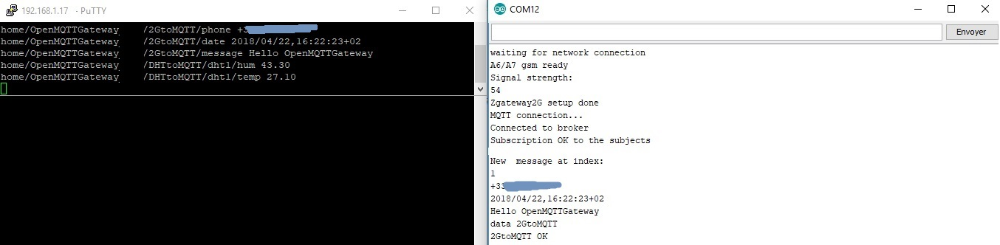

# GSM 2G gateway
## Receiving SMS from 2G

Subscribe to all the messages with mosquitto or open your MQTT client software:
`mosquitto_sub -t +/# -v`

Generate your SMS by sending an SMS to the phone number of the A6/A7 SIM card you will see :

```
home/OpenMQTTGateway/2GtoMQTT {"phone":"+33123456789","date":"2018/04/22,16:17:51+02","message":"Hello OpenMQTTGateway"}
```

## Send data by MQTT to send an SMS message with A6/7

`sudo mosquitto_pub -t home/OpenMQTTGateway/commands/MQTTto2G -m '{"phone":"+33123456789","date":"2018/04/22,16:17:51+02","message":"hello"}'`

This command will send by SMS the sentence "hello" and use the phone number 0123456789

Arduino IDE serial data received when publishing data by MQTT



Arduino IDE serial data received when receiving SMS


