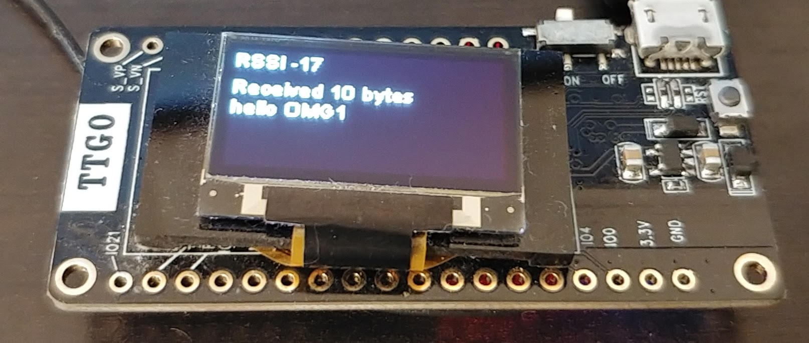

# LORA gateway
## Receiving data from LORA signal

Subscribe to all the messages with mosquitto or open your MQTT client software:

`    sudo mosquitto_sub -t +/# -v`

Generate your LORA signals by using another TTGO LORA module, you can flash the sender program from [this repository](https://github.com/LilyGO/TTGO-LORA32-V2.0) and the SSD1306 library [there](https://github.com/ThingPulse/esp8266-oled-ssd1306)


Once one board flashed with OMG and the other with the sender program you should receive regular packets into `home/OpenMQTTGateway_ESP32_LORA_TEST/LORAtoMQTT` like below:

```json
{"rssi":-16,"snr":9.25,"pferror":-3598,"packetSize":9,"message":"hello 35"}
{"rssi":-26,"snr":9,"pferror":-3598,"packetSize":9,"message":"hello 36"}
{"rssi":-16,"snr":9.5,"pferror":-3581,"packetSize":9,"message":"hello 37"}
```

## Send data by MQTT to convert it on LORA signal 
`mosquitto_pub -t home/OpenMQTTGateway/commands/MQTTtoLORA -m '{"message":"hello OMG1"}'`

This command will send by LORA the message "hello OMG1" and use the default parameters defined in [config_LORA.h](https://github.com/1technophile/OpenMQTTGateway/blob/4b8d28179b63ae3f3d454da57ec8c109c159c386/config_LORA.h#L32)



If you want to test that your sending works you can use another TTGO LORA module, you can flash the receiver program from [this repository](https://github.com/LilyGO/TTGO-LORA32-V2.0)  and the SSD1306 library [there](https://github.com/ThingPulse/esp8266-oled-ssd1306)

## Send data by MQTT with advanced LORA parameters

LORA  sending support the following parameters that should be specified in the json message; 
* txpower: 2 to 20
* spreadingfactor: 6 to 12. If a spreading factor of 6 is set, implicit header mode must be used to transmit and receive * * packets.
* frequency: 433E6, 866E6, 915E6
* signalbandwidth: 7.8E3, 10.4E3, 15.6E3, 20.8E3, 31.25E3, 41.7E3, 62.5E3, 125E3, and 250E3
* codingrate: 5 to 8
* preamblelength: 6 to 65535
* syncword: byte
* enablecrc: boolean

More info on where the LORA library is born [@sandeepmistry](https://github.com/sandeepmistry/arduino-LoRa/blob/master/API.md#radio-parameters)

Example:
`mosquitto_pub -t home/OpenMQTTGateway/commands/MQTTtoLORA -m '{"message":"test8","txpower":17,}'`

will make LORA use the a txpower of 17 when sending the message "test8"
