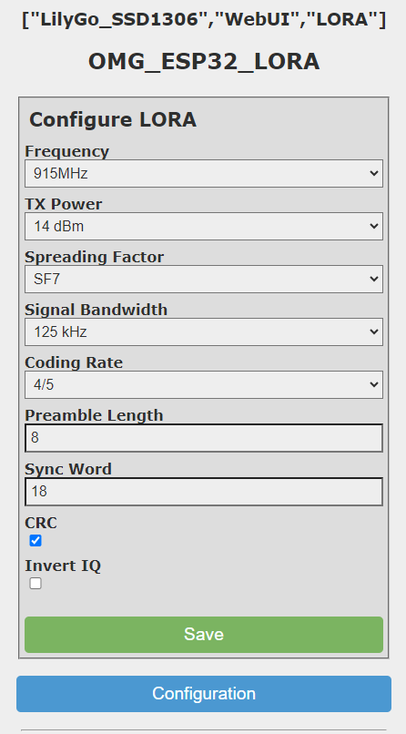
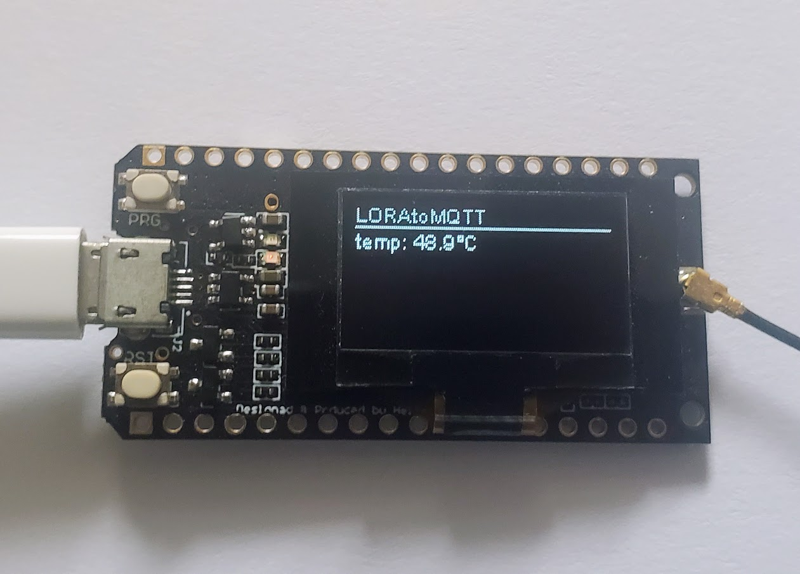
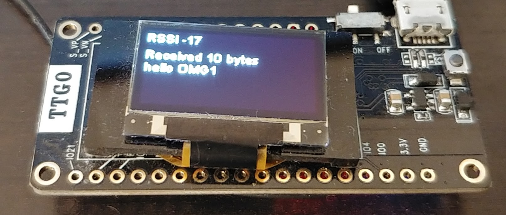

# LoRa gateway

## What is a LoRa gateway
A LoRa (Long Range) gateway is a device that facilitates communication between LoRa nodes and networks, enabling the transmission and reception of data over long distances using the LoRa modulation technique. It's designed to work with devices that utilize LoRa technology, such as the MakerFab soil and moisture sensor, devices from PricelessTookit and DIY sensors.

The primary distinction between a LoRa gateway and a LoRaWAN gateway lies in the protocol and network architecture:

LoRa gateway: Focuses solely on the physical layer, utilizing the LoRa modulation for communication. It's responsible for receiving and transmitting raw LoRa signals without concerning itself with network protocols or data handling at higher layers. Being focused solely on the physical layer, a LoRa gateway offers greater flexibility for customization and experimentation. The OpenMQTTGateway LoRa gateway receives raw LoRa signals, processes them, and publishes the data to an MQTT topic. Conversely, it can subscribe to MQTT topics and send commands to LoRa devices. This gateway is particularly useful for DIY projects, home automation enthusiasts, and scenarios where direct integration of LoRa devices with MQTT is desired.

LoRaWAN gateway: Operates at a higher layer and is part of the LoRaWAN network architecture. LoRaWAN is a protocol specification built on top of the LoRa technology, providing features like adaptive data rate, encryption, and multi-channel/multi-modulation. A LoRaWAN gateway handles the data from multiple LoRa nodes, forwards it to a centralized network server, which then manages the data and communicates back to the nodes.

In essence, while both gateways utilize LoRa technology for communication, a LoRaWAN gateway is more sophisticated, offering advanced features and integration with the LoRaWAN network infrastructure. The LoRa gateway, with its simpler architecture, is ideal for small networks of nodes, offering easier setup and configuration, making it an interesting choice for users keen on experimenting with LoRa technology.

## Configuring the LoRa gateway

The LoRa gateway can be configured by MQTT commands or by using the WebUI, here are the parameters available, they can be combined with the key "save" or "erase":
* txpower: 0 to 14
* spreadingfactor: 7 to 12
* frequency: 433000000, 868000000, 915000000
* signalbandwidth: 7800, 10400, 15500, 20800, 31250, 41700, 62500, 125000, and 250000
* codingrate: 5 to 8
* preamblelength: 6 to 65535
* syncword: byte
* enablecrc: boolean
* invertiq: boolean
* onlyknown: boolean

With the WebUI:


With MQTT commands:
`mosquitto_pub -t home/OpenMQTTGateway/commands/MQTTtoLORA/config -m '{"frequency":"433000000","save":true}'`

## Receiving data from LoRa signal

Subscribe to all the messages with mosquitto or open your MQTT client software:

`    sudo mosquitto_sub -t +/# -v`

Generate your LoRa signals by using another LoRa module, you can flash the sender program from [this example](../../examples/LoraTemperature/) to an ESP32 LoRa board, this sample node will generate a LoRa signal containing the ESP32 internal temperature. 

Once one board flashed with OMG and the other with the sender program you should receive regular packets into `home/OpenMQTTGateway_ESP32_LORA_TEST/LORAtoMQTT/AABBCCDDEEFF` like below:

```json
{"id":"AA:BB:CC:DD:EE:FF","rssi":-16,"snr":9.25,"pferror":-3598,"packetSize":9,"tempc":"55.3"}
{"id":"AA:BB:CC:DD:EE:FF","rssi":-26,"snr":9,"pferror":-3598,"packetSize":9,"tempc":"55.4"}
{"id":"AA:BB:CC:DD:EE:FF","rssi":-16,"snr":9.5,"pferror":-3581,"packetSize":9,"tempc":"57"}
```



Messages that contain non-printable characters will be converted to hexadecimal and look like this:
```json
{"rssi":-121,"snr":-11.75,"pferror":-29116,"packetSize":3,"hex":"C0FFEE"}
```
They can be filtered by setting the "onlyknown" command to `true` or by an activation into the WebUI or Home Assistant.

And from a supported device (in this case, a WiPhone), looks like this:
```json
{"rssi":-50,"snr":9.25,"pferror":20728,"packetSize":30,"from":"123ABC","to":"000000","message":"Hi from WiPhone","type":"WiPhone"}
```
## Send data by MQTT to convert it on LoRa signal 
`mosquitto_pub -t home/OpenMQTTGateway/commands/MQTTtoLORA -m '{"message":"hello OMG1"}'`

This command will send by LoRa the message "hello OMG1" and use the default parameters defined in [config_LORA.h](https://github.com/1technophile/OpenMQTTGateway/blob/4b8d28179b63ae3f3d454da57ec8c109c159c386/config_LORA.h#L32)



If you want to test that your sending works you can use another TTGO LoRa module, you can flash the receiver program from [this repository](https://github.com/LilyGO/TTGO-LORA32-V2.0)  and the SSD1306 library [there](https://github.com/ThingPulse/esp8266-oled-ssd1306)

## Send data by MQTT with advanced LoRa parameters

* Plain text message: `mosquitto_pub -t home/OpenMQTTGateway/commands/MQTTtoLORA -m '{"message":"test8","txpower":17}'`\
will make LoRa use the a txpower of 17 when sending the message "test8"
* Binary message: `mosquitto_pub -t "home/OpenMQTTGateway/commands/MQTTtoLORA" -m '{"hex":"01C0FFEE"}'`\
will send binary 0x01C0FFEE
* WiPhone message: `mosquitto_pub -t "home/OpenMQTTGateway/commands/MQTTtoLORA" -m '{"message":"test","type":"WiPhone","to":"123ABC","from":"FFFFFF"}'`\
will send "test" to a WiPhone with chip ID 123ABC

## Decoding LoRaWAN ABP devices

The gateway can decrypt uplinks from LoRaWAN devices using ABP (activation by personalization), such as Dragino sensors switched to ABP mode. It is not a LoRaWAN network server, so this only suits a simple setup:
* The gateway listens on a single frequency, spreading factor and bandwidth. Set each device to send on that same channel (for example `AT+CHS=903900000` and a fixed data rate with ADR off on Dragino devices) and use sync word `0x34`.
* There is no join (OTAA) and no MAC command handling. Downlinks are sent only when you queue them (see below), and confirmed uplinks are acknowledged. Turn off on the device any feature that waits for MAC answers, such as link checks.

This feature is available on ESP32 only. It is not part of the default binaries: build with `'-DLORA_LORAWAN'`. To also decode the payload with a JavaScript decoder, add `'-DLORA_LORAWAN_JS'` and the Duktape library, for example in your `prod_env.ini`:
```ini
[env:ttgo-lora32-v21-lorawan]
extends = env:ttgo-lora32-v21
lib_deps =
  ${env:ttgo-lora32-v21.lib_deps}
  ${libraries.duktape}
build_flags =
  ${env:ttgo-lora32-v21.build_flags}
  '-DLORA_LORAWAN'
  '-DLORA_LORAWAN_JS'
  '-DARDUINO_LOOP_STACK_SIZE=16384'
```

### Declaring a device
The easiest way is the WebUI: open **Configuration > Configure LoRaWAN**, then **Add device**. The page lists the declared devices. It lets you edit their name, model, session keys, Home Assistant entities and decoder, and test a decoder on a payload before saving. Stored keys are never shown, and an empty key field keeps the current key.

You can also add the device with its DevAddr and session keys through the LoRa configuration command. Use `"save":true` to keep it after a restart:

`mosquitto_pub -t home/OpenMQTTGateway/commands/MQTTtoLORA/config -m '{"lorawan":{"devaddr":"0187F184","nwkskey":"<32 hex digits>","appskey":"<32 hex digits>","name":"Front door","model":"LDS02"},"save":true}'`

You can declare up to 16 devices (`LORAWAN_MAX_DEVICES`), either one at a time or as an array. To change the name or model later, send only the `devaddr` and the fields to change. To delete a device, send `{"lorawan":{"devaddr":"0187F184","remove":true},"save":true}`. The LoRa state message lists the configured devices, but never their keys.

For each uplink, the gateway checks the message integrity code (MIC) with the NwkSKey, drops repeated frames (same frame counter) and decrypts the payload with the AppSKey. It then publishes to `home/OpenMQTTGateway/LORAtoMQTT/<DEVADDR>`:
```json
{"id":"0187F184","name":"Front door","model":"LDS02","fcnt":67,"fport":10,"payload":"8C6C0100003B00000000","rssi":-34,"snr":10.5,"pferror":-2435,"packetSize":23}
```
Packets from unknown devices, or that fail the MIC check, are published as raw `hex` like any other binary packet.

### JavaScript payload decoders
With `LORA_LORAWAN_JS`, you can attach a decoder to each device. It uses the same formats as The Things Network:
* `function Decoder(bytes, port)` returns an object (TTN v2).
* `function decodeUplink(input)` receives `{bytes, fPort}` and returns `{data, warnings, errors}` (TTN v3).

Publish the script as is, not wrapped in JSON, to `home/OpenMQTTGateway/LORAWANdecoder/<DEVADDR>`. The device must already be declared. The script is stored in flash and can be up to 3800 bytes (`LORAWAN_DECODER_MAX_SIZE`); an empty message removes it:

`mosquitto_pub -t home/OpenMQTTGateway/LORAWANdecoder/0187F184 -f lds02_decoder.js`

The fields of the decoded object are added to the published message:
```json
{"id":"0187F184","name":"Front door","model":"LDS02","fcnt":67,"fport":10,"payload":"8C6C0100003B00000000","BAT_V":3.18,"BAT_PCNT":"88.33","DOOR_OPEN_STATUS":1,"DOOR_STATE":"open","LAST_DOOR_OPEN_DURATION":0,"UTC_TIME":"2026-10-09T06:49:17.000Z","rssi":-34,"snr":10.5,"pferror":-2435,"packetSize":23}
```
If the decoder fails, the message contains `decoder_error` instead. Decoders run on Duktape (ECMAScript 5.1 with some ES6 additions such as `const`), so arrow functions, `let` and template literals are not supported. When a decoder runs, the gateway sets its clock by NTP so that `new Date()` returns the current time.

### Home Assistant entities
Add an `entities` list to the device declaration to create Home Assistant entities from the published fields:
```json
{"lorawan":{"devaddr":"0187F184","entities":[
  {"key":"DOOR_STATE","type":"binary_sensor","name":"Door","class":"door","on":"open","off":"close"},
  {"key":"BAT_V","name":"Battery voltage","class":"voltage","unit":"V"},
  {"key":"rssi","name":"RSSI","class":"signal_strength","unit":"dBm"}]},"save":true}
```
`type` is `sensor` by default. `class` is the Home Assistant device class. Sensors use `state_class` `measurement` unless you set another one. Fields named like the existing LoRa sensors (`tempc`, `hum`, `moi`, `batt`, `count`) are discovered automatically.

### Downlinks
LoRaWAN devices are usually class A: they only listen for a short time 1 s (RX1) and 2 s (RX2) after each of their uplinks. You can't send a command whenever you want. You queue it, and the gateway sends it in the receive window that follows the next uplink of the device. One queued downlink is sent per uplink, and up to 8 can be queued per device (`LORAWAN_MAX_QUEUE`). Downlinks are encrypted and signed with the device keys. The downlink frame counter is kept in flash.

Queue a command with the `send` key, as an object or an array. The payload is the hex FRMPayload, up to 51 bytes:

`mosquitto_pub -t home/OpenMQTTGateway/commands/MQTTtoLORA/config -m '{"lorawan":{"devaddr":"0187F184","send":{"fport":1,"hex":"01000E10"}}}'`

Use `{"lorawan":{"devaddr":"0187F184","clear_queue":true}}` to drop the pending commands. You can also queue and clear commands from the device page of **Configure LoRaWAN**, which shows the pending commands and the downlink frame counter. The uplink message that triggered a downlink reports it:
```json
{"id":"0187F184","fcnt":5,"fport":10,"payload":"8D500100007300000300","downlink":{"fcnt":0,"window":"rx2","power":20,"fport":1,"payload":"01000E10","source":"mqtt"},"downlink_pending":1}
```

Uplinks with a confirmed data type are acknowledged in the same way, even if no command is queued.

#### Downlink rules
The `downlinks` object of a device declaration holds commands sent automatically, and receive window settings:
```json
{"lorawan":{"devaddr":"0187F184","downlinks":{
  "window":"rx2",
  "schedules":[{"every":86400,"fport":1,"hex":"01015180"}],
  "triggers":[{"when":{"DOOR_STATE":"open"},"fport":1,"hex":"A601","cooldown":3600}]}},"save":true}
```
* `schedules`: queues the command every `every` seconds. It is sent after the first uplink, then after the first uplink following each interval.
* `triggers`: answers an uplink that matches `when`. Use `"uplink"` to match any uplink, or an object of decoded field values that must all be equal. The command is sent in the receive window of that uplink, before the queued ones. `cooldown` (seconds) limits how often it fires.
* `window`: `auto` (default) uses RX1, or RX2 if RX1 can no longer be reached. `rx1` and `rx2` force one window.
* `rx1_frequency`, `rx1_sf`, `rx1_bw`, `rx2_frequency`, `rx2_sf`, `rx2_bw` and `rx1_delay` (seconds, default 1) override the receive windows.
* `tx_power` (dBm) overrides the downlink power.

By default the receive windows follow the region of the configured frequency. For US915 and AU915, RX1 uses the 500 kHz channel matching the uplink channel with the same spreading factor, and RX2 uses 923.3 MHz, SF12, 500 kHz. Both are sent at 20 dBm, because 500 kHz downlinks are about 6 dB less sensitive than 125 kHz uplinks. For EU868, RX1 uses the uplink channel at no more than 14 dBm, and RX2 uses 869.525 MHz, SF12, 125 kHz at 20 dBm. Elsewhere, both windows use the uplink settings and the configured power.

::: tip Dragino devices in single channel mode
With `AT+CHS`, Dragino devices (e.g. LDS02) transmit on the fixed channel, but compute their RX1 channel from their internal channel hopping, so RX1 changes from one uplink to the next. RX2 is fixed: use `"window":"rx2"`. Their downlink commands (e.g. `01000E10` for a 1 hour uplink interval) were accepted on port 1 in testing.
:::

ABP devices usually restart their frame counter when they reboot. The gateway accepts such a restart (the message contains `"fcnt_reset":true`) instead of rejecting the frames.

More info on where the LoRa library is born [@sandeepmistry](https://github.com/sandeepmistry/arduino-LoRa/blob/master/API.md#radio-parameters)

Tutorial on how to leverage LoRa for a mailbox sensor from [PricelessToolkit](https://www.youtube.com/channel/UCz75N6inuLHXnRC5tqagNLw):
<iframe width="560" height="315" src="https://www.youtube.com/embed/6DftaHxDawM" frameborder="0" allow="autoplay; encrypted-media" allowfullscreen></iframe>
