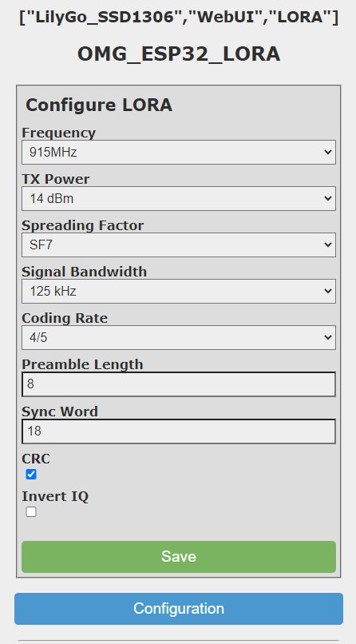

# LORA gateway

Tutorial on how to leverage LORA for a mailbox sensor from [PricelessToolkit](https://www.youtube.com/channel/UCz75N6inuLHXnRC5tqagNLw):
<iframe width="560" height="315" src="https://www.youtube.com/embed/6DftaHxDawM" frameborder="0" allow="autoplay; encrypted-media" allowfullscreen></iframe>

## Configuring the LORA gateway

The LORA gateway can be configured by MQTT commands or by using the WebUI, here are the parameters available, they can be combined with the key "save" or "erase":
* txpower: 0 to 14
* spreadingfactor: 7 to 12
* frequency: 433000000, 868000000, 915000000
* signalbandwidth: 7800, 10400, 15500, 20800, 31250, 41700, 62500, 125000, and 250000
* codingrate: 5 to 8
* preamblelength: 6 to 65535
* syncword: byte
* enablecrc: boolean
* invertiq: boolean

With the WebUI:


With MQTT commands:
`mosquitto_pub -t home/OpenMQTTGateway/commands/MQTTtoLORA/config -m '{"frequency":"433000000","save":true}'`

## Receiving data from LORA signal

Subscribe to all the messages with mosquitto or open your MQTT client software:

`    sudo mosquitto_sub -t +/# -v`

Generate your LORA signals by using another LORA module, you can flash the sender program from [this example](../../examples/LoraTemperature/) to an ESP32 LORA board, this sample node will generate a LORa signal containing the ESP32 internal temperature. 

Once one board flashed with OMG and the other with the sender program you should receive regular packets into `home/OpenMQTTGateway_ESP32_LORA_TEST/LORAtoMQTT/AABBCCDDEEFF` like below:

```json
{"id":"AA:BB:CC:DD:EE:FF","rssi":-16,"snr":9.25,"pferror":-3598,"packetSize":9,"tempc":"55.3"}
{"id":"AA:BB:CC:DD:EE:FF","rssi":-26,"snr":9,"pferror":-3598,"packetSize":9,"tempc":"55.4"}
{"id":"AA:BB:CC:DD:EE:FF","rssi":-16,"snr":9.5,"pferror":-3581,"packetSize":9,"tempc":"57"}
```

Messages that contain non-printable characters will be converted to hexadecimal and look like this:
```json
{"rssi":-121,"snr":-11.75,"pferror":-29116,"packetSize":3,"hex":"C0FFEE"}
```
And from a supported device (in this case, a WiPhone), looks like this:
```json
{"rssi":-50,"snr":9.25,"pferror":20728,"packetSize":30,"from":"123ABC","to":"000000","message":"Hi from WiPhone","type":"WiPhone"}
```
## Send data by MQTT to convert it on LORA signal 
`mosquitto_pub -t home/OpenMQTTGateway/commands/MQTTtoLORA -m '{"message":"hello OMG1"}'`

This command will send by LORA the message "hello OMG1" and use the default parameters defined in [config_LORA.h](https://github.com/1technophile/OpenMQTTGateway/blob/4b8d28179b63ae3f3d454da57ec8c109c159c386/config_LORA.h#L32)


If you want to test that your sending works you can use another TTGO LORA module, you can flash the receiver program from [this repository](https://github.com/LilyGO/TTGO-LORA32-V2.0)  and the SSD1306 library [there](https://github.com/ThingPulse/esp8266-oled-ssd1306)

## Send data by MQTT with advanced LORA parameters

* Plain text message: `mosquitto_pub -t home/OpenMQTTGateway/commands/MQTTtoLORA -m '{"message":"test8","txpower":17}'`\
will make LORA use the a txpower of 17 when sending the message "test8"
* Binary message: `mosquitto_pub -t "home/OpenMQTTGateway/commands/MQTTtoLORA" -m '{"hex":"01C0FFEE"}'`\
will send binary 0x01C0FFEE
* WiPhone message: `mosquitto_pub -t "home/OpenMQTTGateway/commands/MQTTtoLORA" -m '{"message":"test","type":"WiPhone","to":"123ABC","from":"FFFFFF"}'`\
will send "test" to a WiPhone with chip ID 123ABC

More info on where the LORA library is born [@sandeepmistry](https://github.com/sandeepmistry/arduino-LoRa/blob/master/API.md#radio-parameters)
