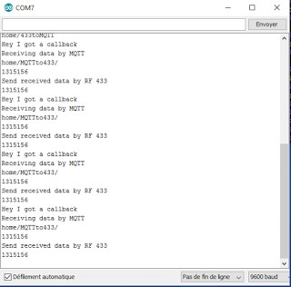
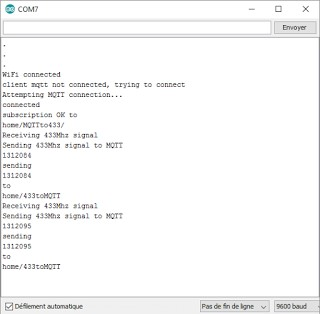
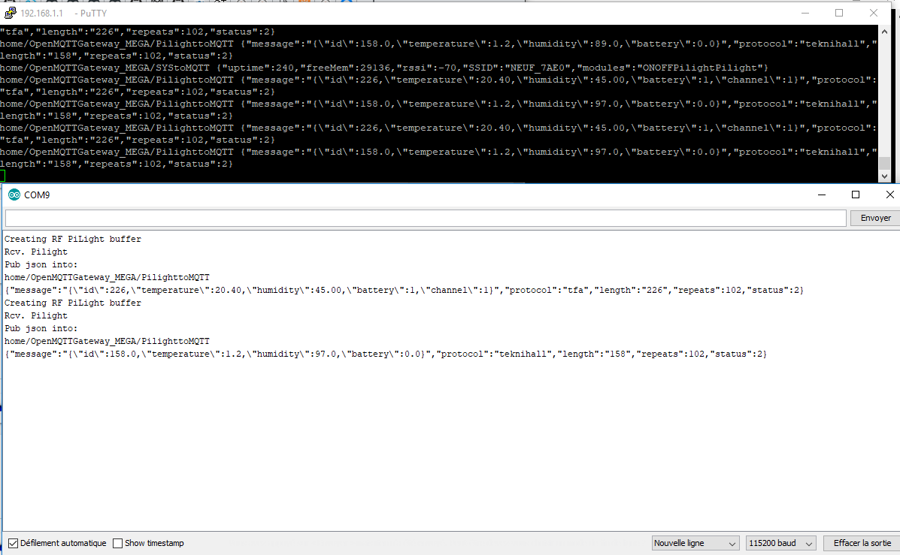

# RF gateways  (433mhz/315mhz)

## RTL_433 device decoders

This feature is only available on a ESP32 based device with a supported transceiver connected due to the resource requirements of the rtl_433 device decoders.  At the present time only Pulse Position Modulation (OOK_PPM), Pulse Width Modulation (OOK_PWM) and  Pulse Manchester Zero Bit (OOK_PULSE_MANCHESTER_ZEROBIT) based decoders are available.

### Supported hardware combinations

- ESP32 based device with a CC1101 transceiver
- Heltec WiFi LoRa 32 (V2.1) and LilyGo Lora 32 V2.1
- ESP32 DOIT DevKit V1 and Ai-Thinker R01 (SX1278)
- ESP32 + SX1278/SX1276

### Supported Decoders

```
Registering protocol [2] "Acurite 609TXC Temperature and Humidity Sensor"
Registering protocol [3] "Acurite 592TXR Temp/Humidity, 5n1 Weather Station, 6045 Lightning, 3N1, Atlas"
Registering protocol [4] "Acurite 986 Refrigerator / Freezer Thermometer"
Registering protocol [5] "Acurite 606TX Temperature Sensor"
Registering protocol [6] "Acurite 00275rm,00276rm Temp/Humidity with optional probe"
Registering protocol [7] "Acurite 590TX Temperature with optional Humidity"
Registering protocol [8] "Acurite Grill/Meat Thermometer 01185M"
Registering protocol [9] "Akhan 100F14 remote keyless entry"
Registering protocol [10] "AlectoV1 Weather Sensor (Alecto WS3500 WS4500 Ventus W155/W044 Oregon)"
Registering protocol [11] "Ambient Weather TX-8300 Temperature/Humidity Sensor"
Registering protocol [13] "Auriol AFT 77 B2 temperature sensor"
Registering protocol [14] "Auriol AFW2A1 temperature/humidity sensor"
Registering protocol [15] "Auriol AHFL temperature/humidity sensor"
Registering protocol [16] "Auriol HG02832, HG05124A-DCF, Rubicson 48957 temperature/humidity sensor"
Registering protocol [18] "Blyss DC5-UK-WH"
Registering protocol [20] "Bresser Thermo-/Hygro-Sensor 3CH"
Registering protocol [22] "Burnhard BBQ thermometer"
Registering protocol [23] "Calibeur RF-104 Sensor"
Registering protocol [24] "Cardin S466-TX2"
Registering protocol [25] "Chuango Security Technology"
Registering protocol [26] "Companion WTR001 Temperature Sensor"
Registering protocol [29] "Ecowitt Wireless Outdoor Thermometer WH53/WH0280/WH0281A"
Registering protocol [30] "Eurochron EFTH-800 temperature and humidity sensor"
Registering protocol [34] "Esperanza EWS"
Registering protocol [36] "Fine Offset Electronics, WH2, WH5, Telldus Temperature/Humidity/Rain Sensor"
Registering protocol [37] "Fine Offset Electronics, WH0530 Temperature/Rain Sensor"
Registering protocol [38] "Fine Offset WH1050 Weather Station"
Registering protocol [39] "Fine Offset Electronics WH1080/WH3080 Weather Station"
Registering protocol [41] "FT-004-B Temperature Sensor"
Registering protocol [42] "Generic wireless motion sensor"
Registering protocol [43] "Generic Remote SC226x EV1527"
Registering protocol [44] "Generic temperature sensor 1"
Registering protocol [45] "Govee Water Leak Dectector H5054, Door Contact Sensor B5023"
Registering protocol [46] "Globaltronics QUIGG GT-TMBBQ-05"
Registering protocol [47] "Globaltronics GT-WT-02 Sensor"
Registering protocol [48] "Globaltronics GT-WT-03 Sensor"
Registering protocol [49] "Microchip HCS200 KeeLoq Hopping Encoder based remotes"
Registering protocol [50] "Honeywell ActivLink, Wireless Doorbell"
Registering protocol [51] "HT680 Remote control"
Registering protocol [52] "inFactory, nor-tec, FreeTec NC-3982-913 temperature humidity sensor"
Registering protocol [54] "Interlogix GE UTC Security Devices"
Registering protocol [56] "Kedsum Temperature & Humidity Sensor, Pearl NC-7415"
Registering protocol [57] "Kerui PIR / Contact Sensor"
Registering protocol [58] "LaCrosse TX Temperature / Humidity Sensor"
Registering protocol [59] "LaCrosse TX141-Bv2, TX141TH-Bv2, TX141-Bv3, TX141W, TX145wsdth, (TFA, ORIA) sensor"
Registering protocol [60] "LaCrosse/ELV/Conrad WS7000/WS2500 weather sensors"
Registering protocol [61] "LaCrosse WS-2310 / WS-3600 Weather Station"
Registering protocol [63] "Markisol, E-Motion, BOFU, Rollerhouse, BF-30x, BF-415 curtain remote"
Registering protocol [64] "Maverick et73"
Registering protocol [66] "Missil ML0757 weather station"
Registering protocol [68] "Nexus, FreeTec NC-7345, NX-3980, Solight TE82S, TFA 30.3209 temperature/humidity sensor"
Registering protocol [70] "Opus/Imagintronix XT300 Soil Moisture"
Registering protocol [71] "Oregon Scientific Weather Sensor"
Registering protocol [72] "Oregon Scientific SL109H Remote Thermal Hygro Sensor"
Registering protocol [74] "Philips outdoor temperature sensor (type AJ3650)"
Registering protocol [75] "Philips outdoor temperature sensor (type AJ7010)"
Registering protocol [76] "Prologue, FreeTec NC-7104, NC-7159-675 temperature sensor"
Registering protocol [77] "Quhwa"
Registering protocol [79] "Rubicson Temperature Sensor"
Registering protocol [80] "Rubicson 48659 Thermometer"
Registering protocol [81] "Conrad S3318P, FreeTec NC-5849-913 temperature humidity sensor"
Registering protocol [82] "Silvercrest Remote Control"
Registering protocol [83] "Skylink HA-434TL motion sensor"
Registering protocol [84] "Wireless Smoke and Heat Detector GS 558"
Registering protocol [85] "Solight TE44/TE66, EMOS E0107T, NX-6876-917"
Registering protocol [86] "Springfield Temperature and Soil Moisture"
Registering protocol [87] "TFA Dostmann 30.3221.02 T/H Outdoor Sensor"
Registering protocol [88] "TFA Drop Rain Gauge 30.3233.01"
Registering protocol [89] "TFA pool temperature sensor"
Registering protocol [90] "TFA-Twin-Plus-30.3049, Conrad KW9010, Ea2 BL999"
Registering protocol [91] "Thermopro TP11 Thermometer"
Registering protocol [92] "Thermopro TP08/TP12/TP20 thermometer"
Registering protocol [94] "TS-FT002 Wireless Ultrasonic Tank Liquid Level Meter With Temperature Sensor"
Registering protocol [95] "Visonic powercode"
Registering protocol [96] "Waveman Switch Transmitter"
Registering protocol [97] "WG-PB12V1 Temperature Sensor"
Registering protocol [98] "WS2032 weather station"
Registering protocol [99] "Hyundai WS SENZOR Remote Temperature Sensor"
Registering protocol [100] "WT0124 Pool Thermometer"
Registering protocol [101] "X10 RF"
Registering protocol [102] "X10 Security"
```

### Change receive frequency

Default receive frequency of the module is 433.92 Mhz, and this can be can changed by sending a message with the frequency.  Parameter is `mhz` and valid values are 300-348 Mhz, 387-464Mhz and 779-928Mhz.  Actual frequency support will depend on your board

`home/OpenMQTTGateway/commands/MQTTtoRTL_433 {"mhz":315.026}`

### Change Signal RSSI Threshold Delta

Delta applied to RSSI floor noise level to determine start and end of signal, defaults to 9db.

`home/OpenMQTTGateway/commands/MQTTtoRTL_433 {"rssi": 9}`

### Retrieve current status of receiver

`home/OpenMQTTGateway/commands/MQTTtoRTL_433 {"status":1}`

```
{"model":"status",
"protocol":"debug",
"debug":0,                  - rtl_433 verbose setting
"duration":11799327,        - duration of current signal
"Gap length":-943575,       - duration of gap between current signal
"rssi":-38,                 - most recent received signal strength
"train":1,                  - signal processing train #
"messageCount":3,           - total number of signals received
"totalSignals":9,           - RegOokFix signal quality count ( of 10 )
"ignoredSignals":0,         - RegOokFix signal quality ignored signals
"unparsedSignals":3,        - RegOokFix signal quality unparseable signals
"_enabledReceiver":1,       - which receiver is enabled
"receiveMode":0,            - is the receiver currently receiving a signal
"currentRssi":-89,          - current rssi level
"rssiThreshold":-82,        - minimum rssi level to start signal processing
"pulses":0,                 - how many pulses have been received in the current signal
"StackHighWaterMark":5528,  - ESP32 Stack
"freeMem":112880}           - ESP32 memory available
```


## Changing Active Receiver Modules

### Switching Active Receiver Module

Switching of the active transceiver (RTL_433 receiver only) module is available between the RF, RF2, RTL_433 and Pilight Gateway modules, allowing for changing of signal decoders without redeploying the openMQTTGateway package.  Sending a JSON message to the command topic of the desired receiver will change the active transceiver module.

To enable the RF Gateway module send a json message to the RF Gateway module command subject with the key being 'active', and any value.  The value at this time is ignored. 

Example:
`mosquitto_pub -t "home/OpenMQTTGateway/commands/MQTTto433" -m '{"active":true}'`

To enable the PiLight Gateway module send a json message to the PiLight Gateway module command subject with the key being 'active', and any value.  The value at this time is ignored. 

Example:
`mosquitto_pub -t "home/OpenMQTTGateway/commands/MQTTtoPilight" -m '{"active":true}'`

To enable the RF2 Gateway module send a json message to the RF2 Gateway module command subject with the key being 'active', and any value.  The value at this time is ignored. 

Example:
`mosquitto_pub -t "home/OpenMQTTGateway/commands/MQTTtoRF2" -m '{"active":true}'`

To enable the RTL_433 Gateway module send a json message to the RTL_433 Gateway module command subject with the key being 'active', and any value.  The value at this time is ignored. 

Example:
`mosquitto_pub -t "home/OpenMQTTGateway/commands/MQTTtoRTL_433" -m '{"active":true}'`

### Status Messages

The openMQTTGateway status message contains a key `actRec` which is the current active receiver module.

1 - PiLight
2 - RF
3 - RTL_433
4 - RF2

## RCSwitch based gateway

### Receiving data from RF signal

Subscribe to all the messages with mosquitto or open your MQTT client software:

`    sudo mosquitto_sub -t +/# -v`

Generate your RF signals by pressing a remote button or other and you should see :

`home/OpenMQTTGateway/433toMQTT {"value":1315156,"protocol":1,"length":24,"delay":317}`

### Disabling Transmit function to safe a PIN

To disable transmit functions to allow the use of another pin, add the following to the config_rf.h file :

`#define RF_DISABLE_TRANSMIT`

### Send data by MQTT to convert it on RF signal 

`mosquitto_pub -t "home/OpenMQTTGateway/commands/MQTTto433" -m '{"value":1315156}'`

This command will send by RF the code 1315156 and use the default parameters (protocol 1, delay 350)

Arduino IDE serial data received when publishing data by MQTT



We see that the Arduino receive the value 1315156 on the MQTT subject "MQTTto433" and send the data by RF

Arduino IDE serial data received when receiving data by 433Mhz



### Send data by MQTT with advanced RF parameters

RF sending support three advanced parameters: bits length, RF protocol and RF pulselength

-if you want to use a bits number different than 24 put inside your topic "length":24 for example

-if you want to use a different RCswitch protocol put inside your payload the protocol number 2, "protocol":2.

-if you want to use a pulselength 315 put inside your topic "delay":315

Example:
`mosquitto_pub -t "home/OpenMQTTGateway/commands/MQTTto433" -m '{"value":1315156,"protocol":2,"length":24,"delay":315}'`
will make RCSwitch use the protocol 2 with a pulselength of 315ms and a bits number of 24 with a power of 5

### Repeat the RF signal OpenMQTTGateway receive
So as to repeat the RF signal received by the gateway once set the following parameter to true in config_RF.h

`#define repeatRFwMQTT true`

### Repeat the RF signal several times
You can add a "repeat" key/value to the MQTTto433 JSON message to override the default number of repeats.

Example:
`home/OpenMQTTGateway/commands/MQTTto433 {"value":1315156,"protocol":1,"length":24,"delay":317, "repeat":10}`

### Set Transmit and Receive Frequency and Transmit Power of CC1101 Transceiver

Default transmit frequency of the CC1101 module is 433.92 Mhz, and this can be can changed by including the frequency in the transmit message.  Parameter is `mhz` and valid values are 300-348 Mhz, 387-464Mhz and 779-928Mhz.  Actual frequency support will depend on your CC1101 board.

`home/OpenMQTTGateway/commands/MQTTto433 {"value":1150,"protocol":6,"length":12,"delay":450,"repeat":8,"mhz":303.732}`

Default receive frequency of the CC1101 module is 433.92 Mhz, and this can be can changed by sending a message with the frequency.  Parameter is `mhz` and valid values are 300-348 Mhz, 387-464Mhz and 779-928Mhz.  Actual frequency support will depend on your CC1101 board

`home/OpenMQTTGateway/commands/MQTTto433 {"mhz":315.026}`

Messages received will include the frequency, and when transmitting on a different frequency the module return to the receive frequency afterwards.  ie transmit messages on 303.732 Mhz then receive messages on 433.92 Mhz 

`{"value":4534142,"protocol":6,"length":26,"delay":356,"mhz":315.026}`

You can adjust the tx-power in db for a transmission. Parameter is `cc1101_pa` and valid values in decibel are (-30  -20  -15  -10  -6    0    5    7    10   11   12) Default is max!
That can be done to reduce range and therefore disturbances with other nearby devices.
If you want to send a transmission with a power of 5 db than use the message 

`{"value":1315156,"protocol":2,"length":24,"delay":315, "cc1101_pa":5}`


## Pilight gateway

### Receiving data from RF signal

Subscribe to all the messages with mosquitto or open your MQTT client software:

`    sudo mosquitto_sub -t +/# -v`

Generate your RF signals by pressing a remote button or other and you will see :



#### Enabling RAW packet return support
First, you need to compile a binary with `Pilight_rawEnabled true` uncommented in config_RF.h.

Once the device is online, you can turn on the RAW packet return support with the following MQTT command:

`mosquitto_pub -t "home/OpenMQTTGateway/commands/MQTTtoPilight/protocols" -m '{"rawEnabled":true}'`

The returned JSON looks like this:
`Client (null) received PUBLISH (d0, q0, r0, m0, 'home/OpenMQTTGateway/PilighttoMQTT', ... (176 bytes))
{"format":"RAW","rawlen":106,"pulsesString":"c:0102010102020202020101010101010102020201020102020202020201010101010101010101010102010102010201020201010203;p:521,944,1924,3845@"}`

The pulseString format is Pilight's native. For those who are not familiar with it:
c:* are the indexes for the p:* array, which are the different pulse length. (e.g. pulse[0] = 521ms, pulse[1]=944ms..., so c[0], which is a '0' = 521ms pulse, c[1], which is a '1' =944ms pulse etc)

After gathering all the packets you need, simply turn off the RAW packet support via MQTT:

`mosquitto_pub -t "home/OpenMQTTGateway/commands/MQTTtoPilight/protocols" -m '{"rawEnabled":false}'`

### Limit Protocols
It is possible to limit the protocols that Pilight will respond to, this can help reduce noise from unwanted devices and in some cases disable conflicting protocols.

#### Available protocols
To list the available protocols on the Serial - 

`mosquitto_pub -t "home/OpenMQTTGateway/commands/MQTTtoPilight/protocols" -m '{"available":true}'`
#### Limit protocols
To limit the protocols, send a JSON array of protocols as below - 

`mosquitto_pub -t "home/OpenMQTTGateway/commands/MQTTtoPilight/protocols -m '{"limit": ["array", "of", "protocols"]}'`

eg: `mosquitto_pub -t "home/OpenMQTTGateway/commands/MQTTtoPilight/protocols" -m '{"limit":["tfa", "ev1527"}'`

#### Reset protocols
To reset and listen to all protocols -
`mosquitto_pub -t "home/OpenMQTTGateway/commands/MQTTtoPilight/protocols -m '{"reset": true}'`

#### Enabled protocols
To list the enabled protocols on the Serial - 

`mosquitto_pub -t "home/OpenMQTTGateway/commands/MQTTtoPilight/protocols" -m '{"enabled":true}'`

### Send data by MQTT to transmit a RF signal

#### Using a known protocol
**ON**
`mosquitto_pub -t "home/OpenMQTTGateway/commands/MQTTtoPilight" -m '{"message":"{\"systemcode\":12,\"unitcode\":22,\"on\":1}","protocol":"elro_400_switch"}'`

**OFF**
`mosquitto_pub -t "home/OpenMQTTGateway/commands/MQTTtoPilight" -m '{"message":"{\"systemcode\":12,\"unitcode\":22,\"off\":1}","protocol":"elro_400_switch"}'`

These commands will transmit by RF the signals to actuate an elro_400 switch.

#### Using a raw signal
You can transmit raw signal data by using the "raw" protocol. This uses the Pilight pulse train string format. One such example string, representing a transmission for Nexus protocol weather stations, looks like this: `c:03020202010102020102010101010101010202020201020102020202020101010201010202;p:500,1000,2000,4000;r:12@`. This string represents pulses and gaps directly.

Each number in the list after `p:` that ends with `;` stands for **p**ulse and gap lengths in microseconds (µs). In this example, we have a list containing lengths of 500µs, 1000µs, 2000µs, and 4000µs.

Each number after `c:` and ended by `;` represents a **c**ode that references the `p:` list by index. In this example, the first 4 numbers after `c:` are 0, 3, 0, and 2, which reference `p:`[0] = 500, `p:`[3] = 4000, `p:`[0] = 500, and `p:`[2] = 2000, respectively. In the language of digital radio transceiving, the most basic unit is usually a pulse and gap pair; in other words, 0s and 1s are represented by a pulse followed by a gap (lack of pulse) and the time lengths of these pulses and gaps. Different protocols have different pulse lengths and gap lengths representing 0, and a different one representing 1. Because of this pulse-gap nature, the codes in `c:` must be taken as pairs; the first number in a pair represents the length of the pulse, and the second number the subsequent gap. In this example, the first pair, 03, represents a pulse of 500µs followed by a gap of 4000µs. The next pair, 02, represents a pulse of 500µs followed by a gap of 2000µs.

The number after `r:` represents how many times the message in the string is to be **r**epeated. The `r:` block is optional. The default number of repeats if `r:` is not specified is 10. Greater than about 100 repeats will cause a crash due to memory usage. If this example were written without specifying repeats, it would look like this: `{"raw":"c:03020202010102020102010101010101010202020201020102020202020101010201010202;p:500,1000,2000,4000@"}`

The entire string must end in a `@`. Each block must end in a `;`, but if it is the last block in the string, the `@` replaces the `;`. Since the `r:` block is optional, this last block could be either `p:` or `r:`.

The JSON for the MQTT message to `home/OpenMQTTGateway/commands/MQTTtoPilight` should specify the pulse train string as the value for the "raw" key: `{"raw":"c:03020202010102020102010101010101010202020201020102020202020101010201010202;p:500,1000,2000,4000;r:12@"}`.

e.g. `mosquitto_pub -t "home/OpenMQTTGateway/commands/MQTTtoPilight" -m '{"raw":"c:03020202010102020102010101010101010202020201020102020202020101010201010202;p:500,1000,2000,4000;r:12@"}'`

## RF with SONOFF RF BRIDGE
### Receiving data from RF signal

Subscribe to all the messages with mosquitto or open your MQTT client software:

`    sudo mosquitto_sub -t +/# -v`

Generate your RF signals by pressing a remote button or other and you will see:
```
home/OpenMQTTGateway/SRFBtoMQTT {"raw":"2B660186042E00E7E5","value":"59365","delay":"1111","val_Thigh":"390","val_Tlow":"1070"}
```

The first parameter is the raw value extracted from the RF module of the Sonoff bridge. The data are in hexadecimal and correspond to the details below:
https://www.itead.cc/wiki/images/5/5e/RF_Universal_Transeceive_Module_Serial_Protocol_v1.0.pdf
OpenMQTTGateway process the raw value to extract the other decimal values that can be reused to reproduce a signal (raw value can also be reused).

NOTE: currently the device doesn't receive correct values from Switches remote control

### Send data by MQTT to convert it on RF signal 
`mosquitto_pub -t "home/OpenMQTTGateway/commands/MQTTtoSRFB" -m '{"value":1315156}'`

This command will send by RF the code 1315156 and use the default parameters:
Repeat = 1
Low time= 320
High time= 900
SYNC = 9500

### Send data by MQTT with advanced RF parameters

RF bridge sending support four advanced parameters; Repeat, Low time, High time & Sync
if you want to repeat your signal sending put into your json payload "repeat":2, 2 means 2 repetitions of signal

if you want to use a low time of 315 put inside your json payload "Tlow":315

if you want to use a high time of 845 put inside your json payload "Thigh":845

if you want to use a sync time of 9123 put inside your json payload "Tsyn":9123 

Example:
`mosquitto_pub -t home/OpenMQTTGateway/commands/MQTTtoSRFB/Tlow_315/Thigh_845/Tsyn_9123 -m '{"value":"33151562","delay":"9123","val_Thigh":"845","val_Tlow":"315"}'`
will make RF Bridge send a signal with the use of listed parameters 315, 845, 9123...

`mosquitto_pub -t home/OpenMQTTGateway/commands/MQTTtoSRFB/Raw -m '{"raw":"267A013603B6140551"}'`
will make RF Bridge send a signal with the use of advanced parameters defined in the raw string

## RF2 gateway KAKU
RF2 gateway enables to send command to RF devices with the KAKU protocol. DIO chacon devices are an example.
It uses the same pinout as the RF gateway and both gateways can be used on the same setup.

Receiving RF codes with the KAKU protocol is not compatible with ZgatewayRF , so as to get the code of your remotes you should comment ZgatewayRF in User_config.h.
Transmitting can be done with both ZgatewayRF and ZgatewayRF2

### Receiving data from KAKU signal

Subscribe to all the messages with mosquitto or open your MQTT client software:

`    sudo mosquitto_sub -t +/# -v`

Generate your RF signals by pressing a remote button or other and you will see :

`home/OpenMQTTGateway/RF2toMQTT {"unit":0,"groupBit":0,"period":273,"address":8233228,"switchType":0}`

### Send data by MQTT to convert it on KAKU signal 

Once you get the infos publish the parameters with MQTT like that for off:

`mosquitto_pub -t home/OpenMQTTGateway/commands/MQTTtoRF2 -m "{"unit":0,"groupBit":0,"period":273,"address":8233228,"switchType":0}"`

for on:

`mosquitto_pub -t home/OpenMQTTGateway/commands/MQTTtoRF2 -m "{"unit":0,"groupBit":0,"period":273,"address":8233228,"switchType":1}"`
