PCB Soldering
=============

- `Introduction`_
- `PCB Eights`_
   - `Headers`_
   - `Voltage Regulator`_
- `PCB Quarter`_
   - `P1 Meter`_
- `PCB Half`_
   - `Pre-Filter`_
- `PCB Full`_

Introduction
------------

The pilight PCB can be ordered as a do-it-yourself kit or pre-soldered. In case you want to solder it yourself, this page will show you all steps needed. If you follow all steps, you will eventually end up with the full pilight PCB. However, if you want to leave certain options, just pick the steps you need.

PCB Eights
----------

.. _Headers:
.. rubric:: Headers

First start by soldering the two headers. This makes it easier to position the rest of the components.

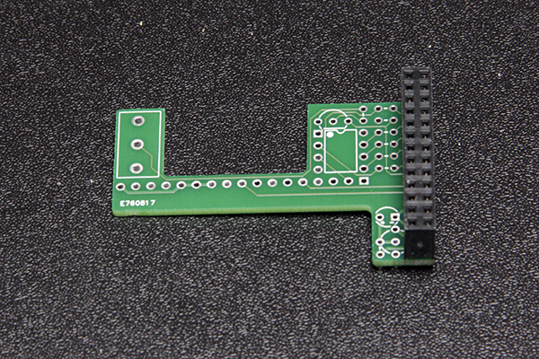

.. rst-class:: alt

+-----------------------+
| |fig1|                |
+-----------------------+
| Image 1: First Header |
+-----------------------+

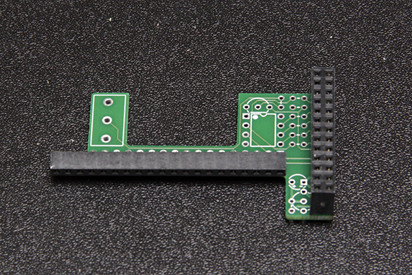

.. rst-class:: alt

+------------------------+
| |fig2|                 |
+------------------------+
| Image 2: Second Header |
+------------------------+

As you can see, the second header is wider than the number of pins on the PCB. Just strip the unconnected connections on the left side to make the header evenly wide as the PCB.

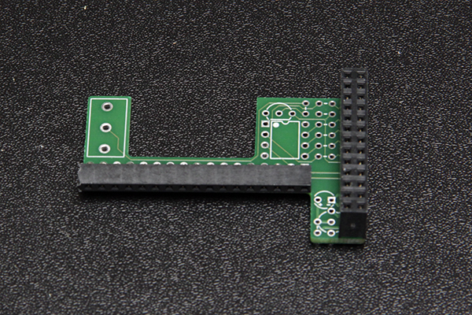

.. rst-class:: alt

+---------------------------------+
| |fig3|                          |
+---------------------------------+
| Image 3: Stripped Second Header |
+---------------------------------+

.. _Voltage Regulator:
.. rubric:: Voltage Regulator

The voltage regulator consists of a capacitor, resistor, and transistor. First start by soldering the transistor close to the first header. Make sure to match the flat and rounded side of the transistor as shown on the PCB itself. Also make sure to push the transistor far through enough so it stays under the first header.

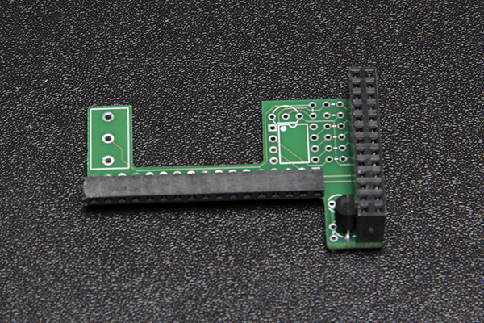

.. rst-class:: alt

+---------------------------------------+
| |fig4|                                |
+---------------------------------------+
| Image 4: Voltage Regulator Transistor |
+---------------------------------------+

The capacitor can best be solder with a little more slack so you can bend it in such manner that it will stay under the first header. Do not bend it too much because then it can interfere with the resistors needed for the pre-filter.

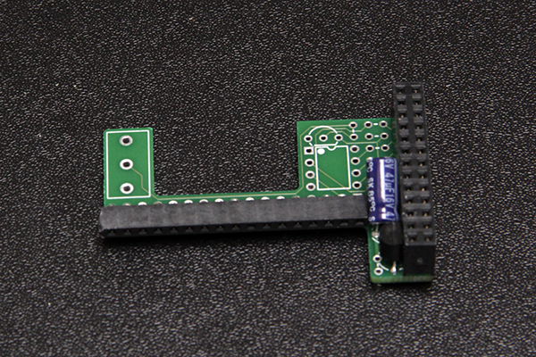

.. rst-class:: alt

+--------------------------------------+
| |fig5|                               |
+--------------------------------------+
| Image 5: Voltage Regulator Capacitor |
+--------------------------------------+

Finish the voltage regulator by soldering the resistor.

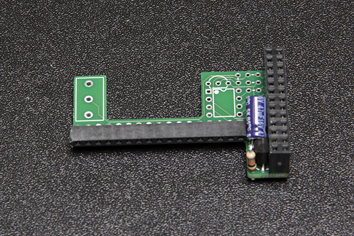

.. rst-class:: alt

+-------------------------------------+
| |fig6|                              |
+-------------------------------------+
| Image 6: Voltage Regulator Resistor |
+-------------------------------------+

PCB Quarter
-----------

.. _P1 Meter:
.. rubric:: P1 Meter

The P1 meter consists of two resistors, a transistor and a wire terminal. Take care in placing the resistors, because they are placed in between the resistors of the pre-filter. Also check if the terminal is not too high for mounting on your final device. For example the System on Module of the Hummingboard together with the P1 terminal make it too high for proper mounting. In this case, leave the terminal and just connect the wires directly to the PCB.

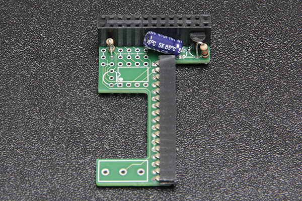

.. rst-class:: alt

+----------------------------------+
| |fig7|                           |
+----------------------------------+
| Image 7: P1 Meter First Resistor |
+----------------------------------+

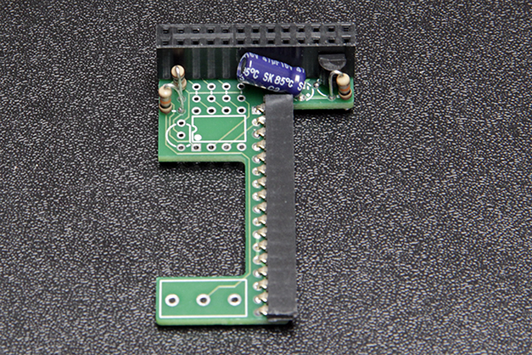

.. rst-class:: alt

+-----------------------------------+
| |fig8|                            |
+-----------------------------------+
| Image 8: P1 Meter Second Resistor |
+-----------------------------------+

Place the transistor as shown on the PCB, with its flat side to the ATTiny.

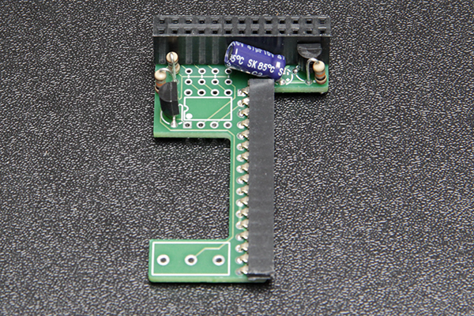

.. rst-class:: alt

+------------------------------+
| |fig9|                       |
+------------------------------+
| Image 9: P1 Meter Transistor |
+------------------------------+

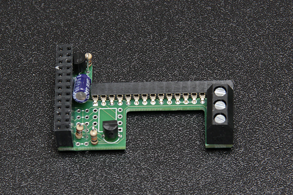

.. rst-class:: alt

+-----------------------------+
| |fig10|                     |
+-----------------------------+
| Image 10: P1 Meter Terminal |
+-----------------------------+

PCB Half
--------

.. _Pre-Filter:
.. rubric:: Pre-Filter

..

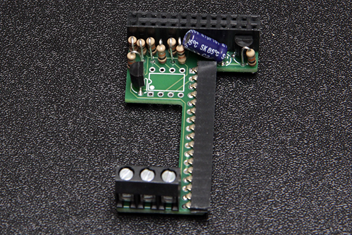

.. rst-class:: alt

+--------------------------------+
| |fig11|                        |
+--------------------------------+
| Image 11: Pre-Filter Resistors |
+--------------------------------+

When installing the socket, please remember where the dot and notch are placed. In the final ATTiny installation, the dot on the PCB and on the ATTiny should match.

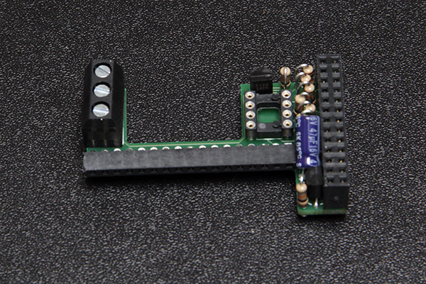

.. rst-class:: alt

+-----------------------------+
| |fig12|                     |
+-----------------------------+
| Image 12: Pre-Filter Socket |
+-----------------------------+

PCB Full
--------

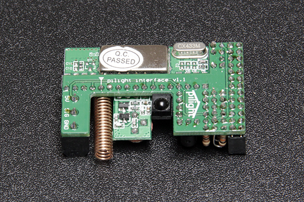

.. rst-class:: alt

+------------------------------+
| |fig13|                      |
+------------------------------+
| Image 13: PCB Final Top View |
+------------------------------+

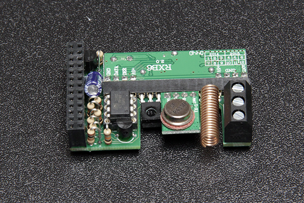

.. rst-class:: alt

+---------------------------------+
| |fig14|                         |
+---------------------------------+
| Image 14: PCB Final Bottom View |
+---------------------------------+
